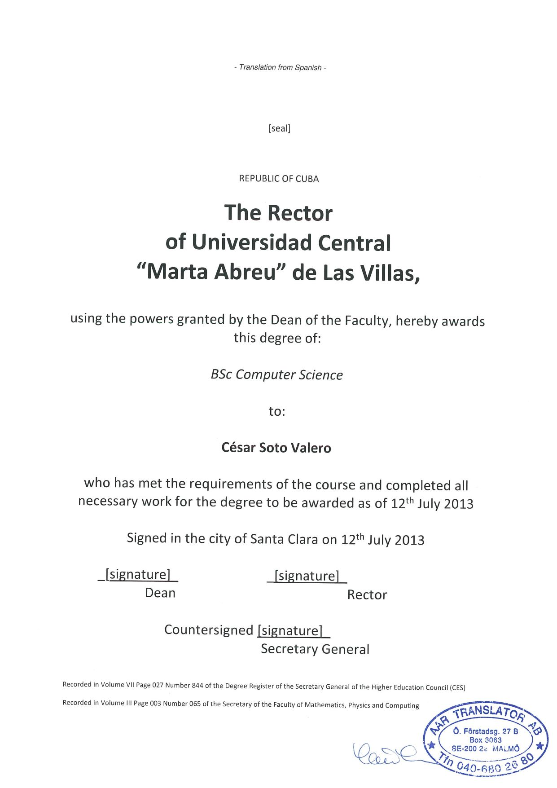
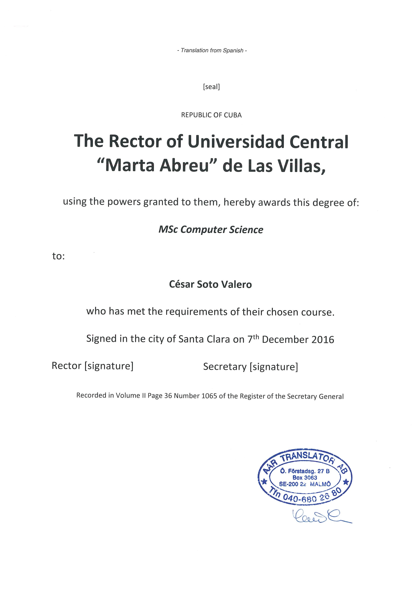
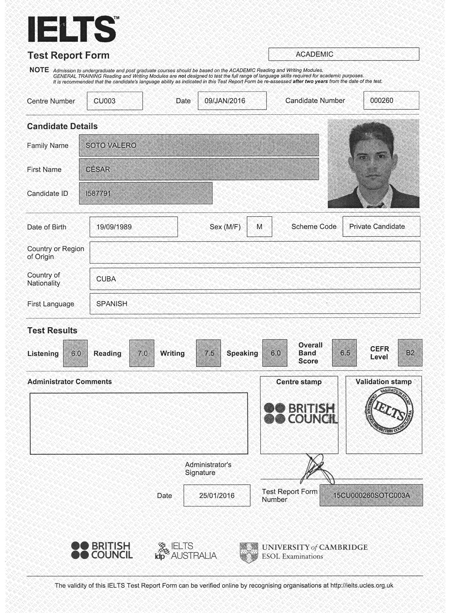
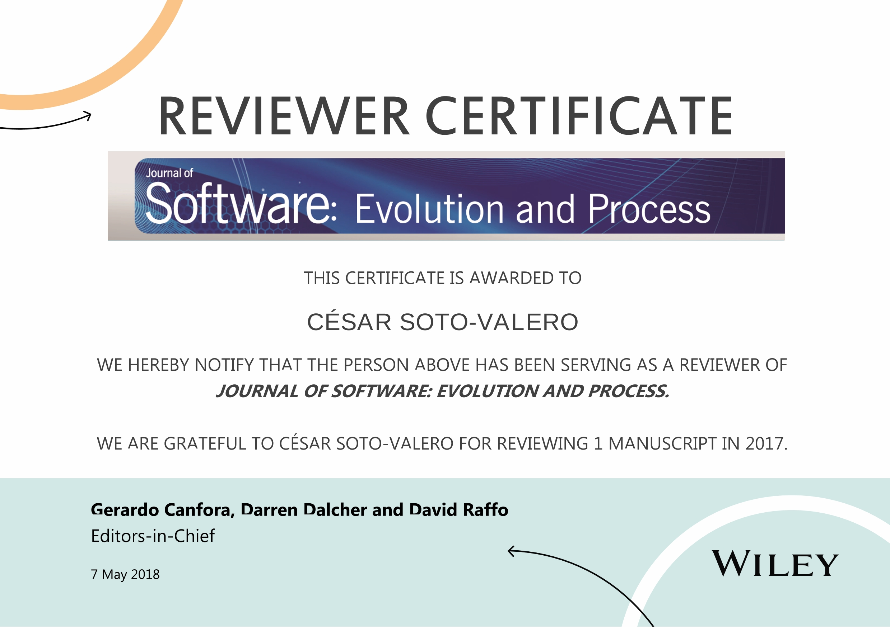
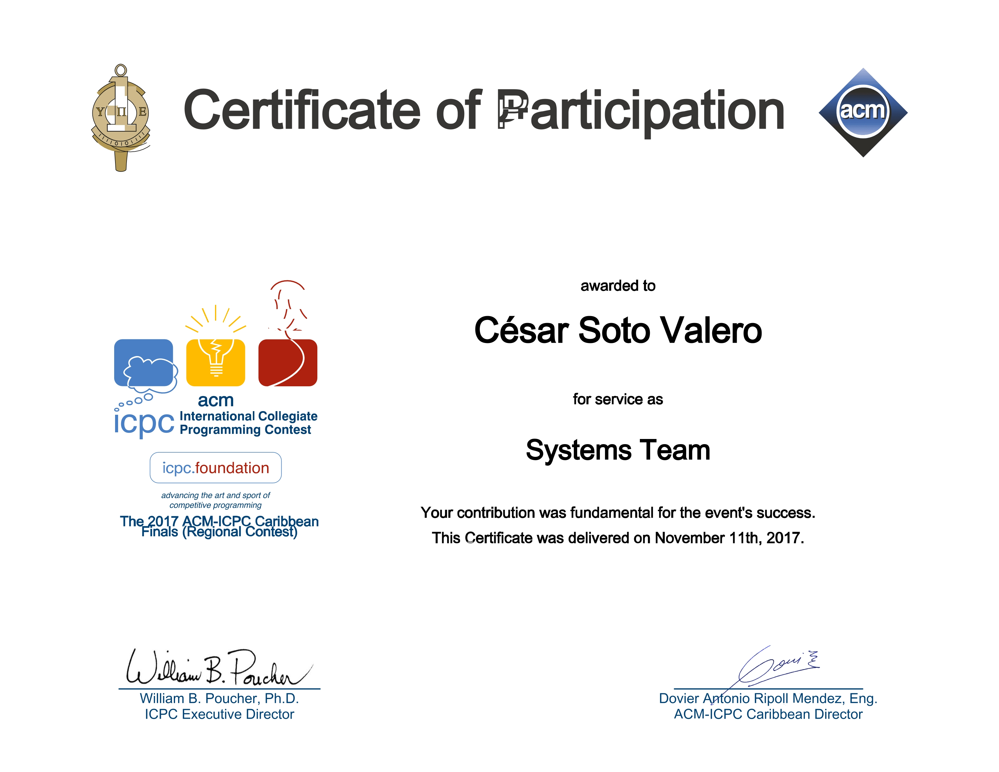
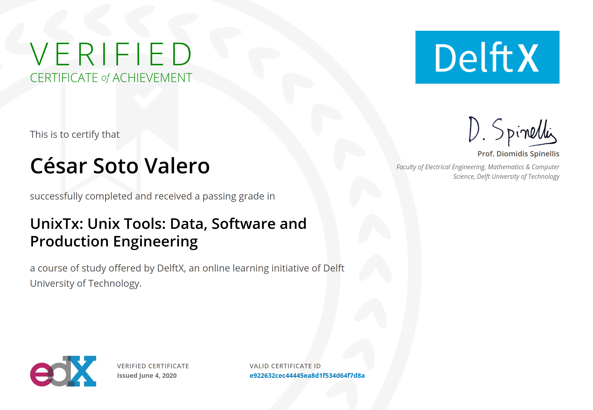
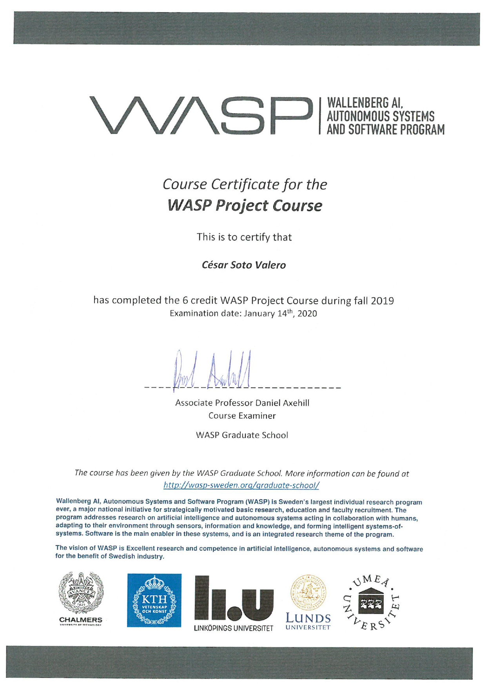
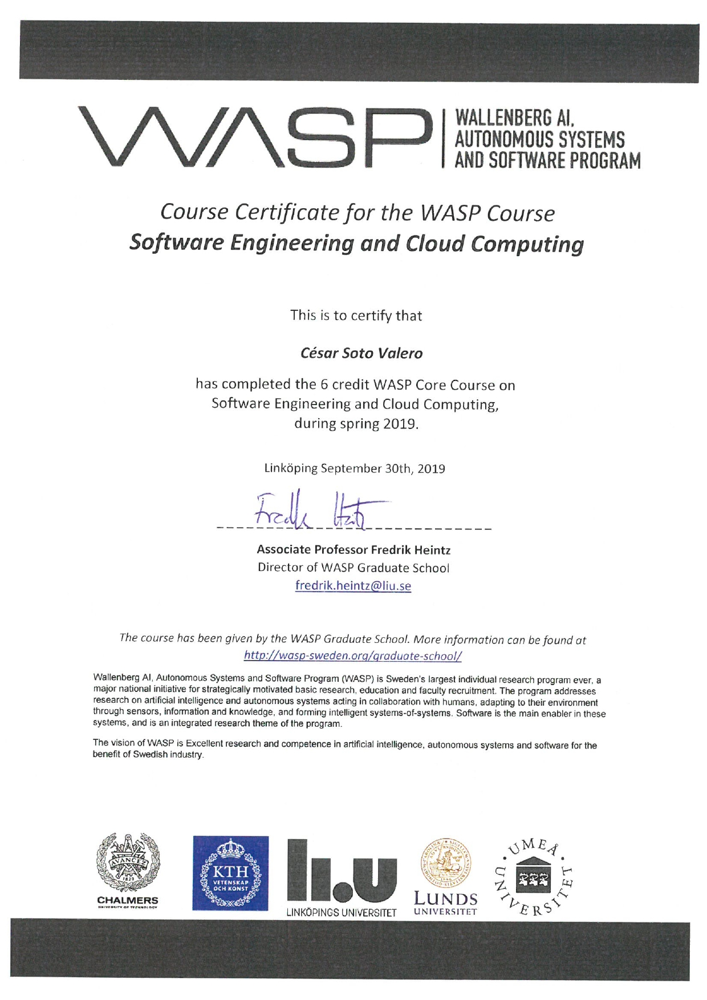

> "Certifications help you formalize your knowledge, put borders around it, and remove gaps. And they demonstrate to most of your potential employers that you’re truly serious about software engineering."
> -- <cite>Yegor Bugayenko</cite>

---

## Degrees

- MSc Computer Science,  [\[Original Degree in Spanish\]](), [\[English Translation\]](../files/certificates/MSc_Degree_(certified)_eng.pdf), [\[Academic Transcripts in English\]](../files/certificates/MSc_Academis_Transcript-eng.pdf), UCLV, 2016

- BSc Computer Science, \[[Original Degree in Spanish](../files/certificates/BSc_Degree_Original.pdf)\], \[[English Translation](../files/certificates/BSc_Degree_(certified)_eng.pdf)\], \[[Academic Transcripts in English](../files/certificates/BSc_Academis_Transcript-eng.pdf)\], UCLV, 2013

## Courses

- [WASP Autonomous Systems I and II](../files/certificates/Certificate_WASP_AS1_Cesar.pdf), KTH, 2020

- [WASP Software Engineering and Cloud Computing](../files/certificates/Certificate_WASP_SECC2019_Cesar.pdf), KTH, 2019

- [WASP Project Course](../files/certificates/Certificate_WASP_Project2019_Cesar.pdf), KTH, 2019

## MOOCs

- [Programming for the Web with JavaScript](#), edX, 2020

- [Unix Tools: Data, Software and Production Engineering](https://courses.edx.org/certificates/e922632cec44445ea8d1f534d64f7d8a), edX, 2020

## Other

- [IELTS Academic Test 6.5](../img/IETLS_Test_Report_Form.jpg), University of Cambridge ESOL Examinations, 2016

- [Reviewer Certificate](https://onlinelibrary.wiley.com/journal/20477481), _Journal of Software: Evolution and Process_, 2017

- [Staff Member](../files/certificates/2017_CertificateStaff_Caribbean_Finals_419972.pdf), _ICPC-ACM International Collegiate Programming Contest_, 2017 

## Awards

- [Data Showcase Award](#), _16th International Conference on Mining Software Repositories_, 2019

- [WASP Outstanding Results Award](#), _WASP Autonomous Systems II_, 2019 

--- 

<table align="center">
   <tr width="100%" align="center" style="background-color:#FFF; border-top: 0px solid #cccccc;">
      <td width="33%" align="center">
      
      </td>
      <td width="33%" align="center">
         
      </td>
      <td width="33%" align="center">
      
      </td>
   </tr>
   <!-- Another row -->
   <tr width="100%" align="center" style="background-color:#FFF; border-top: 0px solid #cccccc;">
      <td width="33%" align="center">
         
      </td>
      <td width="33%" align="center">
      
      </td>
      <td width="33%" align="center">
      
      </td>
   </tr>   
   <!-- Another row -->
   <tr width="100%" align="center" style="background-color:#FFF; border-top: 0px solid #cccccc;">
      <td width="33%" align="center">
      
      </td>
     <td width="33%" align="center">
     
     </td>
     <td width="33%" align="center">
     
     </td>
   </tr>
</table>