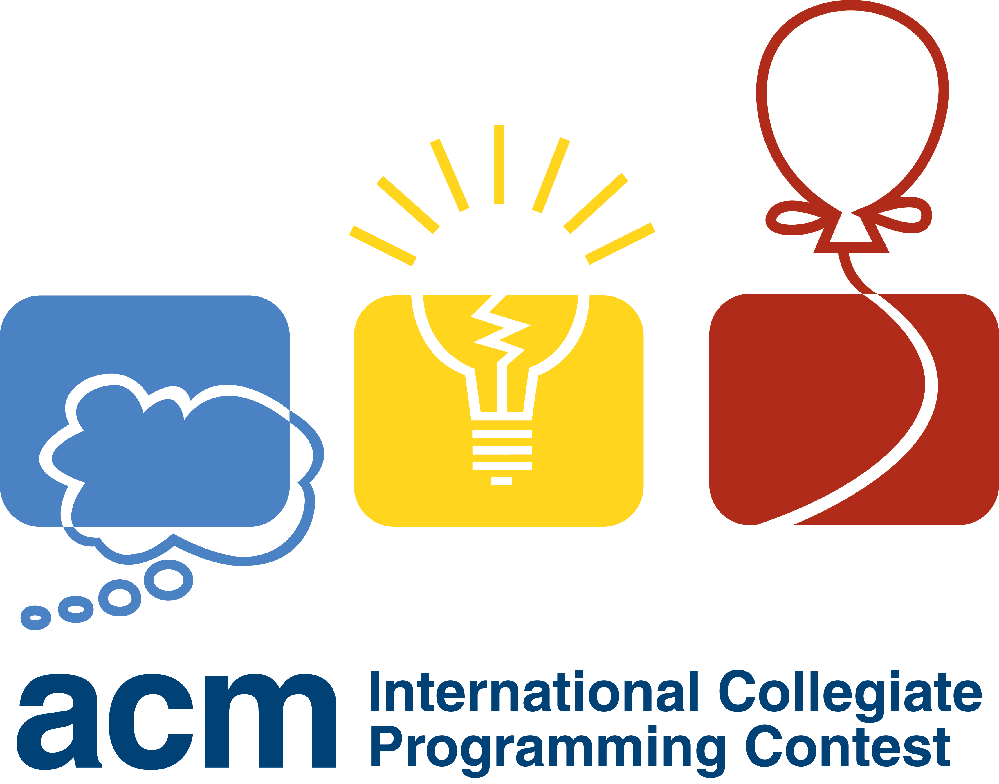
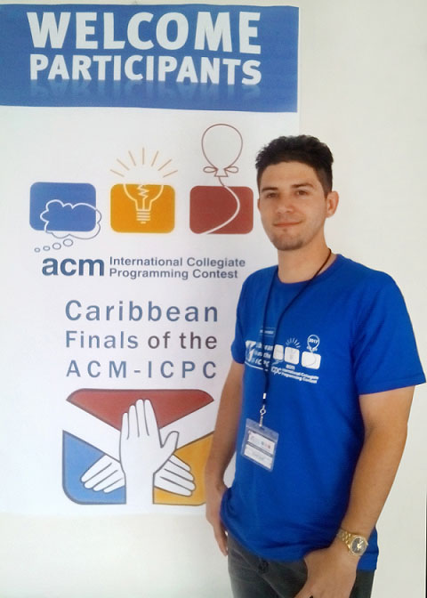

I discovered the world of competitive programming challenges during my first year at university. At that time, I didn't know much about computer algorithms or even mind sports. However, the idea of learning how to code by myself just using an online judge attracted my attention since the first moment. 

I remembered my first ACM-ICPC contest in 2009. It was a mess for me. With only a few weeks of training, I was unable to solve any of the released problems. From that moment onwards, I knew that programming contests are a real challenge, even for serious and highly motivated students.

  

I started my self-training plan, and a couple of months later, I had jumped up to the first ten places in my university. Surprisingly, after four years without submitting a problem to the [COJ](http://coj.uci.cu/),  my [user profile](http://coj.uci.cu/user/useraccount.xhtml?username=CeSaR_uclv) is still in the top 500 contestants from my country. In this post, I want to share some insights and things that I learned when I was a competitive programmer.  

## The step-by-step list for starters
1.	[Start as soon as possible](#start-as-soon-as-possible)
2.	[Master the basic first](#master-the-basic-first)
3.	[Choose an adequate training plan and follow it](#choose-an-adequate-training-plan-and-follow-it)
4.	[Use good study resources](#use-good-study-resources)
5.	[Be persistent](#be-persistent)
6.	[Be efficient](#be-efficient)
7.	[Share your work and ideas with others](#share-your-work-and-ideas-with-others)
8.	[Keep yourself up to date](#keep-yourself-up-to-date)
9.	[Free your mind](#free-your-mind)
10.	[Enjoy](#enjoy)

## Start as soon as possible
There is no such thing as a good "starting time" to become a competitive programmer. It is a long process, so as soon as you start developing and algorithmic thinking, then much better for you to become a strong programmer. I believe that programming should be taught to elementary schoolers. Just think about it, the best competitive programmers, such as the prodigious [Gennady Korotkevich](https://en.wikipedia.org/wiki/Gennady_Korotkevich) started at a very young age. 

## Master the essential first
You need to crawl before walking, be sure to know the basic principles of programming before deep yourself into more advanced topics. You must master data structures, combinatorics, number theory, geometry, graph theory, string analysis, and searching techniques. Study each topic one by one, solving problems and thinking how to merge it.

## Choose an adequate training plan and follow it
A goal without a plan is just a wish. Of course, you need to be diligent and study all the time, but if you don't have a good strategy, then you will advance slowly. Use a calendar to organize your training sessions. Expend one day for each type of problem, by doing so it is more difficult to be bored. I recommend don't expending more than 2 hours on the same problem. If stuck, then change your activity, get some tutorial, or ask for help. 

## Use good study resources
Start with the right foot. Choose your materials and resources carefully. As programming languages, C++ is the better, but you should also know Java and its useful libraries such as BigInteger or Calendar. This is my list of recommended books for starters and intermediate contestants:
- **"Competitive Programming 3: The New Lower Bound of Programming Contests"** written by Steven Halim and Felix Halim.
- **"Programming Challenges: The programming contest training manual"** written by Steven S. Skiena and Miguel A. Revilla.
- **"The Art of Programming Contests"** written by Ahmed Shamsul Arefin

## Be persistent
Persistence is the key to competitive programming success. If you have tenacity, then you have all is needed to be a winner. I'm not kidding; there are a lot of others that don't have enough patience. Every day, take a piece of paper and a pencil and try to think about a problem. Don't surrender easily; choose hard problems. You will learn nothing doing the easy ones, try to solve at least one difficult problem every day.

## Be efficient
It's always better to spend 5 minutes thinking more about implementation rather than spending ten more minutes doing it. Learn about time complexity and the best optimization tricks. In competitive programming, the best-written code it s that you can understand, type faster, and run faster. With time, you will develop a powerful skill: the debugging mind. This means that you will be able to run the program in your mind, saving a lot of valuable developing time.

## Share your work and ideas with others 
The best way to learn is by teaching others. This is because you need to be sure of what you know to convince others. If you find an efficient solution for a problem, then share it. In this way, you will get feedback and will learn during the process.

## Keep yourself up to date
Once you mastered the basics, then use forums to keep updated with the latest implementations. The following is a list of useful websites with studying resources:
- [Codeforces](http://codeforces.com/) 
- [Hackerrank](http://hackerrank.com/)
- [Codechef](http://www.codechef.com/) 
- [Topcoder](http://www.topcoder.com/) 
- [UVA Online Judge](http://uva.onlinejudge.org/) 

## Free your mind
You need hard work and practice (a lot of practice) to become a competent contestant. Once you acquire an algorithmic mindset and the right skills, then only your mind will make the difference. It is a good idea to change your activities, have a hobby (I play the guitar), or spend time doing nothing. I believe that diversion is also an essential part of the training.

## Enjoy
Again, life is more than a competition. With time you will note that competitive programming gave you beneficial programming skills, and you will feel good for having discovered it. However,  software development for the industry is not a contest. Sometimes human capabilities are more important than technical skills. The ACM-ICPC contest are just an excellent way to learn programming.

  

