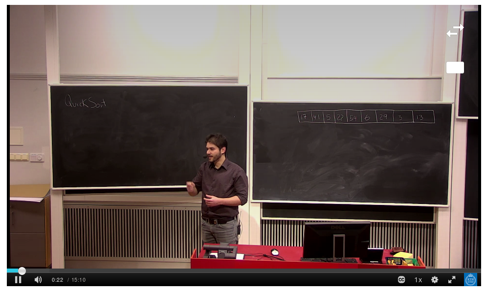

Nobody can deny that teaching is hard. In this 15 min video, I teach how the Quicksort algorithm works the old way: with a blackboard and chalk. As you can see, I committed many mistakes. Considering that I spent 2h of preparation for this, my performance was not as good as expected. 

What else could have been worse?

# Wrapping up 

For my new session, these are some preparation tips that may help:

- Record me during the rehearsal: it is incredible the many mistakes that we don't notice if we don't see ourself during the performance
- Move my hands and speak slowly: the corporal language is essential, this is something that I'm still learning from the best speakers  
- Practice, practice, and practice