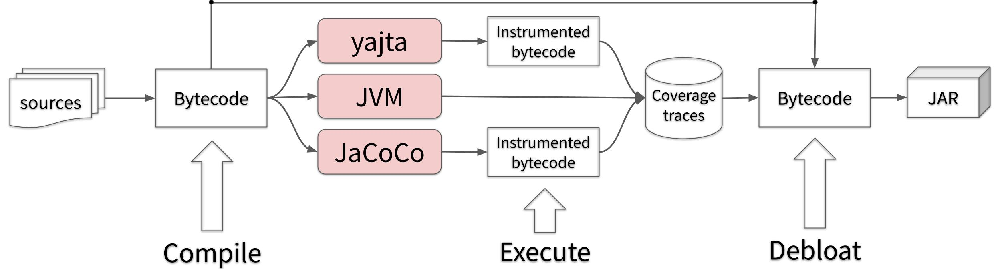

> "Diversity is what we love." *― Benoit Baudry*

For months, I have worked on dynamic debloat of Java artifacts with [JDBL](https://github.com/castor-software/jdbl). To do so, I need to compile and execute the application to determine what part of the compiled sources are being used when executing certain workload. Then, with collected usage information, I remove the rest of the software. These two main task might seem simple at first glance. However, the inability of tracing and coverage tools to precisely detect what is used at execution time make the task a real challenge. I found the solution on the combination of various tools with similar purposes, i.e. by leveraging [software diversity](https://dl.acm.org/doi/abs/10.1145/2807593). Let me explain.  

# The problem

There are awesome Java coverage tools out there, notably: [JaCoCo](https://www.eclemma.org/jacoco/), [JCov](https://wiki.openjdk.java.net/display/CodeTools/jcov), and [Cobertura](https://cobertura.github.io/cobertura/). All these tools relied on the same underlying principle that drives debloat: determining what is parts of the software are necessary to produce a result. In genera, coverage tools perform the following tasks:

1. Instrument the bytecodes, i.e., injecting probes at particular locations 
2. Execute the test suite to "activate" the probes
3. Compare the activated sections of the code with respect to the original bytecodes
4. Report on the achieved coverage, depending on the chosen metric

During the third task, the coverage tool determines what parts of the application are necessary. Therefore, it makes sense to consider the rest as bloat. 

The problem with this approach is that coverage tools are not intended for that purpose. Also, the richness of Java bytecode constructs and dynamic behaviours poses a challenging even for the most advanced tools. For example, 

# The solution

JDBL is extensible. 

We combine a variety of implementations in order to achieve

  

