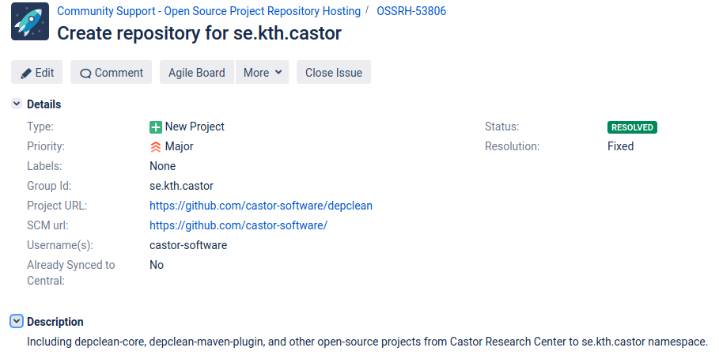

Maven Central is the de-facto repository for hosting software artifacts that compile to the JVM.
It is one of the world’s largest and oldest archives of software libraries.
In this post, I'll describe the process of releasing a new artifact in Maven Central following a step-by-step approach. 

<figure class="jb_picture">
{% responsive_image width: "100%" border: "0px solid #808080" path: img/posts/2020/mdg.png alt: "Excerpt of 1% of the whole graph of Maven artifacts" %}
  <figcaption class="stroke"> 
&#169; Excerpt of 1% of the Maven Dependency Graph of software artifacts. <a href="https://dl.acm.org/doi/10.1109/MSR.2019.00060">Source</a>.
</figcaption>
</figure>

# Create a JIRA ticket in Sonatype

First, you need to create a JIRA account and submit a ticket there requesting for a project namespace in Sonatype (aka, GroupId):

1.  [Create a JIRA account](https://issues.sonatype.org/secure/Signup!default.jspa)
2.  [Create a New Project ticket](https://issues.sonatype.org/secure/CreateIssue.jspa?issuetype=21&pid=10134)

A staging repository is already configured for the requested GroupId, you need to find someone with a deployer role that comments on the ticket to verify your request. 
Below is an example of a ticket that I created requesting a repository for the namespace `se.kth.castor`

The ticked review is a manual process, it normally takes less than 2 business days.

# Configuring the POM

After the approval of the ticket, you need to add additional information to the POM of the Maven project or module to be deployed. Follow the steps below exactly as they are. 

- Choose appropriate coordinates as explained [here](https://central.sonatype.org/pages/choosing-your-coordinates.html):


<groupId>com.example.applications</groupId>
<artifactId>example-application</artifactId>
<version>1.4.7</version>

 
- Add your project name, description, and URL:


<name>Example Application</name>
<description>Describe your Application</description>
<url>http://www.example.com/example-application</url>


- Add licence information:


<licenses>
  <license>
     <name>The Apache License, Version 2.0</name>
    <url>http://www.apache.org/licenses/LICENSE-2.0.txt</url>
  </license>
</licenses>


- Add information about developer/s :


<developers>
  <developer>
    <name>Manfred Moser</name>
    <email>manfred@sonatype.com</email>
    <organization>Sonatype</organization>
    <organizationUrl>http://www.sonatype.com</organizationUrl>
  </developer>
</developers>


- Add SCM information, the following example uses GitHub:


<scm>
  <connection>scm:git:git://github.com/simpligility/ossrh-demo.git</connection>
  <developerConnection>scm:git:ssh://github.com:simpligility/ossrh-demo.git</developerConnection>
  <url>http://github.com/simpligility/ossrh-demo/tree/master</url>
</scm>


- Add distribution management and authentication to Sonatype via the `nexus-staging-maven-plugin`:


<distributionManagement>
  <snapshotRepository>
     <id>ossrh</id>
     <url>https://oss.sonatype.org/content/repositories/snapshots</url>
  </snapshotRepository>
</distributionManagement>
<build>
  <plugins>
     <plugin>
       <groupId>org.sonatype.plugins</groupId>
       <artifactId>nexus-staging-maven-plugin</artifactId>
       <version>1.6.7</version>
       <extensions>true</extensions>
       <configuration>
         <serverId>ossrh</serverId>
         <nexusUrl>https://oss.sonatype.org/</nexusUrl>
         <autoReleaseAfterClose>true</autoReleaseAfterClose>
       </configuration>
     </plugin>
     ...
  </plugins>
</build>


- Add javadoc and sources attachments using the `maven-javadoc-plugin` and  `maven-source-plugin` :
 

<build>
  <plugins>
     <plugin>
        <groupId>org.apache.maven.plugins</groupId>
          <artifactId>maven-source-plugin</artifactId>
          <version>2.2.1</version>
          <executions>
            <execution>
              <id>attach-sources</id>
              <goals>
                <goal>jar-no-fork</goal>
              </goals>
            </execution>
          </executions>
        </plugin>
        <plugin>
          <groupId>org.apache.maven.plugins</groupId>
          <artifactId>maven-javadoc-plugin</artifactId>
          <version>2.9.1</version>
          <executions>
            <execution>
              <id>attach-javadocs</id>
              <goals>
                <goal>jar</goal>
              </goals>
            </execution>
          </executions>
     </plugin>
  </plugins>
</build>


- Add GPG signed components using the `maven-gpg-plugin`:
 

<build>
  <plugins>
     <plugin>
        <groupId>org.apache.maven.plugins</groupId>
        <artifactId>maven-gpg-plugin</artifactId>
        <version>1.5</version>
        <executions>
           <execution>
              <id>sign-artifacts</id>
              <phase>verify</phase>
              <goals>
                <goal>sign</goal>
              </goals>
           </execution>
        </executions>
     </plugin>
  </plugins>
</build>


- Follow [these instructions](https://central.sonatype.org/pages/working-with-pgp-signatures.html) to encrypt your artifact with [gpg2](https://linux.die.net/man/1/gpg2) and distribute your public key to a key server (e.g., [http://keys.gnupg.net](http://keys.gnupg.net)). Do not forget to choose a passphrase to protect your secret key. Then add your gpg credentials with your passphrase to your Maven`settings.xml` file locally and use the [Sonatype Nexus repository manager](https://oss.sonatype.org/) as the server :


<settings>
  <profiles>
     <profile>
       <id>ossrh</id>
         <activation>
          <activeByDefault>true</activeByDefault>
          </activation>
          <properties>
            <gpg.executable>gpg2</gpg.executable>
            <gpg.passphrase>the_pass_phrase</gpg.passphrase>
          </properties>
        </profile>
      </profiles>
</settings>

<servers>
  <server> 
    <id>ossrh</id>
    <username>the_user_name</username>
    <password>the_password</password>
  </server>
</servers>r


- Add `nexus-staging-maven-plugin` with the following configurations:


<build>
  <plugins>
     <plugin>
        <groupId>org.sonatype.plugins</groupId>
        <artifactId>nexus-staging-maven-plugin</artifactId>
        <version>1.6.7</version>
        <extensions>true</extensions>
        <configuration>
           <serverId>ossrh</serverId>
           <nexusUrl>https://oss.sonatype.org/</nexusUrl>
           <autoReleaseAfterClose>true</autoReleaseAfterClose>
        </configuration>
     </plugin>
  </plugins>
</build>


# Release to Maven Central

Finally, run a deployment to OSSRH and an automated release to the Central Repository with the following command:


mvn clean deploy


After this, Central sync will be activated for your namespace. After you successfully deploy, your component will be published to Maven Central, typically within 10 minutes, though updates to [search.maven.org](https://search.maven.org) can take up to two hours.

If you have any issue, let me know in the comments below. Happy deploying  :smile:

# References

- [Apache Maven Official Instructions](https://maven.apache.org/repository/guide-central-repository-upload.html)
- [OSSRH Guide](https://central.sonatype.org/pages/ossrh-guide.html)
- [Tutorial on YouTube](https://www.youtube.com/watch?v=bxP9IuJbcDQ)