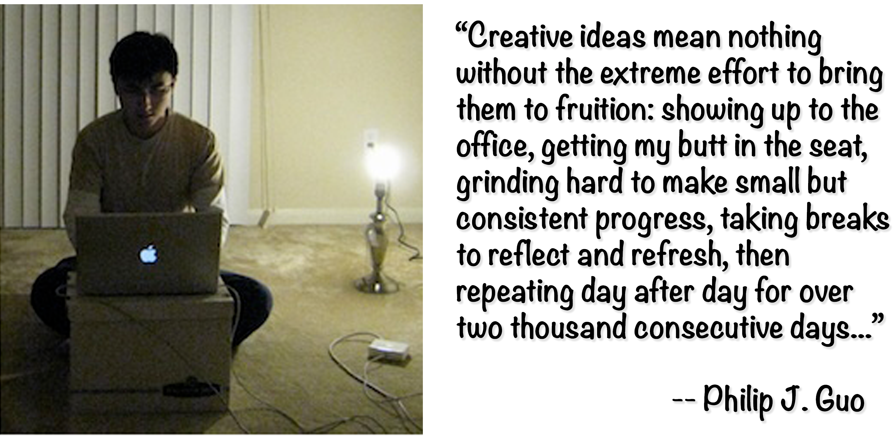

I recently read the amazing short book titled _"The Ph.D. Grind"_ by Prof. Philip Guo. The book (~100 pages) is a compendium of his memories, written right after finishing his Ph.D. in 2012. I felt ecstatic with such a brilliant masterpiece that I could barely put it down once I started. As a Ph.D. student doing research in Computer Science, I sometimes feel like I'm going through a unique and particularly arduous path. Reading this book helped me to deeply understand the singularities and generalities of pursuing a Ph.D. Thus, the big picture is much clearer for me now. I only wish I had read this piece earlier in my Ph.D. career. In this post, besides the ~~obvious~~ recommendation to read this book, I want to share my personal comments regarding some of the author's key reflections.

<figure class="jb_picture">
    
</figure>

Each chapter in _"The Ph.D. Grind"_ is straight to the point; they are even titled with a single word: _Downfall_, _Inception_, _Relapse_, _Reboot_, _Production_, and _Endgame_ -- What can be more succinct than that? In the preface, Philip empathizes that the book only describes his personal experiences as a Ph.D. student. This is an author's precaution to avoid being judged as a generalist in such a sensitive topic: "it is just a single data point," he says. However, while reading his memories, I felt that very much of his experiences might generalize to a large extend. In my opinion, the Ph.D. game has not changed very much in decades.

> "Past performance is not and indicator of future results."
> -- <cite>Philip Guo</cite>

The evolution in the author's mentality about the Ph.D. student role is remarkable. At the start of his journey, Philip considered himself to be a very competent grad student. The reader can appreciate how this winner mentality consistently degrades through the first years of his Ph.D. when he was thrown head-first into large projects without receiving the proper context about how his efforts fit into the big-picture vision of a tenured professor. In the end, he recognized that he lacked the experience necessary to turn his initial ideas into real research projects. Nevertheless, the initial struggles inspired several of his latter Ph.D. projects. In this context, one must understand that a Ph.D. is not the same as a graduate school because you are primarily on your own. A Ph.D. student doesn't have an explicit curriculum to complete. Therefore, a Ph.D. is an entirely different type of challenge, and it is not comparable with any other kind of educational activity.

> "Professors love to repeat the refrain: If it's already been done before, then it wouldn't be research! For the first time, I viscerally felt the meaning of those words."
> -- <cite>Philip Guo</cite>

The author is brutally honest in describing the ups and downs of his Ph.D. trajectory. This is especially relevant today when usually only success stories are advertised on social media, never the failures. During the first two years, Philip lived in complete isolation, mentally burned-out yet still trying to make some gradual progress. The way he describes this particular kind of mental pain is so vivid that it still strikes a sensibility chord on me. Research is often emotionally and mentally all-consuming (he found it almost impossible to shut off his brain and relax for a while). Ph.D. students experience isolation and loneliness from spending day and night grinding on obscure, ultra-specialized problems that few people around understand or even care about. Unfortunately, this a common ailment afflicting Ph.D. students. It seems that the pain is somehow necessary, especially at the beginning. Pursuing a Ph.D. is a lot about overcoming the struggling of trying to do something relevant to science. The convoluted nature of the task should make you feel stupid; if it doesn't, you're not doing it right.

> "My rational brain understood that experimental research in science and engineering fields often involves a tremendous amount of unglamorous, grungy labor to produce results."
> -- <cite>Philip Guo</cite>

Another common experience that Phil illustrates nicely is the contrast between his initial expectations vs. the reality when working on a research project. Doing research is a difficult challenge per se, not only because of the complexity of the technical tasks but due to the uncountable hours of tedious and repetitive labor required to validate research ideas. Professors needed students to do this kind of labor to execute their visions. The author worked on these intensive research activities during his first two years. As he recognizes afterward, being a good soldier is also necessary for research. He noticed how some projects might last longer than individual Ph.D. student "lifetimes". Students may be dispensable for some professors, but as long as the original vision is done and published, then the project is considered a success. Therefore, joining an already initiated research project is a double edge sword. On one hand, you don't start from scratch, but on the other hand, if 
your peers have 
already published the first ideas of that project, it would be tough for you to publish something new about it.

> "It's very hard to publish on a topic if your advisor isn't also obsessively thinking about it, since you're directly competing against other students whose advisors are obsessively thinking about it."
> -- <cite>Philip Guo</cite>

As in many other carriers, it doesn't matter what they say: a Ph.D. is also about people. Finding the right project and person to work with is crucial for the success of any Ph.D. student. In this regard, your supervisor is not only your mentor and the person that will give you the thumbs up when you're ready to write your thesis. Philip discovered the hard way how the future of a research effort heavily depends on the supervisor's personal interest. One of his first projects failed because his supervisor's heart wasn't fully into the project. Good supervisors will not accept working on projects they don't care about, especially at the beginning of the student's path. Of course, it is essential to build your own plan proactively. But you need to be careful because the line that separates a proactive student from a stubborn one is very subtle in the eyes of supervisors. If in doubt, always trust your supervisor! If you have no doubts, anyways, you should always trust your supervisor!

> "Properly calibrating your pitch to the academic sub-community you're targeting is crucial for getting a paper accepted."
> -- <cite>Philip Guo</cite>

Success in academia also depends on research taste. Working on arcane topics can make it very difficult for your work to be known and considered a novel contribution. Philip's Ph.D. started as a continuation of somebody's previous work and finished as a brand-new research field in which he was one of the founders. He noticed that, as a researcher, to achieve success, you need to know about the "rhetorical tricks, newfangled buzzwords, and marketing-related contortions required to satisfy reviewers and get your paper accepted". I agree with this viewpoint. Researching a particular topic also means being part of a ~~small~~ community of people who may care about what you're doing. Thus, your papers should be framed in a way that targets the right community of researchers that are going to review them. Reviewers each have their unique subjective tastes and philosophical biases. Things are easier when the Ph.D. student, and her potential reviewers, speak the same language.

> "I learned about the importance of being endorsed by an influential person; simply doing good work isn't enough to get noticed in a hyper-competitive field."
> -- <cite>Philip Guo</cite>

The purpose of a Ph.D. is to train you to be a professional researcher, forcing you to do some valuable contribution as a proof of your abilities. As a Ph.D. student, you're at the earliest stage of your career as a researcher. Sometimes, having a lot of papers published is not enough to be recognized. One also needs to catch the eyes of at least one "important" person to succeed. Philip understood this very well during his Ph.D. trajectory. On reflection, this fact may be perhaps a bit harsh to some very bright people. But in the context of a highly competitive research environment, those who are successful had learned that to succeed, they need to impress people around. As a Ph.D. student, you couldn't afford to put yourself in a vacuum. Therefore, don't focus on anything that wouldn't progress your career.

> "I had accumulated enough battle scars from the past three years of research failures to develop better intuitions for which ideas might succeed."
> -- <cite>Philip Guo</cite>

The most valuable attribute one can possess is the experience accumulated through the exercise of a specific activity. The only way to gain such experience is to grind hard, failing quickly and learning from it. Philip describes several difficult situations during his time as a Ph.D. student. As he mentions, creative work is rarely fun: "It requires intense focus, rigorous discipline, keen attention to details, high pain tolerance, and an obsessive desire to produce great work". Great ideas are not cheap. Only the experience gained from mental battles can provide the proper intuition to discern between good and bad ideas when doing research.

> "I discovered that this strategy of finding and setting short-term deadlines for myself would work wonders in keeping me focused throughout the rest of my Ph.D. years. Without self-imposed deadlines, it becomes easy to fall into a rut and succumb to chronic procrastination.
> -- <cite>Philip Guo</cite>

Doing research is similar to an engineering discipline, which implies repeatability, rigor, and effective analysis. Working hard is not enough; you also need to work smart and beat procrastination. Setting realistic deadlines (through self-micro-management) is a very effective way to keep pace. Having the ability to recognize the tasks that are not going to get favorable results is crucial. In this regard, the supervisor is the right person to provide the necessary guidance when you feel lost in a research endeavor. The author recognizes that asking for help is a sign of smartness. It means that the student has the perceptiveness and maturity to realize when the research is going nowhere. I wish I had been more focused and open at the beginning of my Ph.D.

> "People don't want to try a new tool unless they can instantly  see major benefits without any drawbacks; researchers simply don't have the time or resources to get their prototypes working well enough to meet these stringent requirements."
> -- <cite>Philip Guo</cite>

Wanted or not, a researcher's job is to create prototypes, experimentally evaluate their effectiveness, write papers, and then move on to the next idea. Thus, academic research aims to produce validated ideas, not polished products (that's the role of companies). Philip was an ardent pragmatic who cared more about achieving compelling, beneficial results rather than demonstrating complex theoretical proofs. He was hit with a lesson in the harshness of real-world deployment: "failures come in unexpected rooms, and once the user gets a bad first impression, then it's over". As a researcher in Computer Science, you need to accumulate enough experience in designing, implementing, and "marketing" research prototypes. However, it is important to understand that professors respect real-world deployment far less than theoretical novelty. Ph.D. students need publications as proof of the legitimacy of their work. So in the end, what you need is to come up with ideas that could potentially lead to publications.

> "My Ph.D. ended successfully because I was able to carry several of my own ideas to fruition and graduate with a dissertation that I was very proud of."
> -- <cite>Philip Guo</cite

Success is what you feel when you win your personal battles. This is what a Ph.D. provides at the end of the road: the fulfillment of winning an arduous and years lasting battle against the world. Of course, the rage of satisfaction is greater if you were the captain of your ship. In my opinion, this is one of the characteristics that sets Philips apart from the rest of Ph.D. students: he was able to implement his own ideas to fruition. In my case, I'm one of the first Computer Science Ph.D. students to identify a pervasive problem ([bloated dependencies](https://link.springer.com/article/10.1007/s10664-020-09914-8)) and to offer [some early-stage prototype solution ([DepClean](https://github.com/castor-software/depclean)) that others can improve upon. Not a big thing, but after all, a Ph.D. is about expanding the boundaries of human knowledge by a minuscule microscopic amount.

> "This accomplishment wouldn't have been possible without a rare combination of great luck, personal initiative, insightful nudges from generous people, and nearly ten thousand hours of grinding."
> -- <cite>Philip Guo</cite

Success is not for free. I'm hinted at by the modesty of Philip when he recognizes that his success was also circumstantial. As in many other success stories, it is about coming up with the right idea at the right time and place and putting in the hours of effort and labor. Throughout these years, I've learned that working hard is crucial but not a guarantee of success. Thus, it is a necessary but not sufficient condition to reach the glory of graduating. Luck knocks on everyone's door at some point, but only a few people are able to recognize its particular sound.
 

# Additional lessons learned

- Spend time finding a good advisor and trust him/her
- Be an early contributor to an up-and-coming area
- Avoid research paralysis and don't procrastinate
- Impose self-discipline and structure on the workdays
- Networking is essential to create professional connections
- Doing internships during the Ph.D. has many advantages
- Asking for help is crucial for the success of any venture, providing help opens many unseens doors as well
- Give and attend talks, expose your work to a broader audience to get real-time feedback from your potential reviewers

# Conclusion

I have difficulty explaining to people what the process of doing a Ph.D. in Computer Science is like, and when trying to answer my friends when asking me if they should do it. In the future, I'll point them to this book. Knowing what goes into a Ph.D. is invaluable in making such a decision, and this book was quite helpful in that regard. As a Ph.D. student, you need to know why you're doing it. In my case, I do it to win a personal battle that pushes my limits so I'll emerge as a stronger person in the end. Of course, there are other ways (e.g., running a start-up, joining a big corporation, etc.). If are seriously considering doing a Ph.D. in Computer Science, this is the book for you. Thank you, Philip, for this timeless gift!

