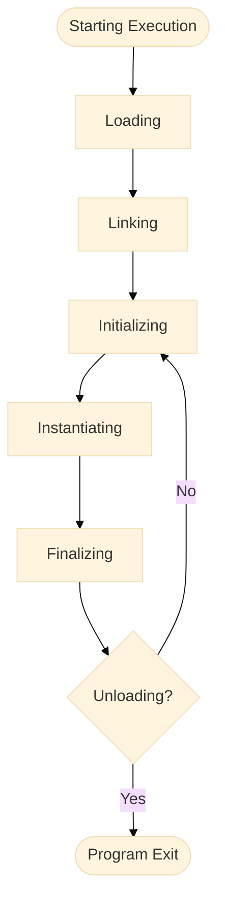

If you are reading this post it's likely that you already know how to ~~write Java~~ code.
That's very good for you, I think everyone should know how to code these days (in the same way everyone should know about basic math operations such as +, -, *, and / even though we all have calculators). 
In a [previous post](../blog/aot-vs-jit-compilation-in-java.html), I wrote about how Java code is first "compiled" to bytecode and later interpreted and **executed** by the JVM.
However, I didn't explained how the JVM actually perform the bytecode execution.
The aim of this article is to fill this gap.
I going to answer the question: What happens when clicking the "execute" button on your favorite IDE?
After reading this post, you will understand the execution lifecycle of a Java application and the activities performed by the JVM during the execution phase.

<figure class="jb_picture">
  
  <figcaption class="stroke"> 
    &#169; Deep knowledge is often a requirement for proper execution. Photo taken at <a href="https://goo.gl/maps/F1qSQuaeJ7wdvnnRA">Kungsträdgården metro station</a>.
  </figcaption>
</figure>

# Execution Lifecycle

The execution lifecycle of a Java application can be broadly divided into three phases:

1. **Compilation:** The source code of the application is converted into bytecode[^2] using the "javac" compiler.
2. **Class Loading:** The bytecode is loaded into memory and the necessary class files are prepared for execution.
3. **Bytecode Execution:** The JVM executes the bytecode and the program runs.
 
The JVM is responsible for managing the last phase. 
This includes loading the bytecode, allocating memory, and converting the bytecode into native machine code.
In other words, the JVM handles the task of translating the bytecode into machine code that is specific to the target platform and executing it.
This is a complex process because each microprocessor architecture "understands" a different set of instructions (e.g., x86, ARM, MIPS, PowerPC, etc.).
The JVM also provides runtime services such as memory management, thread synchronization, and exception handling.

This post is focused on the **bytecode execution phase**.

The following activity diagram illustrates what happens during this phase:

[//]: # (see https://mermaid-js.github.io)

The following sections give more details on each of the activities that occur during the bytecode execution phase.

[//]: # (insert d3 vizualization below)
[//]: # (see https://medium.com/@johnson.leon.t/d3-ds-part-3-542559b53d7f)
[//]: # ({::nomarkdown})
[//]: # (

)
[//]: # ()
[//]: # ({:/nomarkdown})

## Loading

Loading refers to the process of finding the binary form of a class or interface (i.e., a `class` file format) with a particular name and constructing a `Class` object from that binary form.
The JVM uses a [ClassLoader](https://docs.oracle.com/en/java/javase/17/docs/api/java.base/java/lang/ClassLoader.html) to find the binary representation of `Main`.
The `ClassLoader` class and its subclasses implement the loading process.
The method `defineClass` is called to construct `Class` objects from binary representation of the class file format.

JVM provides two types of class loaders: a built-in class loader called the **bootstrap class loader**, which loads the core Java classes from the `rt.jar` file; and the **extension class loader**, which loads classes from the `ext` directory. 
In addition, **application class loaders** can be used to load classes from other locations, such as the classpath or a remote server.
The later are customized subclasses of `ClassLoader` that can load classes via the `java.lang.Class` instance.


public class CustomClassLoader extends ClassLoader {
  public CustomClassLoader(ClassLoader parent) {
    super(parent);
  }
  // Method to load a class given its name
  public Class<?> loadClass(String name) throws ClassNotFoundException {
    if (!name.startsWith("com.example")) {
      // Delegate to the parent class loader
      return super.loadClass(name);
      }
    // The class name does start with "com.example", construct the file name
    String fileName = name.substring(name.lastIndexOf('.') + 1) + ".class";
    // Try to open an InputStream for the file
    InputStream inputStream = getClass().getResourceAsStream(fileName);
    // If the stream is null, throw a ClassNotFoundException
    if (inputStream == null) {
      throw new ClassNotFoundException();
    }
    try {
      // Create a byte array to hold the contents of the file
      byte[] bytes = new byte[inputStream.available()];
      // Read the bytes from the input stream
      inputStream.read(bytes);
      // Define the class using the class name, the byte array, and the number of bytes
      return defineClass(name, bytes, 0, bytes.length);
    } catch (IOException e) {
      throw new ClassNotFoundException();
    }
  }
}


This class extends the `ClassLoader` class and overrides its `loadClass` method to provide custom behavior for loading classes. 
It first checks if the class name starts with "com.example", and if it does not, it delegates to the parent class loader. 
If the class name does start with "com.example", it constructs the file name and tries to open an `InputStream` for it.
If it succeeds, it reads the bytes from the input stream and calls the `defineClass` method to define the class. If it fails, it throws a `ClassNotFoundException`.

In summary, the class loading process performs these three functions:

- Create a binary stream of data from the class file
- Parse the binary data according to the internal data structure
- Create an instance of `java.lang.Class`

When this is done, the class instance is ready for linking.

## Linking

Linking refers to the process of taking a binary form of a class or interface and combining it into the runtime state of the JVM, so that it can be executed. 
Linking involves three steps: verification of the binary representation, preparation of a class of interface, and (optionally) resolution of symbolic references.

1. **Verification:** checks that the loaded representation of a class is well-formed, with a proper symbol table. It also checks that the code that implements the class obeys the semantic requirements of the Java programming languague and the JVM. For example, it checks that every instruction has a valid operation code; that every branch instruction branches to the start of some other instruction, rather than into the middle of an instruction; that every method has a correct signature. 
2. **Preparation:** involves creating the `static` fields (class variables and constants) for a class or interface and initializings such fields to the default values. This involves allocation of static storage and any data structures that are used internally by the implementation of the JVM, such as method tables.[^1]
3. **Resolution:** is the process of checking symbolic references from a class to other classes and interfaces, by loading the other classes and interfaces that are mentioned, and checking that the references are correct.

> "During the static linkage in simple implementations of the C language, a compiled program contains fully-linked version of the program, including completely resolved links to library routines used by the program. 
> Copies of these library routines are included in the `a.out` file.
> In Java, instead, symbolic references are resolved only when they are actively used (i.e., lazy form of resolution).
> For example, if a class has several symbolic references to another class, then the references might be resolved one at a time, as they are used, or perhaps not at all, if these references were never used during execution of a program." 

In summary, the linking process involves three phases:
- Verification
- Preparation
- Resolution (optional)
 
When this is done, the classes are ready for initialization. 

## Initializing

Initialization of a class consists of executing its static initializers and the initializers for `static` fields (class variables) declared in the class.
The static initializers are executed in the order that they appear in the source code.

Consider the following code example, when the JVM initializes the `Main` class, it first initializes all of its superclasses, starting with `Object`.
Since `Object` has no superclass, the recursion stops there.
Then, the JVM initializes `Main` by executing the class variable initializers and static initializers in the order that they appear in the source code.
In this example, the class variable initializer for `x` is executed first, followed by the `static` initializer block, and finally the class variable initializer for `z`.
After the class is fully initialized, the `main` method can be executed.


class Main extends Object {
  // Class variable initializers and static initializers are executed in this order
  static int x = 1;  // Initializer for static field x
  static int y;  // No initializer for static field y
  // Static initializer
  static {
    y = x + 1;
  }
  static int z = x + y;  // Initializer for static field z
  public static void main(String[] args) {
    // Main method is executed after the class is initialized
  }
}


<aside class="quote">
    <em>“Superclasses are initialized before subclasses.”</em>
</aside>

In general, initialization of a class or interface `T` occurs when any of the following circumstances occurs:
- An instance of `T` is created
- A static method of `T` is invoked
- A static field of `T` is assigned
- A static field of `T` is used and the field is not a constant field
- Also note that invocation of a method in a class via reflection causes initialization of the class

Once all classes are initialized, the JVM proceeds to instantiate the classes.

## Instantiating

A new class instance is explicitly created when evaluation of a class instance creation expression is performed (e.g., when using the `new` operator).

A class instance may be implicitly created when:

- Loading a class or interface that contains a string literal or a text block may create a new `String` object
- Execution of an operation that causes boxing conversion may create a new object of a wrapper class
- Execution of a string concatenation operation may create a new `String` object
- Evaluation of a method reference expression or a lambda expression may create a new object of a functional interface

Here's an example of creating a new instance of the class `Point`:


Point magicPoint = new Point(42, 42);


During instantiation, the following steps are performed:

- Memory is allocated on the heap to hold the new object
- The class's constructor is called to initialize the new object
- The reference to the new object is returned

## Finalizing

Finalization is the process of cleaning up the resources held by an object and preparing it for garbage collection.
The class `Object` defines a method `finalize` that is called by the garbage collector when an object is about to be reclaimed.

The JVM defines a `finalize` method in the `Object` class, which can be overridden by subclasses to perform any necessary cleanup actions before the object is garbage collected. 
Here is an example of a class that overrides the finalize method to delete a file when the `TempFile` object is garbage collected:


public class TempFile {
  private File file;
  public TempFile(String filename) {
    file = new File(filename);
  }
  @Override
  protected void finalize() throws Throwable {
    // Delete the file when the TempFile object is garbage collected
    file.delete();
    super.finalize();
  }
}


The previous example can be useful if you want to ensure that temporary files are always deleted when they are no longer needed. 
It's important to note that the `finalize` method is not guaranteed to be called, and it should not be relied upon for important tasks.
It is simply a means of performing cleanup actions before an object is garbage collected.

## Unloading

Unloading refers to the process of removing a class or interface from the runtime state of the JVM (e.g., when its defining class loader is reclaimed by the garbage collector).
Class unloading reduces memory use.
Consequently, this optimization is only significant for applications that load large numbers of classes and interfaces, and that stop to use them after some time.

The following code shows an example of user-defined garbage collection. 
Note that the class `LargeClass` has a large array of integers that consume a lot of memory:


import java.lang.ref.WeakReference;
public class LargeClass {
  // A large array of integers that consumes a lot of memory
  private int[] data = new int[Integer.MAX];
  public static void main(String[] args) {
    // Create a LargeClass object and hold a weak reference to it
    LargeClass largeObject = new LargeClass();
    WeakReference<LargeClass> weakRef = new WeakReference<>(largeObject);
    largeObject = null;  // largeObject is no longer strongly reachable
    // Run the garbage collector
    System.gc();
    // Check if the LargeClass object has been collected
    if (weakRef.get() == null) {
      System.out.println("The LargeClass object has been collected");
    } else {
      System.out.println("The LargeClass object has not been collected");
    }
  }
}


In the previous example, if the `LargeClass` object has been garbage collected, the output will be "The LargeClass object has been collected." Otherwise, the output will be "The LargeClass object has not been collected."

Classes and interfaces loaded by the bootstrap class loader are never unloaded.
Therefore, in typical standalone applications, class unloading is less common because the system `ClassLoader` is usually active for the lifetime of the application, and hence the classes it loads are not unloaded.

Different from garbage collection, class unloading refers to the removal of a class definition (the `Class` object representing the `LargeClass`, in this case) and its associated metadata from the JVM's memory. 
This typically happens when the class loader that loaded the class becomes eligible for garbage collection, as previously explained. 
Class unloading depends on several factors, such as the behavior of the garbage collector and the JVM's implementation details. 

The following example shows a scenario where class unloading is likely to occur:


import java.lang.ref.WeakReference;
import java.net.URL;
import java.net.URLClassLoader;
public class ClassUnloadingExample { 
  public static void main(String[] args) throws Exception {
    // Path to the .class file (make sure this is correctly set)
    URL classUrl = new URL("file:///path/to/LargeClass.class");
    // Creating a custom class loader to load "LargeClass"
    URLClassLoader customClassLoader = new URLClassLoader(new URL[]{classUrl});
    // Load "LargeClass" using the custom class loader
    Class<?> largeClass = Class.forName("LargeClass", true, customClassLoader);
    // Create a weak reference to the custom class loader
    WeakReference<ClassLoader> weakClassLoaderRef = new WeakReference<>(customClassLoader);
    // Clear all strong references to the custom class loader and the class
    customClassLoader = null;
    largeClass = null;
    // Suggesting garbage collection
    System.gc();
    // Wait a moment to increase the likelihood that GC has run
    Thread.sleep(1000);
    // Check if the custom class loader has been garbage collected
    if (weakClassLoaderRef.get() == null) {
      System.out.println("Custom class loader has been garbage collected, indicating that LargeClass might have been unloaded");
    } else {
      System.out.println("Custom class loader is still in memory");
    }
  }
}


In the previous example, a custom class loader is used to load `LargeClass.class` and then clears all references to that class loader, making it eligible for garbage collection.
The program then checks whether the custom class loader has been garbage collected by checking the `WeakReference`.
If the `customClassLoader` has been collected, it is likely that the class it loaded (`LargeClass`) has been unloaded.[^3]

## Program Exit

Program exit refers to the process of terminating the execution of a program. 
This means that all threads that are not daemon threads are terminated, or some thread invokes the `exit` method of the `Runtime` class.
This method halts the JVM and exit with a specified exit code. 
However, the use of this method is restricted by a security manager.
If a security manager is present and it does not allow the program to exit, the `exit` method will throw a `SecurityException`.

# Conclusion

In this article, we took a deeper look at the execution lifecycle of a Java application. 
As discussed, there are many phases that are performed before the typical `main` method is executed.
From loading the class to unloading, the JVM perform a complex series of steps to ensure that the application is executed correctly.
This knowledge is important for developers, as it helps understanding how the JVM works and how to optimize Java applications.
I hope you enjoyed this article and learned something new 😎.

# References

- [The Java Language Specification, Java SE 19 Edition](https://docs.oracle.com/javase/specs/jls/se19/jls19.pdf)
- [Dynamic Class Loading in the Java Virtual Machine](https://dl.acm.org/doi/10.1145/286942.286945)

# Footnotes

[^1]: The method table is an array of pointers to the data for each instance method that can be invoked on objects of that class.
[^2]: The bytecode is a low-level code that can be run on any Java Virtual Machine (JVM).
[^3]: This example is not guaranteed to demonstrate class unloading every time it is run, as garbage collection and class unloading depend on several factors and JVM internals.
