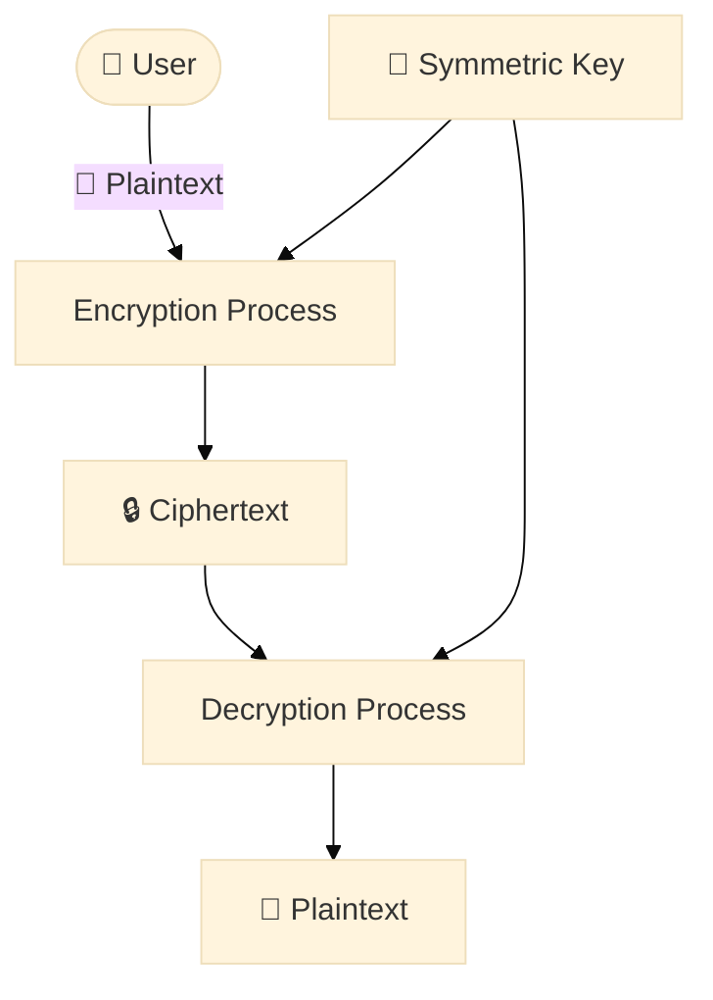

[//]: # (My writing process:)
[//]: # (I start with 3 questions at the top:)
[//]: # (- What problem am I solving?)
[//]: # (- What are the benefits of solving it?)
[//]: # (- What emotion am I generating?)
[//]: # (From these questions, I create:)
[//]: # (- At least 5 headlines)
[//]: # (- The bullet point summary)
[//]: # (Then I fill in the details.)

TODO

---
[//]: # (======================================================================================)

# IMAGE

<figure class="jb_picture">
  
  <figcaption class="stroke"> 
    &#169; TODO
  </figcaption>
</figure>

# QUOTE

> “TODO”
> ― <cite><a href="URL">FULANO DE TAL</a></cite>

# SIDE QUOTE

<aside class="quote">
    <em>“TODO.”</em> 
    ― <cite><a href="URL">FULANO DE TAL</a></cite>
</aside>

# SIDE IMAGE



# DIAGRAM

[//]: # (see https://mermaid-js.github.io)

# CODE


TODO


# VIDEO

  <iframe width="560" height="349" src="https://www.youtube.com/embed/IrFS2e-4gqU" title="YouTube video player" frameborder="1" allow="accelerometer; autoplay; clipboard-write; encrypted-media; gyroscope; picture-in-picture" allowfullscreen></iframe>

# Resources

# Footnotes

