In academic circles, [peer reviewing](https://en.wikipedia.org/wiki/Scholarly_peer_review) is the act of assessing the quality of a research paper to determine if it's worth to be published in a journal or conference.
Peer reviewers are supposed to be (human) experts in the field, and their opinions have direct influence on the final decision taken by the associated editor regarding accepting or rejecting a paper submission.
During the last years, I've peer-reviewed [a good number](../service.html) of research papers submitted to top journals and conferences, mostly within the fields of Software Engineering, Applied Machine Learning, and Sports Sciences.
As a PhD student, I've also played on the other side of the fence, submitting [my own papers](../publications.html) to similar venues and getting all kinds of positive and negative peer reviews in response.
I think this dual perspective has contributed to broadening my understanding of the peer review process.
In hindsight, it's clear to me that there are many challenges to overcome in order to improve peer reviews for the benefit of the academic community.
Specifically, I have noticed a large variance in the quality of many of the reviews I've had the chance to see.[^4]
In this post, I share my personal approach when peer-reviewing research papers. 
I share my reviewer's flow, which I've polished over time in order to deliver a decent peer review within a reasonable amount of time, i.e., my goal is doing it fast and effectively.
Whether you're new to peer reviewing or looking to refine your own approach, you'll ~~probably~~ find some practical tips on this article.
Let's provide good feedback to authors so that they could enhance the quality of their papers!

<figure class="jb_picture">
  {% responsive_image width: "100%" border: "0px solid #808080" path: img/posts/2023/2023-11-12/dansmuseet.jpg alt: "Reviews are a matter of personal taste." %}
  <figcaption class="stroke"> 
    &#169; Beauty and tidiness have always been a matter of personal taste. Photo taken at the <a href="https://maps.app.goo.gl/k3aDzTu7VhFGibBG9">Dansmuseet</a>, in Stockholm, Sweden.
  </figcaption>
</figure> 

# Understanding

First of all, I would like to emphasize that peer reviews represent **personal opinions** regarding the quality and merits of a research paper.
As such, these opinions can sometimes appear biased, contradictory, or even sound plainly foolish (as I have observed more than once).
The history of science is full of [examples](https://www.sciencealert.com/these-8-papers-were-rejected-before-going-on-to-win-the-nobel-prize) of awesome papers that were initially rejected by academic reviewers.[^2]
Nevertheless, the peer review process seems to be the least terrible method that the scientific community has devised (so far) to judge the quality of unofficial science.
Having said that, let's accept the imperfections of peer review(er)s to focus on what we can do as scientist to improve the quality of our deliveries playing the referee role.

# What I Look For?

When receiving an invitation to review a research paper, I first download the PDF and skim through it.
I don't read anything other than the title and maybe the abstract.
I decide to accept reviewing it only based on its presentation (i.e., if it has readable figures, written in $ \LaTeX $, acceptable size, etc.).
I trust that the editor has done a good job at determining if the paper is worth reviewing.

```mermaid
%%{init: {'theme':'base'}}%%
graph TB
    A[👨‍🏫 Author/s submit research paper] --> B[👨‍💼 Editor quick look at the paper]
    B -->|Accepts for review| C[👩‍🔬👨‍🔬👨‍🔬 Peer Reviewers review paper]
    B -->|Desk Reject| D[🚫 Paper Rejected]
    C --> E[👨‍💼 Editor takes a decision]
    E -->|Accept| F[✅ Paper Accepted]
    E -->|Reject| G[❌ Paper Rejected]
    E -->|Request Revisions| H[🔄 Paper Returned to Author]
    H -.-> A
    style C fill:#ffe200,stroke:#333,stroke-width:2px
```

Once I decided to accept the review, I go through a two-step process: 1) First Glance Review and 2) Detailed Review.
Next, I describe what I look for in each of them.

## Quick Review

<aside class="quote">
    <em>“I spot a poorly written paper in 5 minutes or less. When this happens, I know the paper has really no chances to get accepted.”</em> 
</aside>

First, I print the paper just to confirm that it looks good.
A good paper always "feels" nice when printed on paper.
Once I have it in my hands, I search for a **clear novelty claim statement**.
Such a novelty claim is often written somewhere in the introduction section.
It should be generally easy to spot.
It reads like this: "_In this paper, we propose a new method `X` to solve the problem `Y`_".
In most software engineering papers, I've seen it's also common to find a summary of contributions as a list of bullet points at the end of the introduction section.
It reads something like this: "_The contributions of this paper are as follows: `X`, `Y`, and `Z`_".
If I don't easily find a clear novelty claim, or list of contributions somewhere in the paper, then it's a red flag and I start doubting about its quality.
This is because, as a reviewer, I don't want to squeeze my brain to figure out what the paper is all about.

> "The number one reason for me to reject a paper is the lack of novelty. The second reason is related to presentation. From the author's perspective, it is very challenging to "fix" the novelty issue, but there is much that can be done to improve presentation. For example, adding real-world examples, improving the figures, making the paper clearer and more readable, and fixing incomplete sections."

Second, I try to answer myself the following questions, in this order:

1. Do I **understand** the paper after reading its title and abstract? I assume I should not be an expert in the field to understand the key contribution.
2. Is the paper **beautiful**? For me, beautiful means written in $ \LaTeX $, with clear structure, high-quality (vectorial) figures, well-formatted tables, a right amount of references, and a good balance between the text and other visual elements.
3. Does it include **links** to a <i class="fab fa-github"></i> GitHub repository or raw dataset?  Reproducibility is key. I do `⌘ F` or `Ctrl F` and search for `http` hyperlinks.

If the answer to all the previous questions is "Yes!", then I start to look at the paper favorably and focus on helping the authors get it through.[^3]
If my answer to all of them is "No", then I focus on providing evidence to the editor that the paper is not worth publishing.
In any case, a more detailed review follows.

## Detailed Review

<aside class="quote">
    <em>“I think the key to make good review is asking direct questions to the authors regarding specific sections of the paper.”</em> 
</aside>

The detailed review is the most time-consuming part of the process.
I try to impose a self-set time frame of 2 hours to complete it.
My main goal here is to provide constructive feedback to the authors (if the paper is good) or to make it clear to the editor that the paper should not be published (if the paper is bad).

I use the following checklist to guide my review:

- [ ] I think the idea is novel (not done before) and identifies and fills a knowledge gap.
- [ ] I understand the contributions of the paper after reading the introduction.
- [ ] I find the research questions well-defined, relevant, and meaningful.
- [ ] I believe the methodology is rigorous and performed to a high technical standard.
- [ ] I agree that the conclusions are well-supported and linked to the original research questions.
- [ ] I find the citations appropriate and relevant.
- [ ] I enjoy reading the paper because it is well-written, clear, and easy to follow.

If I can check all the boxes, then I would most likely recommend the paper for acceptance.
Otherwise, I become very skeptical and start thinking about the arguments to justify my recommendation to reject it.

# Bad vs. Good Reviews 

<aside class="quote">
    <em>“I've observed that, in general, the better the journal, the better the submitted papers.”</em> 
</aside>

I've seen a ton of bad reviews and a few good ones.
Counterintuitively, I find bad papers are the easiest to review because there are so many things to criticize.
Good papers, on the other hand, require more work to review because I need to be more creative in finding smarter ways they could be improved.
I've also seen a category of papers that are so good that I have little to say.
Those are the hardest to review because I feel incompetent and prone to write a bad review.
In the following sections, I provide examples of what I believe are good and bad reviews, and explain my personal approach to reviewing papers.

## Bad Reviews

Here are some (not so obvious) characteristics of bad reviews:

- The review clearly shows that the reviewer **didn't read** the paper at all. It throws a general chunk of generic text (this happens more often than you think).
- The review is negatively **opinionated**. E.g., "_The paper is not good. The authors should have done a better job._" How? What specifically should they have done differently?
- The review is **vague** and doesn't help to make the paper any better. E.g., "_Figure 3 is not clear._" Why? How can it be improved?
- THe review is destructive instead of supportive. E.g., "_This paper makes no sense_." 
 
Here's a **real example** of a bad review from one of the co-reviewers of one of the papers I've reviewed:


Reviewer 1: 
The article needs significant improvements in its writing,
as it is more similar to a technical report than a scientific article.
The article is written very superficially, with sections written in a
summarized manner. The Introduction section is profusely long and
confusing, while the Methodology is poorly detailed and
fragmented into many brief subsections. The Discussion section lacks
clarity, not adequately detailing the results presented. These, in
turn, are described very vaguely. Furthermore, most of the references
are old.


I think it's worth mentioning that reviewing papers is a selfless, unpaid act of true academic altruism.
It's primarily carried out by academics in their spare time, and these are people under limited time constraints and a lot of pressure to push forward their own research output.
Reviewing papers is an unseen job, and it's not rewarded in any way.[^5]
This explains, among other things, the poor quality of some reviews (but that is a topic for another post).

## Good Reviews

Here are some characteristics of good reviews:

- Provide **supportive criticisms** with evidence from the text or from other sources. E.g., "_Doe et al. [1] have shown that the analysis you use in Section 3 is not the most appropriate for this situation. Please explain why you used this particular method._"
- Provide **actionable suggestions** on how to improve the manuscript. E.g., "_The introduction needs more detail. I suggest that you improve the description in Section 3 to provide more justification for your study (specifically, you should expand upon the knowledge gap being filled)._"
- Provide **irrefutable/verifiable comments** beyond personal opinions. E.g., "_The paper would benefit from a more detailed literature review to provide context for the study. Although your results are compelling, the data analysis should be improved in the following ways: A, B, and C._"
- Provide **balanced comments** on the strengths and weaknesses of the paper. E.g., "_I commend the authors for their extensive data set, compiled over many years of detailed fieldwork. In addition, the manuscript is clearly written in professional, unambiguous language. If there is a weakness, it is in the statistical analysis (as I have noted above), which should be improved upon before acceptance._"

I always use a simple template in plain text form to guide my review.
It helps me enter into my **reviewer's flow** and ensures I don't forget anything.
Notice that all journals have their own editorial management systems, and they usually provide a form to fill in the review.
So I recommend using Google Docs or similar instead of PDFs to write your review, so you can copy-paste it into the journal's system.

<figure class="jb_picture">
  {% responsive_image width: "100%" border: "1px solid #808080" path: img/posts/2023/2023-11-12/jss-reviewer-portal.png alt: "Reviewer's form for the Journal of Systems and Software" %}
  <figcaption class="stroke"> 
    Figure 1. Screenshot of the reviewer's form for the <a href="https://www.sciencedirect.com/journal/journal-of-systems-and-software">Journal of Systems and Software</a>.
  </figcaption>
</figure>

Good reviews have a known structure that is easy to follow and understand, for example:


Title: [Paper's Title]

**Summary**

One-paragraph summary of the paper.

**Positive Aspects**

Bullet list in decreasing order of relevance.

Example:
- The topic is relevant and timely.
- The idea is novel and fills a knowledge gap.
- The conclusion makes sense.

**Major Inconsistencies**

Bullet list of major issues in decreasing order of relevance.

Example:
- The paper is not novel, it was done before by John Doe in 1984 [1].
- The methodology is not rigorous, it's clearly flawed.
- The conclusions are not backed by the results.

**Minor Inconsistencies**

Bullet list of minor issues in decreasing order of relevance.

Example:
- Figure 3 is not clear.
- Paragraph 2 in section 3 is redundant.
- Terminology is not consistent.

**Questions and Remarks to the Authors**

Bullet list of direct questions to the authors regarding major issues.

**Nitpicking**

Bullet list of minor issues (e.g., typos, grammar, etc.).
- Page 3, line 4: "the" should be "they."
- Figure 2: the font is too small.
- Figure 4 is unclear and could benefit from a higher resolution.

**Comments to the Editor**

Key points to justify my recommendation to
accept, accept after minor revisions, major revision, or reject.

Example:
The paper is a valuable addition to the field of [field],
with potential implications for [applications]. 
I recommend acceptance after moderate revisions as outlined above.


It's a good practice looking at the reviewer's guidelines in each particular journal.[^1]
Sometimes they provide a list of specific questions that reviewers should answer when reviewing a paper.
When peer reviewing, I believe it is essential to provide balanced feedback by offering constructive criticism that includes suggestions for improvement.
It's also important to begin by recognizing the strengths of the work, which motivate the authors.
I always make an effort to double-check that my feedback is clear and objective, backing points with evidence and tyring to remain impartial.
I treat the authors as "you" in my review, and I write in first-person pronoun "I" to make it more personal.
This makes clear that I'm not a GPT chatbot but "an opinionated person" with a taste for good science. 

# Common Reviewer's Phrases (Bonus Section)

Here are some common phrases that I use when looking for nitpicking issues:

- The sentence `X` is **cryptic**.
- The paragraph `X` is **redundant**.
- The word `X` is **unnecessary**.
- The paragraph `X` is **orphan**, merge with the previous one or extend.
- The arguments in paragraph `X` are quite **subjective**, specify.
- Add more concrete **examples** for `X` and `Y`.
- The idea `X` is interesting, **elaborate** more on it.
- The variable `X` is not well-defined, **clarify**.
- For sake of understanding, **rephrase** the sentence `X`.

# Last Thoughts

Becoming an effective peer reviewer is an essential aspect of academic life.
It's also a good opportunity to stay up to date with what's going on in our research field.
Consequently, I tend to accept most reviewer requests from good journals.
As more reviews come in, I think that adopting structured, thoughtful, and ethical reviewing practices is essential.
With this, I not only to contribute to the advancement of science but also enhance my own understanding and reputation in the field.
In essence, the quality of peer review lies in balancing rigorous critique with constructive support, always aiming to foster scientific progress, for the benefit of the authors, the reviewers, and the wider research community.

# External Resources

- [:earth_americas: Peer fortress: The scientific battlefield](https://matt.might.net/articles/peer-fortress/)
- [:earth_americas: Review a Research Paper: Constructive Critique in Five Steps](https://www.yegor256.com/2023/12/17/how-to-review-research-paper.html)
- [:earth_americas: How to Write a Peer Review: 12 things you need to know](https://clarivate.com/blog/how-to-write-a-peer-review-12-things-you-need-to-know/)

# Footnotes

[^1]: For example, [here](https://ieeeaccess.ieee.org/about-ieee-access/announcements/reviewerbestpractices_ieeeaccess/) are the reviewer guidelines for _IEEE Access_, and [here](https://dl.acm.org/journal/tosem/reviewers) for _ACM Transactions on Software Engineering and Methodology_. Notice how vague some of these suggestions are.

[^2]: For example, [the PageRank algorithm](https://doi.org/10.1016/S0169-7552(98)00110-X) by Larry Page and Sergey Brin, which later became the foundation of Google’s search engine, was not fully appreciated by early reviewers. The proposed approach to ranking web pages based on links fundamentally changed the internet and greatly contributed to Google’s dominance in the field of web search.

[^3]: I personally don’t care about the authors' prestige, but some people certainly do.

[^4]: Overall, I believe the general quality of reviews is poor. Improving the quality of reviews is a problem that I think needs to be addressed by the institutions that benefit directly from the research.

[^5]: Some efforts have been made to reward reviewers, such as [Publons](https://publons.com/) and [Web of Science](https://clarivate.com/). However, these platforms lack direct rewards, beyond digital badges and certificates, and are not widely recognized by the academic community.

