[//]: # (I'm solving the problem of developers not realizing the implications of trusting compilers and other foundational tools in the software development process. )
[//]: # (The benefits of solving this problem are raising awareness about the risks associated with compromised tools and encouraging secure development practices. )
[//]: # (The emotion I'm generating is curiosity and caution.)

Let me ask: 
_Would you trust a cracked version of [Adobe Photoshop](https://en.wikipedia.org/wiki/Adobe_Photoshop) downloaded from a random website?_
I hope your answer is a radical "no."
But what if I ask you instead:
_Do you trust the latest financial transaction processed by your bank's mobile app?_
You probably do believe that your payment will be processed securely.
Certainly, our sense of "trust" in a software application varies significantly depending on its origins, and on the reputation of its distributor.
Now, what if I tell you that there exists certain "proof" that **no matter what the software origin is, you should never trust it?**
This is, in essence, what Ken Thompson claimed during his Turing Award lecture, in 1984.
In his article "Reflections on Trusting Trust," Thompson demonstrated that you cannot trust code that you did not totally create yourself.
His proof was based on the idea that it is possible to insert a [backdoor](https://en.wikipedia.org/wiki/Backdoor_(computing)) into a compiler that would propagate itself invisibly into all programs compiled with it (including the next versions of the same compiler).
Thus, creating a self-replicating chain of compromised software applications.
The "Trojan Horse compiler," as he called it, highlights the fundamental issue of trust in software development, independent of the security measures or reputation of software vendors.
In this post, I'll revisit Thompson's famous proof of distrust, 40 years later.
My goal is to reflect on the transcendence of its core message.
I'll dive into the implications it poses to [the software supply chain landscape](../blog/the-software-supply-chain.html) as it is today.
Let's dig in.

<figure class="jb_picture">
  {% responsive_image width: "100%" border: "0px solid #808080" path: img/posts/2023/2023-12-27/cross_t_centralen.jpg alt: "TODO" %}
  <figcaption class="stroke"> 
    &#169; The legend tells: there's always a backdoor! Photo from Stockholm's <a href="https://goo.gl/maps/57JsiWkcPKBbXWve8">Central Station</a>.
  </figcaption>
</figure>

# What Is It All About?



[Ken Thompson](https://en.wikipedia.org/wiki/Ken_Thompson) is a prolific Computer Scientist known for being one of the original creators of the UNIX operating system, together with [Dennis Ritchie](https://en.wikipedia.org/wiki/Dennis_Ritchie) in the early 70s.
He created the [B programming language](https://en.wikipedia.org/wiki/B_(programming_language)), a [precursor](https://www.bell-labs.com/usr/dmr/www/chist.html) of C.
[Thompson and Ritchie received the Turing Award](https://amturing.acm.org/award_winners/thompson_4588371.cfm) in 1983 "for their development of generic operating systems theory and specifically for the implementation of the UNIX operating system."
UNIX was the foundation of many modern operating systems, including Linux, macOS, and Android.

In [his Turing Award lecture](https://dl.acm.org/doi/10.1145/358198.358210 ), Thompson presented a chilling idea that has become one of the most famous in the history of cybersecurity.
He described a theoretical attack that could be carried out by modifying a compiler to insert a backdoor into the UNIX `login` command.
The core idea is that the compromised compiler is able to recognise what it is compiling, and is therefore able to insert itself back into the compiler even when that backdoor is no longer within its source code.
I know it sound a bit confusing, so let's break it down from the beginning.

## Bootstrapping Compiler

 A [compiler](https://en.wikipedia.org/wiki/Compiler) is a software that translates source code written in a high-level programming language that humans can read into highly optimized [machine code](https://en.wikipedia.org/wiki/Machine_code) that computers can execute directly.
Compilers are the backbone of software development.
Note that compilers are software too.
This means that they are also written in a programming language, thus to create a compiler one has to use another compiler.

Creating the first version of a compiler is an intriguing process, referred to as [bootstrapping compiler](https://en.wikipedia.org/wiki/Bootstrapping_(compilers)).
The idea is to incrementally develop the full compiler, starting from a very basic one, until a full-fledged, self-hosting compiler is created.
For example, in the case of the C programming language, the first version of the compiler was written in a basic assembly language which can understand a minimal subset of C.
Then, the initial compiler was used to write a slightly more advanced C compiler using the minimal subset of C that the initial compiler can handle.
This process is repeated until a full C compiler is created that can compile itself.
This full C compiler can [compile its own source code](http://sens.cse.msu.edu/Software/Telelogic-3.5/locale/english/help/htmlhlp/comptheory.html), as well as any other C programs.
The figure below illustrates the process of creating such a self-hosting compiler.

```mermaid
%%{init: {'theme':'base'}}%%
graph TB
    P1["👨‍💻 Very smart person/s"] --> |"create"| A["1️⃣ Initial C compiler in Assembly (C1)"]
    A --> |"compile"| B["2️⃣ Minimal C compiler (C2)"]
    B --> |"compile"| C["3️⃣ Intermediate C compiler (C3)"]
    C --> |"compile"| D["4️⃣ Full C compiler (C4)"]
    D --> |"full compiler can compile itself"|D 
    D --> |"use"| P2["👩‍💻 No so smart person (me) uses the full compiler"]
```



What is interesting in the previous figure is that the full C compiler (C4), which can compile itself as well as any other C programs, keeps some kind of "memory" of the previous compilers because it shares part of their implementation. 
So the question is: _What if one of the previous compilers, such as the initial C1, had a backdoor?_ 
According to Thompson, this would imply that the backdoor could be perpetuated across all subsequent versions of the compiler.

## The Trojan Horse Compiler

If a backdoor is inserted into the source code of a compiler, it can be detected by inspecting the source code.
However, Thompson's idea was to insert a backdoor into the compiler itself, not into its source code.
In such a way that even if the source code of C4 appears to be clean, the backdoor can be reinserted during the compilation process through the use of [self-replicating code](https://en.wikipedia.org/wiki/Quine_(computing)).
The figure below illustrates Thomson's idea of creating a self-replicating compiler with a backdoor.

```mermaid
%%{init: {'theme':'base'}}%%
graph TD
    
    B["🔧 Original Compiler (C1)"]
    M["😈 Thomson"] -->|inserts backdoor| B
    B -->|includes self-replicating code| D["🛠️ New Compiler (C2)"]
    D --> |compiles into| F["🐍 Modified Compiler with Backdoor (C3)"]
    F --> |application binaries|G["📦 Compiled Applications with Backdoor"]

    H["👨 User"] -->|writes| S["📄 Application Source Code"]
    S -->|compiles using| F

    subgraph " "
        direction TB
        B
        D
        F
    end
    
    classDef compilerStyle fill:#f9f,stroke:#333,stroke-width:1px;
    class B,D,F compilerStyle;
```



The backdoor is inserted into the original compiler (C1) and then propagated to all subsequent versions of the compiler, C1 to C2 to C3.
When a user compiles an application using the latest version of the compiler (C3), the backdoor is inserted into the compiled application binaries because the previous versions of the compiler (C1 and C2) contained executable code that could insert the backdoor during the compilation process.
This means that the backdoor is present in all applications compiled with the compromised compiler, even if the source code of the applications is clean.

Let's dive more into this with an illustrative example.

## Self-Replicating Program (Quine)

It is possible to write a program that replicates itself? 
The answer is yes, and it is called a [Quine](https://en.wikipedia.org/wiki/Quine_(computing)).
A Quine is a computer program that takes no input and produces a copy of its own source code as its only output.
Quines are possible in any [Turing-complete programming language](https://en.wikipedia.org/wiki/Turing_completeness), as a direct consequence of [Kleene's recursion theorem](https://en.wikipedia.org/wiki/Kleene%27s_recursion_theorem).

Let's create an example of a self-replicating program in Java to illustrate how a modified compiler could inject malicious behavior into a Java program.
This is the core idea behind the backdoor compiler concept described by Thompson.
The basic idea is that a compiler (`javac`) can be modified to insert malicious code into any program it compiles, even if the original source code is clean.

This requires:
1. A modified version of the Java compiler (javac).
2. A demonstration Java program that shows the injected behavior.

Let's start with a simple Java program that prints "Hello, World!".

```java
// HelloWorld.java
public class HelloWorld {
    public static void main(String[] args) {
        System.out.println("Hello, World!");
    }
}
```

Now the malicious actor modifying the javac compiler to inject malicious code. 

This involves two steps:

1. Find the part of the javac source code that handles the generation of the bytecode for the `main` method.

2.  Modify the compiler to insert additional instructions that execute malicious behavior, such as printing an unauthorized message or performing an unexpected action.

Conceptual pseudo-code for the modified compiler:

```java
// Pseudo-code for a modified compiler
public class ModifiedCompiler {
    public void compile(String sourceCode) {
        // Parse the source code
        // Generate bytecode for the main method
        if (sourceCode.contains("public static void main")) {
            // Inject malicious behavior
            String maliciousCode = "System.out.println(\"Injected by malicious compiler!\");";
            // Add the malicious code to the bytecode
            // (This is a simplified representation)
            sourceCode = injectMaliciousCode(sourceCode, maliciousCode);
        }
        // Continue with the normal compilation process
    }
    private String injectMaliciousCode(String sourceCode, String maliciousCode) {
        // Insert the malicious code into the main method
        int mainMethodIndex = sourceCode.indexOf("public static void main");
        int insertionPoint = sourceCode.indexOf("{", mainMethodIndex) + 1;
        return sourceCode.substring(0, insertionPoint) + "\n" + maliciousCode + sourceCode.substring(insertionPoint);
    }
}
```

Assuming we have the modified compiler in place. 
Now we compile `HelloWorld.java` using this compiler.

```bash
javac -cp . ModifiedCompiler HelloWorld.java
```

After compiling, running the program would exhibit the injected behavior.

```bash
java HelloWorld
```

Expected output:

```
Hello, World!
Injected by malicious compiler!
```

A real-world implementation of this concept would be significantly more complex, involving deep understanding of compiler design and bytecode manipulation.


# Implications

## Software Supply Chain Attacks

Explores how Thompson’s work laid the foundation for understanding software supply chain attacks, emphasizing the importance of securing compilers and other foundational tools.

## Trust and Verification

Explores the implications of Thompson’s work on the software development lifecycle, emphasizing the need for trust and rigorous verification mechanisms.

## Current Challenges

Analyzes the difficulty in detecting malicious modifications in compilers and other foundational software tools, given their deep integration into the system.

# Why Is This important?

Cybersecurity threats are everywhere these days.
I hear about them everywhere: in tech media, at events, and more and more in the public news.
From ransomware attacks[^1] to data breaches, the risks of cyber threats are real and growing.
The sophistication of attacks increases at the same peace as the complexity of software does.
And with every new added feature, the threat exposure grows.

> "An open-source software supply chain attack is the nefarious alteration of a trusted open-source component used later in a trusted program."

In most cases, we assume the existence of a malicious actor trying to exploit vulnerabilities in our systems.
In particular, the [software supply chain](../blog/the-software-supply-chain.html) has become a prime target for attackers.
Indeed, it's not difficult today foreseeing large-scale attacks on software repositories or package managers.
But... what if the threats were (already) hidden in the tools we use (and trust) to build the software itself?
Or in other words: to what extent do you trust the output of your favorite compiler?
This is the question that Ken Thompson, co-creator of Unix, raised in his 1984 during Turing Award lecture.

In this talk, Thompson brilliantly demonstrates that "You can't trust code that you did not totally create yourself."
I the way he proved this assertion made absolutely fascinating.
Forty years ago, open source software was not as prevalent as it is today.
There were no package managers, no GitHub, no GitLab, no Bitbucket.
Yet, he foresaw the risks of trusting software tools and compilers.

Today, creating software from scratch is not a realistic option.
Every component, every library, every tool we use in the software development is composed of open source code, libraries, and compilers.
For its implications, "Reflections on Trusting Trust" could be one of the most bold and thought-provoking ideas in the history of cybersecurity.


# Conclusions

It highlights the potential risks associated with trusting software tools and emphasizes the need for secure development practices and vigilant code review processes.

This example underscores the importance of secure compiler development and rigorous code audits to prevent such vulnerabilities.

Concludes with thoughts on the continuing relevance of trust in software development and the ongoing efforts to secure software against sophisticated attacks.

Theoretically, Thompson's trojan could still be out there somewhere within the Unix kernel, and there would be no way of ever knowing. Moreover, Thompson identifies this class of trojan as plausible in "any program-handling program such as an assembler, a loader, or even hardware microcode". Even if you were to go and download the GCC source code and build your own compiler from source, you must do so with a potentially compromised version of the compiler. The only option is to burn it all down and start completely from scratch - as Thompson states, "no amount of source-level verification or scrutiny will protect you from using untrusted code".

<figure class="jb_picture">
  {% responsive_image width: "75%" border: "1px solid #808080" path: img/posts/2023/2023-12-27/kent-thompson-moral.png alt: "Kent Thompson's moral" %}
  <figcaption class="stroke"> 
    Let's say it again: "You can't trust code that you did not totally create yourself."
  </figcaption>
</figure>

# External Resources

- [Running the “Reflections on Trusting Trust” Compiler](https://research.swtch.com/nih)
- [Open Source Supply Chain Security at Google](https://research.swtch.com/acmscored)
- https://youtu.be/SJ7lOus1FzQ?si=8t9RBRR671xRX_Rn
- [Compilers: Principles, Techniques, and Tools](https://en.wikipedia.org/wiki/Compilers:_Principles,_Techniques,_and_Tools)

# Footnotes

[^1]: Ransomware attacks are one the most common these days. The attacker encrypts the victim's data and demands a ransom for its release. The surge of untraceable cryptocurrencies such as Bitcoin has made it easier for attackers to demand and receive payments without being identified.


