Let me ask:
_Would you trust a cracked version of [Adobe Photoshop](https://en.wikipedia.org/wiki/Adobe_Photoshop) downloaded from a random website?_
I hope your answer is a resounding "no."
But what if I asked you instead:
_Do you trust the latest financial transaction processed by your bank's mobile app?_
You probably believe that your payment will be processed securely.
Certainly, our sense of "trust" in a software application varies significantly depending on its origins and the reputation of its distributor.
Now, what if I told you that there exists certain "proof" that **no matter what the software's origin is, you should never trust it**.
This is, in essence, what Ken Thompson claimed during his Turing Award lecture in 1984.
In his article "Reflections on Trusting Trust," Thompson demonstrated that it is possible to insert a [backdoor](https://en.wikipedia.org/wiki/Backdoor_(computing)) into a compiler that would propagate itself invisibly into all programs compiled with it (including the next versions of the same compiler).
Thus, creating a self-replicating chain of compromised software applications.
The "Trojan Horse compiler," as he called it, highlights the fundamental issue of trust in software development, independent of the security measures or reputation of software vendors.
In this post, I'll revisit Thompson's famous proof of distrust, 40 years later.
My goal is to reflect on the transcendence of its core message.
I'll dive into the implications it poses for the [software supply chain](../blog/the-software-supply-chain.html) landscape as it is today.
Let's dig in.


<figure class="jb_picture">
  {% responsive_image width: "100%" border: "0px solid #808080" path: img/posts/2023/2023-12-27/cross_t_centralen.jpg alt: "TODO" %}
  <figcaption class="stroke"> 
    &#169; The legend tells: there's always a backdoor! Photo from Stockholm's <a href="https://goo.gl/maps/57JsiWkcPKBbXWve8">Central Station</a>.
  </figcaption>
</figure>

# What Is It All About?



[Ken Thompson](https://en.wikipedia.org/wiki/Ken_Thompson) is a prolific computer scientist known for being one of the original creators of the UNIX operating system, along with [Dennis Ritchie](https://en.wikipedia.org/wiki/Dennis_Ritchie) in the early 1970s.
 He created the [B programming language](https://en.wikipedia.org/wiki/B_(programming_language)), a precursor to C. 
Thompson and Ritchi  [received](https://amturing.acm.org/award_winners/thompson_4588371.cfm) the Turing Awardin 1983 "for their development of generic operating systems theory, and specifically for the implementation of the UNIX operating system." 
UNIX was the foundation of many modern operating systems, including Linux, macOS, and Android.

In [his Turing Award lecture](https://dl.acm.org/doi/10.1145/358198.358210), Thompson presented a chilling idea that has become one of the most famous in the history of cybersecurity.
He described a theoretical attack that could be carried out by modifying a compiler to insert a backdoor into the UNIX `login` command. 
The core idea is that the compromised compiler is able to recognize what it is compiling and can reinsert the backdoor into the compiler even when the backdoor is no longer present in the source code.
I know it sounds a bit confusing, so let's break it down from the beginning.

## Bootstrapping a Compiler

A [compiler](https://en.wikipedia.org/wiki/Compiler) is a software that translates source code written in a high-level programming language that humans can read into highly optimized [machine code](https://en.wikipedia.org/wiki/Machine_code) that computers can execute directly.
Compilers are the backbone of software development.
Note that compilers are software too.
This means that they are also written in a programming language, thus to create a compiler one has to use another compiler.

Creating the first version of a compiler is an intriguing process, referred to as [bootstrapping compiler](https://en.wikipedia.org/wiki/Bootstrapping_(compilers)).
The idea is to incrementally develop the full compiler, starting from a very basic one, until a full-fledged, self-hosting compiler is created.
For example, in the case of the C programming language, the first version of the compiler was written in a basic assembly language which can understand a minimal subset of C.
Then, the initial compiler was used to write a slightly more advanced C compiler using the minimal subset of C that the initial compiler can handle.
This process is repeated until a full C compiler is created that can compile itself.
This full C compiler can [compile its own source code](http://sens.cse.msu.edu/Software/Telelogic-3.5/locale/english/help/htmlhlp/comptheory.html), as well as any other C programs.

The figure below illustrates the process of creating such a self-hosting compiler:



```mermaid
%%{init: {'theme':'base'}}%%
graph TB
    P1["👨‍💻 Very smart person/s"] --> |"create"| A["1️⃣ Initial C compiler in Assembly (C1)"]
    A --> |"compile"| B["2️⃣ Minimal C compiler (C2)"]
    B --> |"compile"| C["3️⃣ Intermediate C compiler (C3)"]
    C --> |"compile"| D["4️⃣ Full C compiler (C4)"]
    D --> |"full compiler can compile itself"|D 
    D --> |"use"| P2["👩‍💻 No so smart person (me) uses the full compiler"]
```

What is interesting in the previous figure is that the full C compiler (C4), which can compile itself as well as any other C programs, keeps some kind of "memory" of the previous compilers because it shares part of their implementation. 
So the question is: _What if one of the previous compilers, such as the initial C1, had a backdoor?_ 
According to Thompson, this would imply that the backdoor could be perpetuated across all subsequent versions of the compiler.

## The Trojan Horse Compiler

As we saw before, compilers are sofware artifacts written in a programming languague.
If a backdoor is inserted into the source code of a compiler, it can be detected by inspecting the source code.
However, Thompson's idea was to insert a backdoor into the compiler executable itself, not into its source code.
The trick was doing it in such a way that even if the source code of C4 appears to be clean, the backdoor can be reinserted during the compilation process through the use of [self-replicating code](https://en.wikipedia.org/wiki/Quine_(computing)).

> "The key part of Thompson's genius was to make the compiler recognize when it was compiling a new version of itself (i.e., compiling the source code of the compiler)."

The figure below illustrates Thomson's idea of creating a self-replicating compiler with a backdoor.

```mermaid
%%{init: {'theme':'base'}}%%
graph TD
    
    B["🔧 Original Compiler (C1)"]
    M["😈 Thomson"] -->|inserts backdoor| B
    B -->|includes self-replicating code| D["🛠️ New Compiler (C2)"]
    D --> |compiles into| F["🐍 Modified Compiler with Backdoor (C3)"]
    F --> |application binaries|G["📦 Compiled Applications with Backdoor"]

    H["👨 User"] -->|writes| S["📄 Application Source Code"]
    S -->|compiles using| F

    subgraph " "
        direction TB
        B
        D
        F
    end
    
    classDef compilerStyle fill:#f9f,stroke:#333,stroke-width:1px;
    class B,D,F compilerStyle;
```



As we can see, the backdoor is inserted into the original compiler (`C1`) and then self-propagated to all subsequent versions, `C1` to `C2` to `C3`.
When a user compiles an application using the latest version of the compiler (`C3`), the backdoor is inserted into the compiled application binaries because the previous versions of the compiler (`C1` and `C2`) contained executable code that recognizes it and then insert the backdoor during the compiler's compilation process.
Even if developers review the source code of the compiler, they won't see any malicious code.
This means that the backdoor is present in all applications compiled with the compromised compiler, even if the source code of the applications is clean.

Let's dive more into this with an illustrative example.

## Example

Is it possible to write a program that replicates itself? 
The answer is affirmative.
Such programs are called [Quines](https://en.wikipedia.org/wiki/Quine_(computing)).[^2]
A Quine is a computer program that takes no input and produces a copy of its own source code as its only output.
Quines can be made in any [Turing-complete programming language](https://en.wikipedia.org/wiki/Turing_completeness), as a direct consequence of [Kleene's recursion theorem](https://en.wikipedia.org/wiki/Kleene%27s_recursion_theorem).
They are the core idea behind the backdoor compiler concept described by Thompson.

Let's create an example of a self-replicating program in Java.
It will be useful later to illustrate how a modified compiler could inject malicious behavior into a Java program.
The basic idea is that the `javac` compiler could be modified to insert malicious code into any program it compiles, even if the original source code is clean.

This requires:

1. A modified version of the `javac`.
2. An example of Java program that shows the injected behavior.

Let's start with the typical "Hello, World!" program:


// HelloWorld.java
public class HelloWorld {
    public static void main(String[] args) {
        System.out.println("Hello, World!");
    }
}


Now the malicious actor modifying the `javac` compiler to inject malicious code. 

This involves two steps:

1. Find the part of the `javac` source code that handles the generation of the bytecode for the `main` method.
2. Modify the compiler to insert additional instructions that execute malicious behavior, such as printing an unauthorized message or performing an unexpected action.

Here's a conceptual pseudo-code for the modified compiler:


public class ModifiedCompiler {
    public void compile(String sourceCode) {
        // Parse the source code and generate bytecode for the main method
        if (sourceCode.contains("public static void main")) {
          // Inject malicious behavior
          String maliciousCode = "System.out.println(\"Injected by malicious compiler!\");";
          // Add the malicious code to the bytecode (this is a simplified representation)
          int mainMethodIndex = sourceCode.indexOf("public static void main");
          int insertionPoint = sourceCode.indexOf("{", mainMethodIndex) + 1;
          Sting sourceCode = ourceCode.substring(0, insertionPoint) + "\n" + maliciousCode + sourceCode.substring(insertionPoint);
        }
        // Continue with the normal compilation process
    }   
}


Assuming we have compiled the modified compiler, now we compile `HelloWorld.java` using this compiler:

```bash
javac -cp . ModifiedCompiler HelloWorld.java
```

After compiling, running the program would exhibit the injected behavior:

```bash
java HelloWorld
```

Expected output:

```
Hello, World!
Injected by malicious compiler!
```

The key part of the previous example is in the `if` clause, which allows the compiler to detect _what_ it's compiling and react in response.
We could imagine that this could be anything: the source code of a compiler, the password for the UNIX operating system, or the credentials for a specific application.

Here're is and example in which a password field is detected and a `MASTER_PASSWORD` inserted to allow access to the application:


if (sourceCode.contains("password")) {
            // Inject malicious behavior
            int mainMethodIndex = sourceCode.indexOf("public static void main");
            int insertionPoint = sourceCode.indexOf("{", mainMethodIndex) + 1;
            String maliciousCode = "\ntry {\n"
                                 + "String userPassword = getPasswordFromUser();\n"
                                 + "if (userPassword.equals(\"" + MASTER_PASSWORD + "\")) {\n"
                                 + "System.out.println(\"Master password accepted. Access granted.\");\n"
                                 + "} else {\n"
                                 + "System.out.println(\"User password: \" + userPassword);\n"
                                 + "}\n"
                                 + "} catch (Exception e) { e.printStackTrace(); }\n";
            sourceCode = sourceCode.substring(0, insertionPoint) + maliciousCode + sourceCode.substring(insertionPoint);
        }
}


Note that even if the source code of the `HelloWorld.java` program is inspected and found to be clean, the compiled output will still contain the injected malicious behavior. 
This occurs because the malicious code is added by the modified compiler during the compilation process, making it invisible in the original source code. 
Thompson claims that if, at any point, a developer inserted such malicious behavior into the compiler itself, it would be nearly impossible to detect. 
The backdoor would perpetuate itself, as the compiler would continue to insert the malicious code into every program it compiles, including new versions of the compiler, making the malicious behavior deeply embedded and hidden to its users.

# Implications

Cybersecurity threats are everywhere these days. 
From tech media to public new, we are constantly bombarded with reports of ransomware attacks[^1], data breaches, and other cyber threats. 
As software complexity increases, so does the sophistication of these attacks. 
Each new feature added to software can expand the attack surface, making security an ever-moving target.

In most discussions about cybersecurity I've seen, the focus is mostly on the malicious actors who exploit vulnerabilities in the systems.
The [software supply chain](../blog/the-software-supply-chain.html),[^3] in particular, has become a primary target for attackers.
Large-scale attacks on software repositories and package managers are becoming treading because its scale and consequences. 

Ken Thompson’s seminal 1984 Turing Award lecture forces us to ask deeper questions: 

- _What if the threats are already embedded in the very tools we trust to build our software?_
- _Can we truly trust the output of our favorite compiler?_

Thompson’s demonstration reveals two hard truths:

- Software tools themselves can be compromised in ways that are nearly undetectable through normal inspection methods.
- Trust in software tools must extend beyond source code inspection to encompass the entire toolchain used to produce software. 

**Trust is a Problem:** Thompson's demonstration underscores that trust in software extends beyond the visible source code to the entire compilation process. The implications are clear: if the compiler or any other tool in the toolchain is compromised, every piece of software it produces is potentially compromised as well. This creates a nearly invisible security risk, as traditional inspection methods may not detect such deep-seated vulnerabilities.

**Software Supply Chain Attacks:** Thompson’s work laid the foundational understanding of software supply chain attacks, emphasizing the necessity of securing compilers and other fundamental tools. His reflections make it evident that the security of the entire software ecosystem hinges on the integrity of these tools. A compromised compiler can silently insert vulnerabilities into any software it compiles, making it critical to not only trust but also rigorously verify the tools used in the compilation process.

**Current Challenges:** Detecting malicious modifications in compilers and other foundational tools remains a daunting task. These tools are deeply integrated into our systems, and their integrity is often assumed rather than verified. The challenge is further compounded by the sophistication of modern cyber threats, which can exploit even the slightest vulnerabilities in our software development processes.


# Conclusions

As we reflect on Ken Thompson’s lecture 40 years later, it becomes clear that his insights are more relevant than ever. 
The need for robust verification mechanisms, secure development practices, and a healthy skepticism of the tools we rely on cannot be overstated. 
The question Thompson posed about how much do you trust your compiler continues to resonate, reminding us that in the field of cybersecurity, trust must be continually earned and verified.

<figure class="jb_picture">
  {% responsive_image width: "75%" border: "1px solid #808080" path: img/posts/2023/2023-12-27/kent-thompson-moral.png alt: "Kent Thompson's moral" %}
  <figcaption class="stroke"> 
    Let's say it again: "You can't trust code that you did not totally create yourself."
  </figcaption>
</figure>

Thompson's work highlights the potential risks associated with trusting software tools and emphasizes the necessity of vigilant code review processes. 
Theoretically, this kind of backdoor could still be lurking within the UNIX kernel, and there would be no way of ever knowing.
Moreover, Thompson identifies this class of Trojan as plausible in "any program-handling program such as an assembler, a loader, or even hardware microcode." 
Even if you download the LLM source code and build your own compiler, you must do so with a potentially compromised compiler version.
As Thompson states, "no amount of source-level verification or scrutiny will protect you from using untrusted code," so let's cross our fringers and hope for the best. Peace 🤞. 

# External Resources

- [Running the “Reflections on Trusting Trust” Compiler](https://research.swtch.com/nih)
- [Open Source Supply Chain Security at Google](https://research.swtch.com/acmscored)
- https://youtu.be/SJ7lOus1FzQ?si=8t9RBRR671xRX_Rn
- [Compilers: Principles, Techniques, and Tools](https://en.wikipedia.org/wiki/Compilers:_Principles,_Techniques,_and_Tools)

# Footnotes

[^1]: Ransomware attacks are one the most common these days. The attacker encrypts the victim's data and demands a ransom for its release. The surge of untraceable cryptocurrencies such as Bitcoin has made it easier for attackers to demand and receive payments without being identified.

[^2]: The naming is a playful tribute to [Willard Van Orman Quine](https://en.wikipedia.org/wiki/Willard_Van_Orman_Quine)'s work in formal logic, particularly his interest in self-reference and fixed points in logic, which are ideas closely related to the concept of self-replicating programs.

[^3]: An open-source software supply chain attack is the nefarious alteration of a trusted open-source component used later in a trusted program.

