[//]: # (- What is the personal story? when I was...)
[//]: # (- What problem am I solving?)
[//]: # (- What are the benefits of solving it?)
[//]: # (- What emotion am I generating?)
[//]: # (From these questions, I create:)
[//]: # (- At least 5 headlines)
[//]: # (- The bullet point summary)  

[//]: # (AI Prompt for writing content)
Act like a research assistant with expertise in conducting comprehensive academic and industry-specific research.
Your task is to perform an in-depth investigation into [TOPIC].
Start by outlining the key dimensions of [TOPIC].
Identify major themes, questions, and controversies that are central to understanding the breadth and depth of the topic.
Use a combination of academic databases, professional journals, industry reports, and credible news sources to gather data and literature related to [TOPIC].
Focus on sourcing the most recent and relevant information.
Analyze the information gathered to trace the evolution of thought and technology in [TOPIC].
Highlight significant advancements, turning points, and ongoing developments.
Discuss the implications of your findings and how they contribute to the current understanding of [TOPIC].
Be sure to include diverse perspectives and address any conflicting data.
Take a deep breath and work on this problem step-by-step.

# IMAGE
<figure class="jb_picture">
  {% responsive_image width: "100%" border: "0px solid #808080" path: img/posts/img-placeholder.webp alt: "TODO" %}
  <figcaption class="stroke"> 
    &#169; TODO
  </figcaption>
</figure>

<figure class="jb_picture">
  {% responsive_image width: "100%" border: "0px solid #808080" path: img/posts/2024/2024-01-12/hero.jpg alt: "A real viking rune exposed in Skansen in Stockholm" %}
  <figcaption class="stroke"> 
    &#169; Make it strong, make it powerful, make it memorable, make it catchy, ... just like a Viking rune. Photo of a Viking rune in <a href="https://maps.app.goo.gl/efFLJ7BjnQf4WrBG7">Skansen</a>, the oldest open-air museum and zoo in Sweden.  
  </figcaption>
</figure>

# QUOTE
> “TODO”
> ― <cite><a href="URL">FULANO DE TAL</a></cite>

# SIDE QUOTE
<aside class="quote">
    <em>“TODO.”</em> 
    <cite>  ― <a href="URL">FULANO DE TAL</a></cite>
</aside>

# SIDE IMAGE


# DIAGRAM
[//]: # (see https://mermaid-js.github.io)

```mermaid
%%{init: {'theme':'base'}}%%
flowchart TB;
U(["👩 User"]) --> |"📒 Plaintext"| C["Encryption Process"]
KEY["🔑 Symmetric Key"]
KEY --> C
C --> K["🔒 Ciphertext"]
K --> F["Decryption Process"]
KEY --> F
F --> G["📒 Plaintext"]
```

# CODE

TODO


# VIDEO

  <iframe width="560" height="349" src="https://www.youtube.com/embed/IrFS2e-4gqU" title="YouTube video player" frameborder="1" allow="accelerometer; autoplay; clipboard-write; encrypted-media; gyroscope; picture-in-picture" allowfullscreen></iframe>



# External Resources

# Footnotes

