Recently, a few friends kindly asked me to provide some feedback on their résumés. 
They are all Computer Science PhD graduates looking to land a new job in the tech industry. 
These people are the cream of the crop, so those résumés should look awesome, right? 
Well, not really. 
I still remember the first draft of my résumé, it was awful (I don't even have the guts to share it here, better looking at its [latest version](../files/CV/cv.pdf)).
I had no experience writing résumés back then, and it took me a while to understand how a great one looks like.
Building an awesome résumé takes time, effort, and conscious planning. 
If you ask me now: 
_What makes a computer scientist résumé stand out from the crowd?_ 
I think of three things: **simplicity**, **solidity**, and **uniqueness**. 
This post revolves around what I mean by these three words.
Alright, I know there is already a ton of content out there about writing résumés. 
However, I still want to share **my personal take on this matter**.
The reason is that this topic is highly subjective and everyone has a different perspective. 
So here I'm just sharing mine.
To narrow it down, my views and opinions in this post are specifically targeting computer scientists and PhD students about to graduate. 
I'll cover how I envision the résumé of a scientist, what content to add, what to skip, its structure, and what I believe are common mistakes to avoid.
Hopefully, my tips will help you create a résumé that's strong, powerful, memorable, and catchy; and maybe receive a $200K+ offer (just kidding).
But seriously, a good résumé can make a huge difference in your job search and career development.
And it's not so hard to get it right!

<figure class="jb_picture">
  {% responsive_image width: "100%" border: "0px solid #808080" path: img/posts/2024/2024-01-12/hero.jpg alt: "Photo of an inventory form a video game character" %}
  <figcaption class="stroke"> 
    &#169; We all started with just a few items in our inventory, facing adversities and gaining experience along the way. Over time, we level up and unlock more challenging quests. Source: <a href="https://github.com/diasurgical/devilutionX/issues/981">DevilutionX</a>.  
  </figcaption>
</figure>

# Purpose



Let's admit it, most résumés are quite boring.

Part of the reason could be that the traditional [résumé](https://en.wikipedia.org/wiki/R%C3%A9sum%C3%A9) is basically a collection of words on a page.
Interestingly, this old-fashioned format has been around for centuries and survived the test of time.[^2] 
Sure, I know it's a digital PDF now, but the essence remains the same. 
Its primary purpose has always been to present the **skills**, **experience**, and **qualifications** of an individual to potential employers.

A résumé is similar to the skill scores of a character in a video game.

Some of them remind me of the inventory of items and "attributes" from the original [Diablo RPG game](https://en.wikipedia.org/wiki/Diablo_(video_game)), which I played 20 years ago. 
The game is mostly about developing the character by leveling up these attributes over time.
Similarly, the typical résumé showcases a skill set to be assessed by somebody else. 
Interestingly, résumés are written by the main character of the story, meaning that we have full control over its content.

The goal is moving the résumé to its next level, step by step.

In real life, as in an RPG game, the next level can only be reached by gaining experience. 
Essentially, it all comes down to overcoming new challenges, sometimes by exploring new territories as well. 
It's the willingness to get into a state of constant improvement that makes experience compound.

So, ultimately, the purpose of a résumé is to signal professional growth.

The résumé also serves as a marketing tool. 
This is the document we send every time we want to demonstrate our suitability for a particular job. 
Thus, the aim is to make a positive first impression, highlight relevant accomplishments, and secure a job interview. 
This means it's important to be intentional about our professional goals and how we want to present ourselves to the world.

The résumé is a living document that we constantly (and intentionally) evolve over time.[^4]

I think a good résumé also requires an understanding, and a certain vision, of the job market. 
It should reflect the current and future market needs in our field. 
A résumé alone won't get us a job _per se_.  However, it leads us very close by unlocking the opportunity to get more interviews.

And of course, it can only fulfill its purpose if it is done the right way.

# Marksmanship



It’s harder to believe in (and to sell) a magical pill that cures everything than one that targets a very specific disease.

Computer scientists are hired based on an assessment of their capacity to bring something new to the table.
To get hired, the most important is proving that one can make an **immediate impact** on a certain project.
Thus, in the highly competitive tech industry, I believe in adopting the mindset of a specialist rather than of a generalist when preparing a résumé.

Those with unique skills earn the highest rewards; it's supply and demand.

The _best_ résumés focus on listing  very specific skills. 
They are written from the perspective of the recruiter rather than from the employee.
Moreover, good résumés are up-to-date.
For example, what I did as a research assistant, or at that technical training back in 2013 is completely irrelevant today.
Recent experience is much more important!
So I would highlight what I did in my previous job, rather than dwelling on outdated accomplishments.

As in any other game, the hiring process has specific rules. 

Understanding the hiring process is also essential, as it varies depending on the size of the company.
For instance, getting hired at larger companies may involve multiple stages, including initial HR screenings, interviews with managers, and external/internal job postings and even formal background checks via third party companies. 
Smaller organizations and startups might have a more streamlined process.

To get an idea, here's an overview of how the hiring process works:

```mermaid
%%{init: {'theme':'base'}}%%
graph TD
    A1[Candidate 1 🧑‍🦱] -->|résumé| B1[Is Large Corp?]
    A2[Candidate 2 👩] -->|résumé| B1[Is Large Corp?]
    A3[Candidate 3 👨‍🦰] -->|résumé| B1[Is Large Corp?]
    B1 -->|Yes| B2[HR Department 🏢]
    B1 -->|No| B3[Hiring Manager 👱]
    B2 -->|Filter résumés| B3
    B3 -->|Review résumés| C1{Looking good?}
    C1 -->|yes ✅| D1[Interview 👱👩]
    C1 -->|no ❌| D3[Next one please!]
    D1 -->|Final Decision| E1[Candidate Hired 🎉]
```
 

Building a strong network and seeking recommendations can be as important as having a well-crafted résumé.

The most coveted jobs are ~~almost~~ never publicly advertised.
These positions are typically filled internally or through referrals.
Everyone knows, but let me emphasize once again: networking and **direct recommendations** are paramount.
Indeed, many PhD graduates, including myself, have secured positions through direct referrals.

Thus, the marksmanship résumé is focused on precision and relevance.

Of course, we all need to start somewhere and get inside the labor market to actually reach the best opportunities. 
To gain access to hidden opportunities, we first need to secure a position.
For that, I suggest crafting a résumé that appeals to specific employers.

# Structure



When crafting a résumé, presentation and structure are very important.
I suggest using a $ \LaTeX $ [template](https://resumegenius.com/résumé-templates/latex-résumé-template) and tweaking it to make it personal and unique.
For example, just changing the font family and colors is often enough.
Each section should be clearly labeled and easy to read.

Regarding structure, I would include the following, from top to bottom:

1. Name, contact information, and smiling picture 😀.
2. Links to professional profiles (e.g., LinkedIn or a personal website showcasing projects and publications)
3. Highlight of unique skills, especially those that align with the job you are applying for. This could include specific programming languages, frameworks, or methodologies that are particularly relevant to the position. 
4. Official education, emphasizing degrees, certifications, and any honors or awards received.
5. Hobbies or particular skills outside the regular job (for example, if you are a polyglot or a superstar in a particular sport).

I would also recommend  creating two versions of the résumé: one tailored for the hiring manager and another for the HR department.
Having two versions could increase the chances to be noticed by both technical and non-technical people involved in the hiring process.

The version for the hiring manager should be short and sharp.
As a technical person, the hiring manager should be able to recognize the depth and impact of someone's expertise without the need of reading the boilerplate.
Thus, the version for her should emphasize unique technical skills and accomplishments.
For example, if you got a best paper award in a conference, make sure to explain why is hard (add an estimate % of people who get it) and valuable (why is such a significant achievement).

Meanwhile, the version for HR could be the boring version and include all those general keywords and phrases that are "expected" to align with the job description.
This would help to ensuring it passes through [applicant tracking systems](https://en.wikipedia.org/wiki/Applicant_tracking_system) and resonates with non-technical people.
For example, the boring version could have many pages and list all your papers, grades, conferences, even hackathons, and other activities done in the past 5 years.  

# Content



I think of a résumé as a direct commercial proposal in which a person is the product being marketed.

For a product to hit the mark, it should have something that is extremely unique to it, some value that makes it stand out from the competition. 
For a résumé, I believe the first line of accomplishment should be something that no one else (or only a few people) has and is relevant for the role we are applying to.
For example, if applying for an research and development (R&D) position in a machine learning (ML) field, and the applicant has won a [Kaggle competition](https://www.kaggle.com/competitions), then I would put that on top, because no one else has it (assuming there's only one winner). 
Again, the goal is to highlight distinct achievements and skills that set us apart from other candidates. 
Whether it's a particular project with many GitHub stars, a highly-cited research paper, or a particularly unusual skill, make sure to feature something that is exclusive and reflects a unique professional identity.
This distinctive element is what will grab the attention of potential employers and make  a résumé memorable.

Everyone knows that niche jobs pay better, so positioning as a specialist rather than as a generalist is key.

Building a super specialized résumé is hard, but it pays well in the long run. 
A broad title like "software developer" can be too vague and may undervalue the real expertise. 
Instead, I would try to narrow down and focus into something more specific, such as "database specialist focused on Elasticsearch query optimization" or "machine learning quantitative trading expert." 
This role specification not only makes the résumé appear more polished but also positions the person as a premium candidate in her niche. 
The more specific the description of the skills and experiences are, the more chances to stand out in a crowded job market and be perceived as a valuable asset.

Technical hiring managers understand the value of [personal projects](../software.html) on GitHub, but don't expect other people do.

I believe that having own projects is still undervalued in the market.
A popular personal project means that the person has done something herself.
It demonstrates initiative, creativity, and a passion for the craft. 
Personal projects also show that the candidate is not just working for a paycheck but is genuinely interested in advancing her skills and contributes to the community. 
Be sure to include links to these projects, whether they are GitHub repositories, live applications, or detailed case studies.
I consider my [GitHub account](https://github.com/cesarsotovalero) and [Google Scholar](https://scholar.google.es/citations?user=jNBoowwAAAAJ&hl=en&inst=3006122349567257957) to be my portfolio as a computer scientist.

No matter what, never lie about anything on your résumé.

Be prepared to back up every word on it. 
If you claim to be a Java expert, be ready to discuss the key features introduced in the latest Java version. 
If you can't do that, don't call yourself an "expert."
The point is, you must be ready to substantiate every word. 
One way to achieve this is by ensuring that everything written in the résumé is supported by facts (I love hyperlinks). 
For example, instead of saying "published research papers," it should read "published `X` research papers in journals like `Y`, with `Z` citations in total (link here)."
These links are evidence of your work, they support the claims made in the résumé and allow potential employers to see the skills in action.
Facts build skills' credibility and strengthen the overall employee proposal.

## Skills



A hammer is not a skill for a carpenter.

When it comes to listing skills on a résumé, I often see candidates including basics like Git,[^1] CI/CD, Docker, REST APIs, Python, unit tests, backend, frontend, etc. 
Frankly, this approach misses the mark.
What does it mean to be a _frontend_?
These are basic instruments that all developers should have.
To me they are similar to listing "laptop," "Firefox," "Internet," or "coffee."
Instead, I would recommend focusing on specific frameworks and technologies that demonstrate depth of knowledge and expertise. 
For instance, mention frameworks like Django or Flask for Python, React or Angular for frontend development, or OpenShift for cloud infrastructure.
These specific tools paint a clearer picture of capabilities and the environments a candidate excel in.

Speaking in English is no a skill. 

When it comes to spoken languages, only list those you are truly proficient in.
Personally, I would only include this information if I could claim to be polyglot (fluent in 3+ languages).
English doesn't count because you are as a professional in tech industry by default expected to be proficient on it.
English is a basic skill, the language of international communication, just like GitHub is the place to share code.

An abundance of skills on a résumé can reveal a generalist, someone proficient in many areas but an expert in none.

Another crucial aspect is to avoid overloading your résumé with the minutiae of every software application you've developed. 
Employers are more interested in the impact and scale of your work than the granular technical details. 
Highlight your accomplishments with clear, quantifiable metrics. 
For example, this is good: "I’ve written 15K lines of code in the last two years" or "I've merged 20 pull requests in this large project on GitHub." 
These numbers provide tangible evidence of your contributions and productivity, offering a snapshot of your capabilities.
But of course, skills and numbers are not enough, there is an important human side on the recruitment process.
Something related as "human qualities."

## Qualities



When it comes to highlighting personal qualities on a résumé, it's important to strike the right tone.

It's better not to praise ourselves excessively or come across [acting pretentiously](../blog/some-things-to-remember-before-acting-pretentiously.html). 
It's far more effective to speak with modesty and let the achievements and experiences speak for themselves. 
Only if asked, include testimonials or references from colleagues and mentors who can vouch for our skills and character. 
This third-party validation often carries more weight than self-praise and provides a more credible and balanced view of our professional persona.

Acknowledging weaknesses and persevering through setbacks shows growth and is appealing to employers

I think it's actually good when someone talks about his weaknesses and criticizes himself.
I have great respect for individuals who acknowledge their mistakes and demonstrate a willingness to learn and grow from there. 
For instance, I once shared a story about a paper I submitted that was rejected multiple times because of low quality.
Something like: 
"_I submitted a paper, and it was rejected two times, I didn't give up and improved it along the way, so it got accepted on year later the third attempt_." 
I would respect that kind of honest self-assessment. 
It not only highlights perseverance but also shows that one is open to feedback and dedicated to professional growth. 
Such transparency can be very appealing to _some_ potential employers.

Including a professional picture and links to verify achievements helps to make an application memorable.

I believe that including a professional picture is important, despite some regional regulations [against it](https://qr.ae/psQr3b) to avoid discrimination.[^3]
Hiring managers need to see who they will work with.
A clear, [professional](https://medium.com/cresuma/the-impact-of-photos-on-resumes-a-comprehensive-guide-for-job-seekers-e2b43735f64d) photo helps hiring managers visualize who they might be working with and can make your application more memorable.

The more time/effort spent to accomplish something, the first they should be in the résumé.  

Links speak for themselves.
Alongside the picture, provide links to your accomplishments. 
Whether it’s a link to a published paper, a successful project, or a professional profile, these links serve as concrete evidence of our achievements. 
However, I would advise against listing MOOC courses, as we would just decreasing or value or discrediting ourselves. 
While they are excellent for personal growth, mentioning them on our résumé might detract from your formal education and professional experience.
I only keep [my own list of online MOOCs](../courses.html) for myself so I can come back to them later.

## Passions



As computer scientists, being passionate about open-source projects is one of the best ways to pimp up our résumé.

Showing passions is important.
Ultimately, the person reviewing the résumé will only remember how the candidate made her feel.
For a programmer, having a GitHub account with a few projects is a fantastic way to showcase dedication to coding. 
It demonstrates that the individual is not just working for a paycheck but genuinely enjoys creating and sharing work with the community. 
These projects can serve as tangible proof of skills and enthusiasm, providing deeper insight into what drives the person professionally.

Not to forget our human condition.

Demonstrating interests outside of programming shows that a candidate is a well-rounded individual with diverse passions.
For example, hobbies like playing the guitar or cooking could make the reviewer click with a particular applicant.
Besides, hobbies show creativity and resilience (highly valued in any profession).
Consistency in these passions also indicates a long-term commitment and dedication.
This combination of diverse interests and sustained dedication makes a candidate more compelling and presents a fuller picture of who they are.

OK, this candidate as done great, but what's next for her?

A résumé should also reflect passion and career aspirations.
Beyond listing technical skills and work experience, it is beneficial to include elements that demonstrate commitment to the field.
For example, teaching a course (even if it is for children) or contributing to a popular open-source project (10K stars or more on GitHub) indicates a drive beyond monetary gain and a genuine love for the profession. 
It shows a willingness to give back to the community. 
Highlighting such enthusiasm and contributions can emphasize dedication to the profession and a readiness to go beyond the immediate demands of a job, making the candidate more attractive to potential employers.

# Common Sins



The sin of public templates.

There are some common mistakes that candidates make, which can significantly impact their chances of landing a job. 
One of the first things I advise against is using [Resume.io](https://resume.io/) or any other automatic résumé builder websites. 
Each résumé should be unique and tailored to the specific job we're applying for. 
A public templated résumé often lacks personality and lowers the reviewer's impression. 
Although a unique résumé may force the recruiter to do some mental work to understand it, the key is to make it as short and clear as possible.
This approach ensures that your résumé stands out without overwhelming the reader.

The sin of multiple pages.

You're probably not going to like this, but cutting your résumé down to one page is crucial. 
I understand the challenge, especially for those with extensive academic and teaching backgrounds. 
However, it's essential to be concise. 
You can summarize the entire last page of publications with a single bullet point: 
"Numerous academic publications, talks, and conference presentations (complete list available in my Google Scholar)." 
The same goes for teaching experience; consolidate it into one bullet point. 
No one reads more than one page, so make sure every word counts.

The sin of MOOCS.

Another common mistake is listing online certificates. 
While they are valuable for personal development, they don’t carry much weight in the professional world compared to your PhD. 
Simply listing your PhD under education is often sufficient. Including non-tech experiences, like plumbing, is also a misstep. 
It distracts from your relevant skills and can give the impression that you’re not focused on your tech career. 
Similarly, mentioning freelancing can sometimes work against you. 
It might suggest that you’re not accustomed to the demands of a full-time job, which could be a red flag for some employers.

The sin of formal education.

When it comes to your educational background, only mention the highest degree.
If you have a PhD then nobody cares about your MSc, if you have a MSc nobody cares about your BSc.
Only mention the university you graduated from if it's well-known (e.g., MIT, Cambridge, etc.), otherwise it just rises reputation concerns.

The sin of lying.

It’s also important to be honest about your experience level.
Don’t claim to be a senior researcher if you don’t have the papers to back it up.
Exaggerating your experience can worsen the impression you make.
For example, if you only have one year of experience, it’s unrealistic to claim expertise in more than three technologies.
If you list "Machine Learning in Python", "TensorFlow expert", and other advanced skills, be prepared to substantiate your knowledge with contributions to projects like TensorFlow on GitHub.

The sin of the job hopper.

Additionally, frequent job changes can be a major red flag. 
Employers typically look for a minimum of three years at each company. 
This stability indicates that you’ve had enough time to learn and contribute significantly. 
Changing jobs too frequently can make you appear unstable and unreliable.

# Back to the Future

The past is in the past.

The concept of résumés has evolved over time, reflecting changes in the job market and the expectations of employers.
With the industrial revolution, there was a greater need for workers to present their skills and experience in a more formalized manner.
People changed jobs more frequently, and the qualifications required for different roles became more specialized.
Hence, résumés began to include more structured information about an individual’s work history and education.
The rise of office jobs and corporate culture in the mid-20th century further solidified the importance of résumés.
Employers began to expect well-organized résumés that clearly outlined an applicant's qualifications and experience.

The world has changed fundamentally in the last decades.  

Consider two people with the same grades and qualifications. 
One of them applies for a job with a traditional résumé, showing a history of moving from company `X` to `Y` to `Z` every three to five years.
The other has published research papers, been featured in local media, and has 100K followers. 
Which one do you think has a better chance of getting the job?
The answer, I believe, is the second person.
The reason is not the number of followers but the original, valuable content that this person has proven to be able to create. 
This individual has already practiced and been validated in public.

The future could be digital engagement.

So, in the near future, potential employers will likely want to see that the person they are considering for a position is actively engaging and creating in the increasingly valuable digital world. 
I think the single most valuable skill of the next two decades could be creating something original online. 
Eventually, A public (online) body of work is replacing the traditional résumé.
And I love that, because it's an evolution that effectively demonstrates actual skills and abilities.

# External Resources

- [:earth_americas: The resume that got a software engineer a $300,000 job at Google.](https://levelup.gitconnected.com/the-resume-that-got-a-software-engineer-a-300-000-job-at-google-8c5a1ecff40f)
- [:earth_americas: Pimp Up Your Resume](https://www.yegor256.com/2016/03/08/pimp-up-your-resume.html)

# Footnotes

[^1]: I think just a small number of developers could really claim to be good at Git. Most of us only know a few commands and that's. If you start digging deep then you will ~~probably~~ understand how complex Git is. 

[^2]: Résumés have been around for centuries. One of the [first résumés in human history](https://résuméspice.com/the-history-of-the-professional-résumé/) is attributed to Leonardo da Vinci. In 1482, he wrote a letter to Ludovico Sforza, the Duke of Milan, outlining his skills and offering his services as a military engineer. This letter is often considered the first recorded résumé. 

[^3]: I've heard about some European regulations disallowing the use of photos in the résumés to avoid discrimination.

[^4]: Indeed, I'm technically working on building up my résumé every single day!

