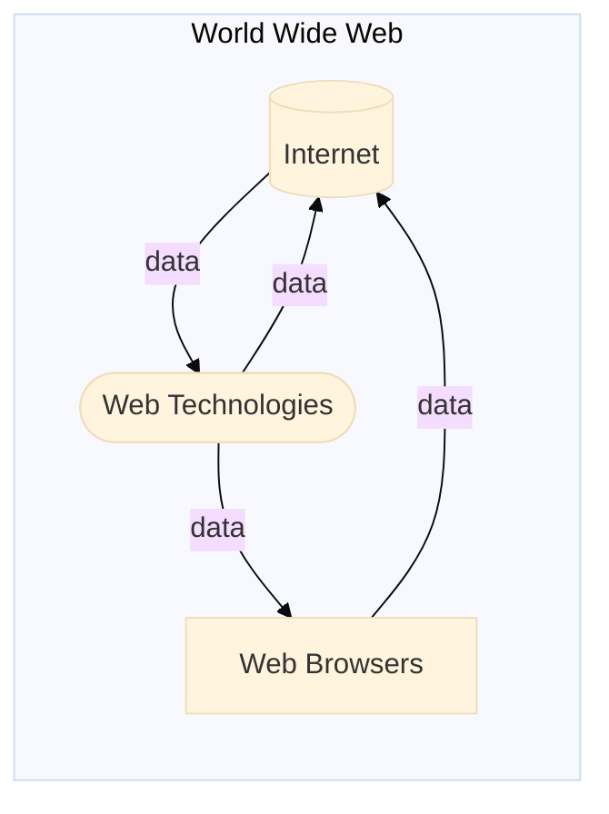
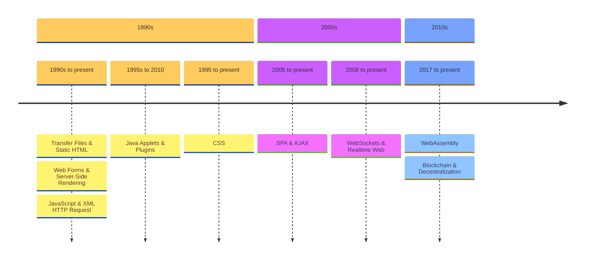

I've been doing some frontend web development lately as part of my daily job.[^1]
Along the way, I've reflected on how web technologies have changed and evolved over time.
While digging into this, I realized how brilliant some of the underlying technologies that power the web are.
I decided to write about them in an effort to gain a better perspective by putting them together.
As a disclaimer, this blog post is not about [the history of the internet](https://en.wikipedia.org/wiki/History_of_the_Internet), which has already been well documented.
Instead, I focus on the different architectures and patterns that have radically changed the way web technologies are developed.
This includes new paradigms that have opened up possibilities for what was previously impossible.
From those that became obsolete, like Java Applets, to those that have stood the test of time, like Static HTML, and the recent emergence of WebAssembly.
If you are a software developer, a web developer, or just curious about how the web works internally, you're likely to find this post interesting.
Let's dive in!

<figure class="jb_picture">
  
  <figcaption class="stroke"> 
    &#169; The World Wide Web, this almost infinity data streaming platform, has been transformed and evolved at unprecedented speed. Picture of the art piece titled "Infinite Park" exposed at <a href="https://maps.app.goo.gl/75AGyCg5QpzjQeFR8">Stockholm's Paradox Museum</a>.
  </figcaption>
</figure>

# The Three Layers of The Web

The [World Wide Web (WWW)](https://en.wikipedia.org/wiki/World_Wide_Web), as we know it today, is a vast collection of data accessible through **the internet**.
The internet ensures that this data is constantly transmitted over devices (mostly via cables) and rendered by **web browsers**.
Browsers are software applications that rely on various **web technologies** to transform the data into more established and human-friendly web pages.
These three core layers keep the web running today.
And this post is mostly about the last layer.

## The Internet

{% badge /img/badges/leonard-kleinrock-dissertation.png 140 https://www.lk.cs.ucla.edu/data/files/Kleinrock/Information%20Flow%20in%20Large%20Communication%20Nets.pdf %}

Most sources say that the internet was created in the 1960s by [ARPANET](https://en.wikipedia.org/wiki/ARPANET), a research project supported by the [DARPA](https://en.wikipedia.org/wiki/DARPA) US agency.[^2] The concept of the internet itself dates back to the first paper about packet switching written in 1961 by the american engineer [Leonard Kleinrock](https://www.lk.cs.ucla.edu/index.html). In his PhD thesis titled “Information Flow in Large Communication Nets”, he proposed a network of computers that could send data to each other. 

The internet and the web, while often used interchangeably, refer to different concepts.  
The internet is a vast global network of interconnected computers that can communicate with each other.
This network includes physical infrastructure [like submarine cables](http://thescienceexplorer.com/technology/our-wi-fi-world-internet-still-depends-undersea-cables), which are crucial for its operation.
On the other hand, the web is a collection of information accessed via the internet, consisting of protocols and technologies designed to support data transfer.
Essentially, the web is just one of several services that utilize the internet to disseminate information.

[//]: # (Submarine cable map)
<figure class="jb_picture">
  {% responsive_image width: "50%" border: "1px solid #808080" path: img/posts/2024/2024-01-12/submarine-cable-map.png alt: "Submarine cable map" %}
  <figcaption class="stroke"> 
    Figure 1. The internet, originated in 1961, is now mostly driven by submarine cables, not satellites. <a href="https://www.submarinecablemap.com/">Source</a>
  </figcaption>
</figure>

Though the internet has been around since the early 1970s, initially accessing documents remotely involved complex processes using services such as FTP, NNTP, and the gopher protocol. 
These protocols, still in use today, primarily provide a simple directory structure from which users can navigate and select files to download, but they do not support direct viewing. 
This limitation highlighted the need for a new protocol that would enable users to view documents directly through software, leading to the creation of the World Wide Web (WWW). 
Today's WWW is predominantly made up of HTML documents and other resources, interconnected through URLs.
These resources are accessed and retrieved via a wonderful pieces of software called "web browsers" that communicate back and forward with servers.

## Web Browsers

In the early 1990s, the development of web browsers rapidly transformed the internet from a niche academic tool into a mainstream technology. 
Sir Tim Berners-Lee,[^3] at CERN, created the first web browser and editor named "WorldWideWeb," later renamed "Nexus," in 1990.
This browser, which initially ran on the NeXTSTEP operating system, laid the groundwork for the public web by allowing users to both browse and edit web pages. 
By February 1992, Berners-Lee had released the Line Mode Browser, the first to support multiple platforms, catalyzing the browser boom. Between 1992 and 1995, several browsers such as Viola, Mosaic, Cello, Netscape Navigator, Opera, and Internet Explorer 1.0 were launched, dramatically opening up internet access to anyone with a computer and a landline. 
Over the decades, web browsers have evolved into complex systems capable of handling not just text and images, but also running comprehensive applications like video players, animation creators, and PDF document renderers, thus continually reshaping how we interact with digital content.

[//]: # (Web browser Nexus in 1994
<figure class="jb_picture">
  {% responsive_image width: "50%" border: "1px solid #808080" path: img/posts/2024/2024-01-12/nexus-web-browser.png alt: "Submarine cable map" %}
  <figcaption class="stroke"> 
    Figure 2. Nexus, the first web browser, as in 1994. <a href="https://digital-archaeology.org/the-nexus-browser/">Source</a>
  </figcaption>
</figure>

On April 30th of 1993, the CERN issued a public statement relinquishing all intellectual property rights to the World Wide Web.
Thus making it freely accessible without any fees.
This decision fostered an environment of unrestricted expansion and innovation in web technologies. 
Berners-Lee left CERN in October 1994 to form the World Wide Web Consortium (W3C), which today includes 406 member organizations from around the world. 
The W3C works to create standards for web development and serves as a forum for discussing web usage. 

## Web Technologies

The web's evolution is marked by an ongoing debate about where to place the execution logic: on the server or the client.
This decision impacts how applications on the web are built and interacted with, shaping user experiences across the globe. Initially created in the 1990s by Tim Berners-Lee to link research papers via hyperlinks, the web quickly grew beyond its academic origins. 
The world's first website and web server were hosted at CERN with the address [info.cern.ch](https://info.cern.ch/), and the very first web page can still be visited at [the project website](https://info.cern.ch/hypertext/WWW/TheProject.html). 
As web technologies evolved, they began solving a myriad of problems, leading to the continuous development and obsolescence of various technologies over time.

[//]: # (First page of Tim Berners-Lee's proposal for the World Wide Web in March 1989)
<figure class="jb_picture">
  {% responsive_image width: "50%" border: "1px solid #808080" path: img/posts/2024/2024-01-12/first-www-proposal.png alt: "Tim Berners-Lee's proposal for the World Wide Web" %}
  <figcaption class="stroke"> 
    Figure 3. Figure in the first page of Tim Berners-Lee's proposal for the World Wide Web in March 1989. <a href="https://www.w3.org/History/1989/proposal.html">Source</a>
  </figcaption>
</figure>

The global internet and web landscape has seen dramatic transformations due to the strategic pushes by companies and nations to standardize certain web technologies.
These technologies have allowed web applications to operate differently from traditional software; they don't require installation, are always updated, and can be accessed from any device with a web browser.
My personal experience with the internet began in 2011 in Cuba, where access was restricted mainly to universities and linked through an intranet, highlighting the diverse global accessibility challenges. 
Over the years, this technology has democratized information access, continually adapting to meet both technological and societal needs.

# Timeline

The following timeline illustrates the evolution of web technologies from the 1990s to the present, highlighting key developments that have changed the modern web landscape.

[//]: # (see https://mermaid-js.github.io)

The next sections delve into each of these technologies in more detail. 

## Files and Static HTML

In the dawn of the 1990s, the World Wide Web was essentially a vast expanse of static HTML pages. Tim Berners-Lee, the inventor of HTML (HyperText Markup Language), designed it as a means for researchers to share documents seamlessly over the Internet. This early iteration of the web featured pages that were predominantly text-based, interspersed with hyperlinks that facilitated navigation between documents. The simplicity of HTML was pivotal, making it possible for virtually anyone to create and publish content on the web without needing sophisticated technical skills.

The fundamental architecture of the web during this era was straightforward: web browsers requested files from servers, which functioned much like file servers connected to a network. These servers did little more than retrieve and send the requested files back to the browsers. The browsers would then render these files, which might include links to images and GIFs, further enhancing the user experience. This model was particularly effective for delivering content that rarely changed, such as a restaurant's monthly menu. Since the content was static, it could be hosted inexpensively on platforms like GitHub Pages or Amazon S3 buckets, or even served through a Content Delivery Network to enhance accessibility.

The economic advantage of using static HTML was undeniable. Since the server's only task was to deliver files without any processing, the overhead costs were minimal. This efficiency meant that a site could handle thousands or even millions of visits each month at a very low cost, or even for free if hosted on platforms like GitHub Pages. Static HTML remains a viable option for many applications today, testament to the enduring utility of simple, effective web technologies developed in the early days of the internet.

## Server-Side Rendering

As the web began to reach thousands of new users each day, there emerged a desire to expand its capabilities beyond merely sharing static content. This led to the development of server-side scripting, which enabled the rendering of dynamic content on a web server before it was sent to the client. This approach allowed pages to be customized for individual users based on their previous interactions with the website. The first notable scripting method was CGI (Common Gateway Interface), introduced in 1993. Since then, various languages have been developed for dynamic content creation, including Perl, Python, PHP, Ruby, ASP, Java Servlet, and Cold Fusion.

Server-side scripting, when combined with a database, revolutionized web interactions by allowing users to register and log in to websites for the first time. This advancement facilitated the rise of the first wave of web applications, commonly referred to as CRUD applications. CRUD—an acronym for Create, Read, Update, Delete—directly corresponds to both database operations and HTTP requests, providing a structured framework for building dynamic websites.

One of the early successes of this technology was the launch of eBay, initially known as AuctionWeb. Founded on September 3, 1995, in San Jose, California, by Pierre Omidyar, a French-born Iranian programmer, eBay started as an experiment. Omidyar was curious to see what would happen if there was a global marketplace accessible to everyone. To test his idea, he created an auction website where the first item sold was a broken laser pointer, which surprisingly fetched $14.83 from a collector.

The inherent statelessness of the web presents unique challenges, as each request is independent of others. This characteristic complicates tracking user actions such as logins or adding items to a shopping cart. To manage this, developers utilize cookies, sessions, and databases to store user data and maintain continuity across interactions. These tools are crucial for the functionality of modern web applications, which rely heavily on maintaining state to represent user interactions and data.

HTML forms were developed to facilitate user interactions like contacting support, sending messages, or making purchases. When a user submits a form, it typically sends a POST request to a server-side script, such as [sendmail Perl](https://metacpan.org/pod/Mail::Sendmail), which processes the information and can send an email or perform other actions in response. This process, known as server-side rendering, has proven to be incredibly robust over time. Despite the processing overhead associated with generating dynamic content—especially under heavy traffic—technologies like PHP, ASP, Ruby on Rails, Node.js, WordPress, and ASP.NET Core have all embraced server-side rendering due to its powerful capabilities.

## Java Applets and Plugins

During the late 1990s, [Java Applets](https://www.oracle.com/java/technologies/javase/9-deprecated-features.html) were widely believed to be the future of web applications. These applets allowed the execution of Java bytecode directly on the client side, integrating seamlessly within an HTML page through applet tags. This functionality promised to enrich the web experience by offering more sophisticated interactivity directly in the browser, such as playing games, filling interactive forms, and running complex web applications. However, to leverage these capabilities, users were required to install a plugin that would facilitate the execution of these applets on their devices.

The reliance on plugins was not unique to Java; it was a common pattern in the web's evolution. Technologies such as Shockwave, Flash, Director, Real Player, and QuickTime also depended on plugins to enhance browser capabilities and deliver content that native web technologies at the time could not handle. These plugins were essential for providing rich multimedia experiences and interactive content on websites, filling a crucial gap in browser technology. Yet, this approach came with significant drawbacks, particularly concerning security vulnerabilities, which were a constant source of headaches for developers and users alike.

The plugin era began to wane with significant shifts in the technology landscape, notably marked by Apple's 2007 release of the iPhone. Apple explicitly decided against supporting Java Applets, Shockwave, Flash, and other plugins on the new device, urging developers to use JavaScript and HTML for creating web applications. This stance effectively signaled the end of the plugin paradigm. As mobile internet usage surged and security concerns grew, the industry moved towards more secure, native web technologies, leading to the gradual decline of plugins. This transition underscored a broader trend towards enhancing browser capabilities and standardizing web technologies to create a safer and more seamless user experience.

## Client-Side Scripting

[//]: # (The Evolution of JavaScript and Dynamic Web Content)
JavaScript's journey began in May 1995 when Brendan Eich, working for Netscape Communications Corporation, developed it in just ten days. 
Originally code-named ‘Mocha’, JavaScript was unveiled on August 19, 1995, revolutionizing web interaction by allowing web pages to respond dynamically to user inputs. For instance, JavaScript could immediately notify users if their password did not meet the set requirements, enhancing user experience by eliminating the need to reload pages. This feature marked a significant advancement in making web pages more interactive without constant server communication.

[//]: # (Competition and Security Concerns in Scripting)
During JavaScript's early days, other tech giants like Microsoft and Adobe were also venturing into dynamic client-side scripting. Microsoft introduced technologies such as ActiveX, along with scripting languages like JScript and VBScript, while Adobe developed ActionScript for its Flash authoring tool. Initially, these client-side scripting languages raised significant security concerns because they could execute any code downloaded from the internet, potentially harming the user’s computer. To mitigate these risks, browsers implemented strict containment measures, although some scripts could still bypass these protections through techniques like exploiting browser vulnerabilities.

[//]: # (The Shift Towards Server-Side Scripting)
Given the limitations and security issues associated with client-side scripting, many developers preferred server-side scripting to create dynamic content. However, to enrich the user experience, websites occasionally used a mix of minimal client-side scripting alongside server-generated content. This approach helped in delivering a more interactive and engaging web experience without compromising security.

[//]: # (Node.js: Unifying Client and Server-Side Development)
The development landscape took a dramatic turn with the creation of Node.js in May 2009 by Ryan Dahl and other developers at Joyent. Node.js, an open-source, cross-platform runtime environment, allowed developers to use JavaScript for server-side application development. By integrating Google’s V8 JavaScript engine with an event loop and a non-blocking I/O API, Node.js facilitated the development of efficient and scalable web applications. This innovation was partly inspired by the need for better handling of file uploads, as seen in applications like Flickr, where the progress of file uploads was not visible to the user without querying the server.

[//]: # (The Rise of AJAX and Modern Web Applications)
The potential of JavaScript extended significantly with the advent of AJAX (Asynchronous JavaScript and XML), particularly after its use in Google's products like Gmail and Google Maps in the early 2000s. AJAX was initially made possible by the XMLHTTP request component, created by Microsoft for its Outlook Web App in 1998. This technology allowed web pages to request additional data from servers without needing a page refresh, leading to more dynamic and responsive web applications. Today, AJAX is a fundamental component of modern web development, enabling continuous data exchange between browsers and servers and significantly enhancing the user experience on the internet.

## CSS

[//]: # (The Genesis of CSS and Enhanced Web Aesthetics)
As the internet began to flourish, one significant limitation of HTML was its rudimentary style capabilities, confined mostly to basic alignments and text formatting. Recognizing the need for more sophisticated presentation options, style sheets were introduced to expand HTML's styling functions. This innovation led to the development of Cascading Style Sheets (CSS) in 1996, which fundamentally changed web design. CSS allowed for the separation of document content (written in HTML) from document presentation, including detailed specifications of fonts, colors, layouts, and other visual aspects. This separation not only made web pages more visually appealing but also significantly streamlined the web development process by allowing styles to be defined once and reused across multiple pages.

[//]: # (Revolutionizing Web Design with CSS)
CSS's introduction was a response to the growing demand for more dynamic and stylistically diverse websites. By allowing developers to control the layout and appearance of web elements independently from HTML structure, CSS enabled a more efficient way to design visually engaging websites. This level of aesthetic control transformed the web, enabling developers and designers to create complex designs that were previously impossible or impractical with HTML alone. As CSS evolved, it became responsible for the majority of the styling on web pages, influencing everything from layout to animations, thereby enhancing the user's visual experience and interaction with the web.

[//]: # (JavaScript and CSS)
The concurrent rise of JavaScript further complemented the capabilities of CSS, providing a way to dynamically manipulate page elements and styles through the Document Object Model (DOM). This synergy between JavaScript and CSS meant that web pages could not only look better but also react in real-time to user inputs without refreshing the page. JavaScript’s ability to interact with CSS properties brought about a new era in web design, where the static pages of the early web gave way to dynamic, interactive experiences. This integration has been pivotal in shaping the modern web, making it a rich, responsive environment that adapts to the needs of users and designers alike.
  
## SPA and AJAX

[//]: # (The Rise of AJAX and Modern Web Applications)
The term AJAX (Asynchronous JavaScript and XML), coined in 2005, revolutionized web development by enabling web applications to communicate with servers in the background, using the XMLHttpRequest object. Although initially designed for XML, AJAX quickly adapted to other data formats like JSON, which became more prevalent due to its simplicity and lightweight nature. This asynchronous communication allowed web pages to update content dynamically without refreshing, unlocking new paradigms in web authoring and greatly enhancing user experiences with interactive and seamless interfaces.

[//]: # (Evolution of Web Requests: From AJAX to Fetch)
By 2015, advancements in web technology led browser vendors to develop a more efficient method for making network requests, known as the `fetch` API. This modern approach provided a promise-based mechanism to handle responses, streamlining the process of asynchronous requests. Utilizing `fetch`, developers could send a single-page application (SPA) to the client, which would then request data as needed from a server-side API. This data could seamlessly update specific parts of the web page, improving the app's responsiveness and user engagement without reloading the entire page.

[//]: # (The Impact of Single Page Applications &#40;SPAs&#41;)
SPAs marked a significant shift in web development, emphasizing rich client-side interactivity. This model allowed parts of the webpage to update independently, signaling their loading status with animations such as spinning icons while waiting for data. This paradigm, heavily reliant on JavaScript frameworks like React and Angular, became incredibly popular for creating complex user interfaces that offered a desktop-like experience within a browser. SPAs managed to bring high interactivity and fluidity to web applications, albeit with challenges such as initial load times and state management complexities.

[//]: # (Frameworks Facilitating SPA Development)
As the complexity of client-side scripting increased, frameworks became essential for managing large codebases and structuring applications efficiently. AngularJS, developed by Misko Hevery at Brat Tech LLC in 2009, was one of the pioneers, followed by Ember.js in 2011. These frameworks provided robust architectures, embracing principles like Convention over Configuration and Don’t Repeat Yourself (DRY), to streamline development and maintenance of SPAs. They addressed many challenges of SPAs by offering structured ways to build and manage stateful, interactive applications efficiently.

[//]: # (React: A New Approach to State Management and UI Rendering)
React, developed by Facebook and released in 2013, introduced a novel approach to building SPAs by employing a one-way data flow and virtual DOM. This architecture allowed React to manage UI updates efficiently—only re-rendering components when actual data changes occurred, minimizing the performance costs associated with DOM manipulation. React’s component-based architecture also enabled developers to build reusable UI blocks, simplifying the development process, reducing bugs, and improving the maintainability of large applications.

[//]: # (Innovations in Styling with React)
React further innovated SPA development by integrating styles directly within components, a method that sparked considerable debate among developers. This approach argued for a modular system where style, structure, and logic are encapsulated within components, scaling more effectively for large applications. By reducing the separation of concerns traditionally seen in CSS, HTML, and JavaScript, React’s inline styling philosophy promotes a more cohesive and maintainable codebase, especially in complex projects. This componentized styling represents a significant evolution in how developers think about and build user interfaces for the web.

## WebSockets

[//]: # (Introduction of WebSockets for Real-time Web Applications)
Before WebSockets were introduced, AJAX was the primary method for asynchronous server communication in web development. However, AJAX had limitations, particularly in scenarios where the server needed to push updates to the client. This gap was evident in applications requiring real-time data updates, as servers had to wait for a new client request to send data. WebSockets, proposed to the W3C, addressed this challenge by establishing a bi-directional communication channel between the client and the server. This protocol supported both text and binary data with significantly reduced overhead compared to traditional HTTP polling methods, enabling more dynamic and responsive web applications.

[//]: # (WebSockets as a Standardized Protocol)
The evolution of WebSockets was a significant milestone in web technology. After several iterations and enhancements, the protocol was officially recognized as IETF protocol 'RFC6455' in December 2011, and quickly implemented across all major browsers. This standardization marked a turning point, allowing developers to reliably use WebSockets to create highly interactive, real-time web applications that could compete with or even surpass desktop applications in functionality and performance. The low latency and efficient data transfer capabilities of WebSockets made them ideal for applications that required constant data exchange and immediate user interaction.

[//]: # (Transformative Impact of WebSockets on Web Interaction)
WebSockets revolutionized how web applications were developed by facilitating a persistent, lightweight connection between the browser and the server. This connection remains open, allowing for instant data exchange without the need for repeated HTTP requests. This architecture is particularly beneficial in real-time applications such as chat platforms, collaborative tools like Google Docs, and multiplayer online games. Each message or interaction in these applications can be instantly communicated across the network, enabling a new level of interactivity and collaboration among users. The ability of WebSockets to allow multiple browsers to connect concurrently to the same service has opened up vast possibilities for real-time, collaborative experiences and applications on the web.

## Decentralized Web

[//]: # (The Rise of Blockchain and Decentralization in Web 3.0)
As Web 3.0 emerged in the late 2010s and early 2020s, it became intrinsically linked with blockchain technology and the broader cryptocurrency movement. This new era of the internet, often referred to as the decentralized web, prioritizes concepts such as decentralization, openness, and enhanced user utility. Blockchain technology, at the core of this movement, provides a distributed ledger that records transactions across multiple computers in such a way that the registered transactions cannot be altered retroactively. This immutable and transparent nature of blockchain facilitates trust and security, fundamental aspects that are driving the shift towards a decentralized internet structure where power and control are distributed across the network rather than held by a few centralized entities.

[//]: # (Blockchain's Role in Enhancing Data Security and Privacy)
Blockchain technology not only supports cryptocurrencies like Bitcoin and Ethereum but also has profound implications for how data is handled and controlled on the internet. By leveraging decentralization, blockchain allows for data to be stored across a network of nodes, ensuring that no single point of failure can compromise the system's integrity. This method enhances data security and user privacy significantly. Moreover, blockchain enables smart contracts, which are self-executing contracts with the terms of the agreement directly written into lines of code. These contracts automate and enforce agreements without the need for intermediaries, thus reducing the risk of fraud and lowering transaction costs. This capability is pivotal for developing decentralized applications (dApps) that operate on a peer-to-peer network, further enhancing user empowerment and control over their online interactions and transactions.

[//]: # (Decentralization Shaping the Future of Web Applications)
The decentralized nature of blockchain is shaping the future of web applications through the creation of a more user-centric internet—Web 3.0. This new web paradigm enhances user control over personal data, with blockchain acting as the backbone for technologies that support data ownership and privacy. For example, decentralized identity systems allow individuals to own and control their identity without reliance on centralized authorities. Additionally, the interconnectivity facilitated by blockchain could enable completely new business models and consumer applications, such as decentralized finance (DeFi) platforms, which offer financial services without traditional banking institutions. As blockchain technology continues to evolve, its potential to support a decentralized, secure, and efficient web environment makes it a critical component of the Web 3.0 infrastructure, poised to redefine the digital landscape.

## WebAssembly

[//]: # (Overcoming JavaScript's Limitations with WebAssembly)
JavaScript, while being the predominant scripting language in modern web browsers, faces significant limitations due to its inherent language characteristics. Each JavaScript engine must parse and recompile the code, creating substantial overhead and contributing to lengthy website load times. Additionally, JavaScript's lack of memory isolation poses security risks by potentially allowing the extraction of information from other processes. Attempts to replace or supplement JavaScript with other languages, such as Java Applets, Microsoft ActiveX, and Silverlight, have historically failed due to security concerns and lack of community consensus among browser vendors.

[//]: # (Emscripten and the Asm.js Experiment)
The [Emscripten](https://emscripten.org/) tool, introduced in 2014, marked a pivotal moment in web development. It utilized `asm.js`, a strict subset of JavaScript designed for compiling low-level languages like C into JavaScript. This approach leveraged LLVM's ahead-of-time optimizations, significantly enhancing performance over traditional JavaScript, as detailed in [Mozilla's performance analysis](https://hacks.mozilla.org/2015/03/asm-speedups-everywhere/). `asm.js` streamlined JavaScript by restricting it to simple numeric types and memory operations, proving that client-side code performance could be substantially improved through careful language design and standardization. This success laid the groundwork for the development and standardization of WebAssembly by the World Wide Web Consortium (W3C) in 2015.

[//]: # (The Advent of WebAssembly)
WebAssembly, or wasm, was developed as a native runtime for the web, allowing developers to write applications in languages such as C, Rust, or Ruby, and compile them into a `.wasm` file. This file is then served from a web server and executed in the browser, with JavaScript often playing a role in bootstrapping the application. This innovation brought the possibility of running high-performance, native applications directly within the browser environment, reminiscent of the capabilities provided by Java Applets in the 1990s. WebAssembly addresses the inefficiencies of transpiling languages like Java or TypeScript to JavaScript, which was traditionally the only way to run applications in browsers.

[//]: # (Enhancing Security and Performance with WebAssembly)
One of the significant advantages of WebAssembly is its robust security model, which prevents binaries from accessing memory outside their allocated space through Software Fault Isolation (SFI) policies. This isolation makes WebAssembly more secure compared to traditional JavaScript environments. Furthermore, WebAssembly modules are more compact and efficient than virtual machines or containers, making them particularly well-suited for environments where network efficiency is critical. Today, WebAssembly is used for a diverse range of browser tasks, from gaming to crypto-mining, and has proven especially effective for short-running tasks on backend platforms, such as Function-as-a-Service (FaaS) offerings.

[//]: # (WebAssembly's Role in Modern Web Applications)
WebAssembly has significantly broadened the scope of what can be achieved with web applications, enabling complex software like AutoCAD and Adobe Photoshop to be ported directly into the browser as highlighted in [Adobe's announcement](https://twitter.com/Adobe/status/1453034805004685313?s=20&t=Zf1N7-WmzecA0K4V8R69lw). This capability transforms web applications to perform functions traditionally reserved for desktop applications, pushing the boundaries of web software and altering our understanding of its potential. As WebAssembly continues to evolve, it promises to further revolutionize the development and performance of applications across the web.

# Summary

In the evolving landscape of web technologies, while certain older technologies like applets and plugins have become obsolete, many foundational methods remain relevant and effective for specific needs today. 
Static HTML, for example, continues to be the optimal solution for simple, infrequently updated content such as a restaurant menu.
its simplicity and efficiency are unmatched even in 2024. Server Side Rendering (SSR) remains invaluable for generating product catalogs and other content that benefits from being immediately accessible by search engines, screen readers, and accessibility tools, ensuring a broad and inclusive reach. Technologies like XML HTTP Request and `fetch` are still essential for adding minimal interactivity to web pages, such as autocomplete or autosuggest features, enhancing user experience without the complexity of more advanced scripts. Websockets are the go-to solution for implementing real-time notifications, providing instantaneous communication crucial for dynamic, interactive applications. Lastly, WebAssembly plays a critical role in deploying performance-intensive native web applications, allowing developers to utilize high-level programming languages to 
build complex software directly in the browser. Collectively, these technologies continue to solve a diverse range of problems, demonstrating their lasting utility in the digital domain.

# A Few Parting Thoughts

The web is just the latest in a series in a series of oscillations that our industry has gone through since 1960s. These oscillations move back and forth between putting all the computer power in central servers and putting all the computing power out at the terminals.

We’ve seen several of these oscillations just in the last decade or so since the web became prominent. At first, we thought all the computer power would be in server farms, and the browsers would be stupid. Then we started putting applets in the browsers. But we didn’t like that, so we moved dynamic content back to the servers. But then we didn’t like that, so we invented Web 2.0 and moved lots of processing back into the browser with Ajax and JavaScript. We went so far as to create huge applications written to execute in the browsers. And now we’re all excited about pulling that JavaScript back into the server with Node…

And so the story goes. We can’t seem to figure out where we want the computing power. We go back and forth between cetralizing it and distributing it. And, I imagine, those oscillations will continue for some time to come.

[//]: # (below is an example of how to write this section properly)
There are valuable lessons to be learned from all of this -- including the need for real, meaningful support (by large corporations) of the projects they rely so heavily upon.

But, for now, I'd like to leave you with a few observations.

# Resources

- [The Evolution of Web Apps 1992-2024, by Dylan Beattie](https://youtu.be/a_1cV7hg5G8?si=VIaAQnfTyR9nuUdc)
- [How We Got Here - The History of Web Development, by Richard Campbell](https://youtu.be/41mnNyMxPOA?si=9NVNYd9jyopvFaXj)

# Footnotes

[^1]: BTW, my sincere appreciation to the frontend and UI devs. What you guys do in the trenches is really hard. I ~~probably~~ never would be able to make a decent living as a frontend.

[^2]: [DARPA](https://www.darpa.mil/) (Defense Advanced Research Projects Agency) is essentially a military research agency funded by the US government. It still exists and is responsible for the development of not only the internet but other technologies like GPS, drones, and even the first computer mouse. It's sad that the internet was not created in a public university, but that's life.

[^3]: Tim Berners-Lee was knighted by Queen Elizabeth II in 2004, so now we should call him "sir" to be more exact. People gets promoted dear reader, the sky is the limit.    

