I've been doing some frontend web development lately as part of my daily job.[^1]
Along the way, I've been thinking on how the whole thing is built under the hood. 
The web technologies that we all use every day have changed and evolved over time.
While digging into this topic, I realized that some of the underlying technical solutions that fuel the World Wide Web are really brilliant, while others are still a mess.
From an engineering perspective, there are many lessons we can learn from it.
So I decided to write about it in this post.
What follows is my modest attempt to do so.
As a disclaimer, this blog post is not about [the history of the internet](https://en.wikipedia.org/wiki/History_of_the_Internet), which has already been well documented.
Instead, I focus on the different architectures and patterns that have radically changed the way web technologies are developed.
This includes new paradigms that have opened up possibilities for what was previously impossible, like Single Page Applications (SPAs) and AJAX.
From those that became obsolete, like Java Applets, to those that have stood the test of time, like Static HTML, to the recent emergence of WebAssembly and the ongoing attempt to decentralize the web.
If you are a ~~nerd~~ engineer, a web developer, or just curious about how the web works internally, you're likely to find this post interesting.
Those who don't know tech history are doomed to repeat past engineering mistakes.
This is gonna be a long one, so grab a coffee and let's go!

<figure class="jb_picture">
  
  <figcaption class="stroke"> 
    &#169; The World Wide Web is a seeming infinity data dumping and pumping platform. It has been transformed and evolved at unprecedented speed over the last 30 years. The picture shows an art piece titled "Infinite Park" exposed at <a href="https://maps.app.goo.gl/75AGyCg5QpzjQeFR8">Stockholm's Paradox Museum</a>.
  </figcaption>
</figure>

# The World Wide Web

The [World Wide Web (WWW)](https://en.wikipedia.org/wiki/World_Wide_Web), as we know it today, is basically a vast collection of data accessible through **the internet**.
The internet ensures that the data (i.e., `0`s and `1`s), is constantly transmitted from servers to clients and vice versa.
Most users perceive the web through the data that is rendered by **web browsers**.
Browsers are software applications that rely on various **web technologies** to transform the data into more readable and human-friendly web pages.
These three core layers (highlighted above with bold font) are responsible for keeping the web alive.
This post dives deep into the last layer: web technologies.
But before that, let's take a look at the big picture.

```mermaid
%%{init: {'theme':'base'}}%%
graph TB;
subgraph "World Wide Web"
  B -- data --> C[💻 Web Browsers] 
  A[(🌐 Internet)] -- data --> B([🔧 Web Technologies])
  C -- data --> B
  B -- data --> A
end
```

## The Internet

{% badge /img/badges/leonard-kleinrock-dissertation.png 140 https://www.lk.cs.ucla.edu/data/files/Kleinrock/Information%20Flow%20in%20Large%20Communication%20Nets.pdf %}

Most sources agree that the internet was created in the 1960s by [ARPANET](https://en.wikipedia.org/wiki/ARPANET), a research project supported by the [DARPA](https://en.wikipedia.org/wiki/DARPA) agency of the United States.[^2]
The concept of "the internet" itself dates back to the first paper about packet switching written in 1961 by the american engineer [Leonard Kleinrock](https://www.lk.cs.ucla.edu/index.html).
In his PhD thesis titled “[Information Flow in Large Communication Nets](https://historyofinformation.com/detail.php?id=788),” he proposed **a network of computers** that could send data to each other. 
That's exactly what the modern internet does at its core!

The internet and the web, while often used interchangeably, refer to different concepts.  
The internet is the global network of interconnected computers that can communicate with each other by agreeing on using the same **data transfer protocol**.
For example, the [Internet Protocol (IP)](https://en.wikipedia.org/wiki/Internet_Protocol) is the most used to transmit data across the internet.
Here the sense of "global" is key, as it transcends geographical barriers between countries (a more restrictive version of the internet is called "intranet" instead).[^4]

The internet is built thanks to physical infrastructure [like submarine cables](http://thescienceexplorer.com/technology/our-wi-fi-world-internet-still-depends-undersea-cables), which are crucial for its operation.
The web, on the other hand, refers to the information that can be accessed through the internet.
It consists of the protocols and technologies designed to support data transfer between servers.
Essentially, the web is just one of several services that utilize the internet infrastructure to disseminate information.
But note that there are other services as well, such as file transfer services, email, VoIP, or streaming platforms.

[//]: # (Submarine cable map)
<figure class="jb_picture">
  {% responsive_image width: "50%" border: "1px solid #808080" path: img/posts/2024/2024-04-27/submarine-cable-map.png alt: "Submarine cable map" %}
  <figcaption class="stroke"> 
    Figure 1. The internet, originated in 1961, is now mostly driven by submarine cables, not satellites. This could be a good point to justify the mess of cables in my desk, the whole world cannot get rid of them! <a href="https://www.submarinecablemap.com/">Source</a>
  </figcaption>
</figure>

The idea of a **global internet** has been around since the early 1970s. 
However, initially accessing documents remotely involved complex processes using services such as [FTP](https://en.wikipedia.org/wiki/File_Transfer_Protocol), [NNTP](https://en.wikipedia.org/wiki/Network_News_Transfer_Protocol), and the [Gopher protocol](https://en.wikipedia.org/wiki/Gopher_(protocol)). 
These protocols, still in use today, provide a simple directory structure from which users can navigate and select files to download, but they do not support a direct visualization of the information being transferred. 
This limitation highlighted the need for a new protocol that would enable users to render documents directly through dedicated software applications.
It was this (probably) the main incentive that led to the creation of the World Wide Web (WWW). 
Today's WWW is predominantly made up of HTML documents and other resources, interconnected through [URLs](https://en.wikipedia.org/wiki/URL).
These resources are accessed and retrieved using a wonderful piece of software called "web browser," which communicates back and forward with the internet servers and displays content to the end users.

## Web Browsers

In the early 1990s, the development of web browsers rapidly transformed the internet.[^6]
Sir [Tim Berners-Lee](https://en.wikipedia.org/wiki/Tim_Berners-Lee),[^3] at CERN, created the first web browser and web editor named "[WorldWideWeb](https://en.wikipedia.org/wiki/WorldWideWeb)," later renamed "Nexus," in 1990 (another poof that long camel cased names are a bad idea in general).
This browser initially ran on the [NeXTSTEP operating system](https://en.wikipedia.org/wiki/NeXTSTEP) (yeah, that's the OS of the NeXT Computer founded by Steve Jobs, which didn't go anywhere, as neither the browser did).
Despite its failure, it laid the groundwork for building public web by allowing users to both browse and edit web pages. 
By February 1992, Berners-Lee's team at CERN released the [Line Mode Browser](https://en.wikipedia.org/wiki/Line_Mode_Browser), the first multi-platform browser.
Between 1992 and 1995, several browsers such as Viola, Mosaic, Cello, Netscape Navigator, Opera, and Internet Explorer 1.0 were launched.
The emergence of diverse browsers supported in different platforms dramatically opened up internet access to anyone with a computer and an internet connection. 

[//]: # (Web browser Nexus in 1994)
<figure class="jb_picture">
  {% responsive_image width: "50%" border: "1px solid #808080" path: img/posts/2024/2024-04-27/nexus-web-browser.png alt: "Submarine cable map" %}
  <figcaption class="stroke"> 
    Figure 2. Nexus, the first web browser, as it was in 1994. It didn't make it, despite its cool name. <a href="https://digital-archaeology.org/the-nexus-browser/">Source</a>
  </figcaption>
</figure>

<aside class="quote">
    <em>“Web browsers are by far the most successful software application ever created in the history of computing.”</em>    
</aside>

Over the last decades, web browsers have evolved to become complex software systems (e.g., Firefox and Chrome reported having roughly [30M](https://openhub.net/p/firefox) and [40M](https://openhub.net/p/chrome/analyses/latest/languages_summary) lines of code in total, respectively).
Modern browsers are capable of handling not just text and images, but also running complex applications like real-time video games, 3D animations, and PDF documents.
It required a lot of engineering effort to make this possible through web technologies.
For example, the [V8 JavaScript Engine](https://v8.dev/) included in Chrome is renowned for its high performance due to just-in-time (JIT) compilation, efficient garbage collection, and optimizations for real-time execution in web browsers.
Web browsers are by far the most successful software application ever created in the history of computing. 

## Web Technologies

Initially created in the 1990s to link research papers via "hyperlinks," **the web** quickly grew beyond its academic origins. 
The world's first website and web server were hosted at CERN.[^7]
On April 30th of 1993, the CERN issued a [public statement](https://home.cern/science/computing/birth-web/licensing-web) relinquishing all intellectual property rights to the World Wide Web.
Thus making it freely accessible without any fees.
This decision fostered an environment of unrestricted expansion and innovation in web technologies.
Berners-Lee left CERN in October 1994 to form the [World Wide Web Consortium (W3C)](https://www.w3.org/), which today includes around 500 member organizations from around the world.
The W3C works to create standards for web development and serves as a forum for discussing web usage and development globally.

[//]: # (First page of Tim Berners-Lee's proposal for the World Wide Web in March 1989)
<figure class="jb_picture">
  {% responsive_image width: "50%" border: "1px solid #808080" path: img/posts/2024/2024-04-27/first-www-proposal.png alt: "Tim Berners-Lee's proposal for the World Wide Web" %}
  <figcaption class="stroke"> 
    Figure 3. Figure in the first page of Tim Berners-Lee's proposal for the World Wide Web in March 1989. <a href="https://www.w3.org/History/1989/proposal.html">Source</a>
  </figcaption>
</figure>

I would like to remark that since its massification, the web landscape has undergone dramatic transformations due to the strategic pushes made by companies and nations to standardize certain web technologies. 
These technologies have added new capabilities that allow web applications to scale and operate differently from traditional software. 
For example, today's web applications do not require installation or updates. 
They simply need a device with a web browser to run.
This has led to the rise of web applications that can be accessed from any device with an internet connection, making them more accessible thanks to the wide spread of mobile phones.

Its rapid development has led to the rise and decline (almost obsolescence) of various technologies over time. 
In particular, there's still an ongoing debate about whether to place the execution logic that consumes most of the computing power on the server or in the client. 
This decision impacts how applications on the web are built and interacted with. 
For example, Server-Side Rendering (SSR) is a technique where the server generates and processes the HTML content that is sent to the client (e.g., using any kind of programming language like Java, C, or Ruby). 
On the other hand, Client-Side Rendering (CSR) is a technique where the client's browser generates the HTML content, mostly using JavaScript.
SSR offers faster initial page loads and SEO benefits by pre-rendering HTML on the server.
CSR provides a more dynamic and interactive user experience at the expenses of slower initial loads and SEO challenges due to content being rendered on the client's browser.
The choice between SSR and CSR is a trade-off that developers must consider when building web applications.

# Timeline of Web Technologies

The following timeline illustrates the evolution of web technologies from the 1990s to the present, highlighting key developments that have changed the modern web landscape.

[//]: # (see https://mermaid-js.github.io)

In the following sections, I delve into each of these technologies in more detail. 

## Static HTML Pages

The first version of HTML was written by Tim Berners-Lee [in 1993](https://www.washington.edu/accesscomputing/webd2/student/unit1/module3/html_history.html).
HTML is a [markup language](https://en.wikipedia.org/wiki/Markup_language) based on [SGML](https://en.wikipedia.org/wiki/Standard_Generalized_Markup_Language) that structures content by defining elements like headings, paragraphs, lists, and links using tags like `h1`, `p`, `ul`, and `a`, respectively.
These elements compose what is known as the [Document Object Model (DOM)](https://www.w3.org/TR/WD-DOM/introduction.html), a tree-like structure that browsers use to render web pages.

In the dawn of the 1990s, the World Wide Web was essentially HTML pages connected via hyperlinks without any styling or data persistence.
This early iteration of the web featured pages that were predominantly text-based, but later evolved to include images, GIFs, and other media.
The HTML supported them by adding more tags like `img`, `video`, `audio`, and `canvas`.
The simplicity of HTML was key to its success, making it possible for virtually anyone to create and publish content on the web without needing sophisticated technical skills.[^5]

The following is an example of a simple HTML page that displays a heading title, a paragraph, and an image:


<!DOCTYPE html>
<html>
<head>
  <title>My First Web Page</title>
</head>
<body>
  <h1>Welcome to My First Web Page</hh1>
  
This is a simple web page created using HTML.

  
</body>
</html>


The fundamental architecture of the web during this era was straightforward.
Web browsers requested files from servers, which functioned much like file servers connected to a network.
These servers did little more than retrieving and sending the requested files back to the browsers.
The browsers would then render these files, which might include links to images and GIFs, further enhancing the user experience.
This model was particularly effective for delivering content that rarely changed, such as a restaurant's monthly menu or landing pages, for example.

```mermaid
%%{init: {'theme':'base'}}%%
graph TB
subgraph "Static HTML"
  C[👩 User]
  B[🖥️ Server]
  A[💻 Browser]
  C -- Request URL --> A
  B -- HTML Page --> A
  A -- Render HTML --> C  
  A -- HTTP Request --> B 
end
```

<aside class="quote">
    <em>“This blog is actually a bunch of static HTML pages.”</em> 
</aside>
The economic advantage of using static HTML is undeniable.
Since the server's only task was to deliver files without any processing, the overhead costs are minimal.
This efficiency meant that a static site could handle thousands or even millions of visits each month at a very low cost.
Indeed, this blog is actually a bunch of static HTML pages built using [Jekyll](https://jekyllrb.com/) and hosted for free using [GitHub Pages](https://pages.github.com/).
Static HTML remains a viable option for many applications today, testament to the enduring utility of simple, effective web technologies developed in the early days of the internet.

## Server-Side Rendering

By the mid 90s, the web began to reach thousands of new users each day.
There was an emerged a desire to expand its capabilities beyond merely sharing HTML content.
For example, users wanted to interact with websites by submitting forms, logging in, and viewing personalized content.
However, the statelessness of the web presented unique challenges, as each request was independent of others.
This led to the development of [server-side scripting](https://en.wikipedia.org/wiki/Server-side_scripting), which enabled persisting and rendering dynamic content on the web server before sending it to the client.
This approach allowed pages to be customized for individual users based on their previous interactions with the website.

The first notable scripting method was [CGI (Common Gateway Interface)](https://en.wikipedia.org/wiki/Common_Gateway_Interface), introduced in 1993.
Since then, various languages have been developed for dynamic content creation, including Perl, Python, PHP, Ruby, ASP, Java Servlet, and Cold Fusion.
Server-side scripting, when combined with a database, revolutionized web interactions by allowing users to register and log in to websites for the first time.
This advancement facilitated the rise of the first wave of web applications, commonly referred to as [CRUD (Create, Read, Update, Delete)](https://en.wikipedia.org/wiki/Create,_read,_update_and_delete) applications.
CRUD directly corresponds to both database operations and HTTP requests, providing a structured framework for building dynamic websites.

> "One of the early successes of this technology was the launch of eBay, initially known as AuctionWeb. Founded on September 3, 1995, in San Jose, California, by Pierre Omidyar, a French-born Iranian programmer, eBay started as an experiment. Omidyar was curious to see what would happen if there was a global marketplace accessible to everyone. To test his idea, he created an auction website where the first item sold was a broken laser pointer, which surprisingly fetched $14.83 from a collector."

HTML forms were developed to facilitate user interactions like contacting support, sending messages, or making purchases.
When a user submits a form, it typically sends a `POST` request to a server-side script.
One of the first examples was [sendmail Perl](https://metacpan.org/pod/Mail::Sendmail), which processes the information to send emails or perform other actions in response to a client's request.

```mermaid
%%{init: {'theme':'base'}}%%
graph TB
subgraph "Server-Side Rendering"
  C[👩 User]
  B[🖥 Server]
  A[💻 Browser]
  D[(🗄️ Database)]
  C -- Request Login Page --> A
  B -- HTML + JavaScript --> A
  A -- Render Login Page --> C
  A -- HTTP Request --> B
  B -- CRUD --> D
  D -- Data --> B
  B -- Processing --> B
end
```

The pattern has proven to be incredibly robust over time, despite the processing overhead associated with generating dynamic content in the server (especially under heavy traffic workloads).
The rise of [microservices and serverless architectures](/blog/design-for-microservices.html) has further refined server-side rendering, allowing developers to build scalable, efficient web applications.
Today, developers rely on [HTTP cookies](https://en.wikipedia.org/wiki/HTTP_cookie), sessions, and databases to store user data.
Web technologies like PHP, ASP, Ruby on Rails, Node.js, WordPress, and ASP.NET Core have all embraced server-side rendering due to its powerful capabilities.

## Client-Side Rendering



[//]: # (The Evolution of JavaScript and Dynamic Web Content)
Client-side rendering is the process of generating web content directly in the user's browser.
To do so, HTML was clearly no enough, a real programming language was necessary.
JavaScript was the answer.
The legend says that JavaScript was created in just ten days by [Brendan Eich](https://en.wikipedia.org/wiki/Brendan_Eich) while working on Netscape in May 1995.
Nothing good can be done in ten days, and that may be one of the reasons why JavaScript has caused so many headaches to developers.
Anyway, JavaScript revolutionised the web by allowing the pages to respond dynamically to user inputs.
For example, it could immediately notify when their passwords did not meet certain validation requirements, instantly, directly in the browser. 
The user experience improved significantly because there was no need to reload page.  
Client-side rendering made web pages more interactive by eliminating the constant (and costly) server communication.

```mermaid
%%{init: {'theme':'base'}}%%
flowchart
    subgraph Browser["Browser"]
        subgraph UserInteraction["User Interaction"]
            JS["JavaScript"]
        end
        subgraph RenderEngine["Rendering Engine"]
            HTML["HTML"] --> CSS["CSS"]
        end
    end
    UserInteraction -->|Manipulates| RenderEngine
    UserInteraction -->|Updates DOM| HTML
    CSS
    K[👩 User] -- "HTTP Request" --> Browser
    Browser -- "Rendered Content" --> K
```

The following is an example of a simple JavaScript function `validatePassword` that takes a password input and alerts the user if it is less than eight characters long, note that all the execution of this logic is done in the browser:


<!DOCTYPE html>
<html>
  <head>
    <title>Password Validation</title>
    
  </head>
  <body>
    <h2>Password Validation</h2>
    
Enter your password:

    <input type="password" id="password" placeholder="Enter password">
    <button onclick="validatePassword()">Validate Password</button>
  </body>
</html>


[//]: # (Competition and Security Concerns in Scripting)
During JavaScript's early days, tech giants like Microsoft and Adobe were also venturing into **dynamic client-side scripting**.
Microsoft introduced technologies such as [ActiveX](https://en.wikipedia.org/wiki/ActiveX), along with scripting languages like JScript and VBScript, 
while Adobe developed ActionScript for its Flash authoring tool. 
Interestingly, none of these technologies ended up going anywhere and today are practically deprecated. 
Indeed, JavaScript became the de facto standard for client-side scripting.
One of the reasons is that these scripting languages were proprietary, raising significant security concerns because they could execute any code downloaded from the internet, potentially harming the user's system.
To mitigate these risks, browsers implemented strict containment measures.
However, some scripts could still bypass these protections through techniques that exploit browser vulnerabilities.

[//]: # (The Rise of AJAX and Modern Web Applications)
The potential of JavaScript extended significantly with the advent of [AJAX (Asynchronous JavaScript and XML)](https://www.w3schools.com/xml/ajax_intro.asp), particularly after its use in Google's products like Gmail and Google Maps in the early 2000s.
AJAX was initially made possible by the [XMLHttpRequest](https://developer.mozilla.org/en-US/docs/Web/API/XMLHttpRequest), initially created by Microsoft for its Outlook Web App in 1998.
This technology allowed web pages to request additional data from servers without needing a page refresh, leading to more dynamic and responsive web applications. 
Today AJAX is a fundamental component of modern web development, enabling continuous data exchange between browsers and servers and significantly enhancing the user experience on the internet.

<aside class="quote">
    <em>“Any application that <em>can</em> be written in JavaScript, <em>will</em> eventually be written in JavaScript”</em> 
    <cite>  ― <a href="https://blog.codinghorror.com/the-principle-of-least-power/">Atwood's Law</a></cite>
</aside>

[//]: # (Node.js: Unifying Client and Server-Side Development)
The development landscape took a dramatic turn with the creation of [Node.js](https://nodejs.org/en) in May 2009.
Node.js is an open-source cross-platform runtime environment that allows developers to use JavaScript for server-side application development.
By integrating Google’s V8 JavaScript engine with an event loop and a non-blocking I/O API, Node.js facilitates the development of efficient and scalable web applications. 
This innovation was partly inspired by the need for better handling of file uploads, as seen in applications like [Flickr](https://www.flickr.com/), where the progress of file uploads was not visible to the user without querying the server.

[//]: # (The Shift Towards Server-Side Scripting)
Given the limitations and security issues associated with client-side scripting, many developers prefer server-side scripting to create dynamic content.
However, to enrich the user experience, websites occasionally implement a mix of minimal client-side scripting alongside server-generated content.
This approach helped in delivering a more interactive and engaging web experience without compromising security.

## Java Applets and Plugins



During the late 1990s, [Java Applets](https://www.oracle.com/java/technologies/javase/9-deprecated-features.html) were widely believed to be the future of web applications. 
These applets allowed the execution of Java bytecode directly on the client side.
Apples integrated seamlessly within an HTML page through an `applet` tag.
This functionality promised to enrich the web experience by offering more sophisticated interactivity directly in the browser.
For example, Applets allowed playing games, filling interactive forms, and running complex web applications. 
However, to leverage these capabilities, users were required to install a plugin that would facilitate the execution of these applets on their devices.

Here's an example of an HTML page embedding a Java Applet. 
Note that in the browser cannot execute the `FileApplet.class` natively. 
To do so, it needs to have the JVM and a dedicated plugin installed.
Therefore, Applets were platform-dependent:


<html>
<head>
    <title>Simple File Reader Applet</title>
</head>
<body>
    <applet code="FileApplet.class" width="300" height="300">
        Your browser does not support Java Applets or Java is not enabled.
    </applet>
</body>
</html>


The reliance on plugins during this period was not unique to Java.
Using plugins to extend browser's functionality was a common pattern back then.
For example, technologies such as Shockwave, Flash, Director, Real Player, and QuickTime also depended on plugins to enhance browser capabilities and deliver content that native web technologies at the time could not handle. 
These plugins provided rich multimedia experiences and interactive content on websites, filling a crucial gap in browser technology.
Yet, this approach came with significant drawbacks, particularly concerning security vulnerabilities, which were a constant source of headaches for developers and users alike.

<aside class="quote">
    <em>“The failure of web plugins ended up making browsers more powerful in the end.”</em> 
</aside>
The plugin era began to wane with significant shifts.
Notably, in 2007 Apple released the iPhone and [explicitly decided against supporting Java Applets](https://www.theregister.com/2007/10/29/no_java_for_leopard/), Shockwave, Flash, and other plugins on the new device.
This pushed developer to rely only on JavaScript and HTML for creating web applications.
As mobile internet usage surged and security concerns grew, the industry moved towards more secure, native web technologies.
This transition underscored a broader trend towards enhancing browser capabilities and standardizing web technologies to create a safer and more seamless user experience.
So in the end, browsers became more powerful, and that was the end of the plugin paradigm!

## CSS and Dynamic Web Design

[//]: # (The Genesis of CSS and Enhanced Web Aesthetics)
One significant limitation of HTML is its rudimentary style capabilities, confined mostly to basic alignments and text formatting.
Cascading Style Sheets (CSS) were introduced in 1996 to expand HTML's styling functions. 
It fundamentally changed web design. 
CSS allowed for the separation of document content (written in HTML) from document presentation.
For example, CSS includes detailed specifications of fonts, colors, layouts, and other visual aspects.
This separation not only made web pages more visually appealing but also significantly streamlined the web development process by allowing styles to be defined once and reused across multiple pages.

For example, the following CSS code defines a style for a `div` element with a red background and white text:


div {
  background-color: red;
  color: white;
}


This style can be shared across multiple HTML pages, ensuring a consistent look and feel throughout a website:

```mermaid
%%{init: {'theme':'base'}}%%
flowchart TB  
  subgraph Website
    direction LR 
    subgraph HTML
        Page1[📄 Page 1]
        Page2[📄 Page 2]
        Page3[📄 Page 3]
        Page4[📄 Page 4]
    end
    subgraph CSS
        Style1[🎨 Style 1]
        Style2[🎨 Style 2]
    end
  end
  Page1 --- Style1
  Page2 --- Style1
  Page3 --- Style1
  Page4 --- Style2
```

[//]: # (Revolutionizing Web Design with CSS)
CSS's introduction was a response to the growing demand for more dynamic and stylistically diverse websites.
It allows developers to control the layout and appearance of web elements independently of HTML structure.
CSS enabled a more efficient way to design visually engaging websites. 
As CSS evolved, it became responsible for the majority of the styling on web pages, influencing everything from layout to animations, thereby enhancing the user's visual experience and interaction with the web.

[//]: # (JavaScript and CSS)
The concurrent rise of JavaScript further complemented the capabilities of CSS, providing a way to dynamically manipulate page elements and styles through the DOM. 
This synergy between JavaScript and CSS meant that web pages could not only look better but also change the visual elements in real-time as a response to user inputs.
JavaScript’s ability to interact with CSS properties brought about a new era in web design, where the static pages of the early web gave way to dynamic, interactive experiences. 
  
## SPA and AJAX

[//]: # (The Rise of AJAX and Modern Web Applications)
The term [AJAX (Asynchronous JavaScript and XML)](https://www.w3schools.com/xml/ajax_intro.asp), coined in 2005, revolutionized web development.
It enables web applications to communicate with servers in the background, requesting and receiving data from a server after the page has loaded.
Although initially designed for XML, AJAX quickly adapted to other data formats like JSON, which became more prevalent due to its simplicity and lightweight nature. 
This asynchronous communication allowed web pages to update content dynamically without refreshing, unlocking new paradigms in web authoring and greatly enhancing user experiences with interactive and seamless interfaces.

[//]: # (Evolution of Web Requests: From AJAX to Fetch)
By 2015, advancements in web technology led browser vendors to develop [a more efficient method for making network requests](https://developer.mozilla.org/en-US/docs/Web/API/Fetch_API), known as the `fetch` API.
This modern approach provides a promise-based mechanism to handle responses, streamlining the process of asynchronous requests. 
By using `fetch`, developers could send a [single-page application (SPA)](https://en.wikipedia.org/wiki/Single-page_application) to the client, which would then request data as needed from a server-side API. 
This data could seamlessly update specific parts of the web page, improving the app's responsiveness and user engagement without reloading the entire page.

[//]: # (The Impact of Single Page Applications &#40;SPAs&#41;)
SPAs marked a significant shift in web development, emphasizing rich client-side interactivity. 
This model allowed parts of the webpage to update independently, signaling their loading status with animations such as spinning icons while waiting for data. 
This paradigm, heavily reliant on JavaScript frameworks like React and Angular, became incredibly popular for creating complex user interfaces that offered a desktop-like experience within a browser. 
SPAs managed to bring high interactivity and fluidity to web applications, albeit with challenges such as initial load times and state management complexities.

[//]: # (Frameworks Facilitating SPA Development)
As mentioned, web frameworks became essential for managing large codebases and structuring applications efficiently. 
[AngularJS](https://angularjs.org/), developed in 2009, was one of the pioneers, followed by [Ember.js](https://emberjs.com/) in 2011.
These frameworks provided robust architectures, embracing principles like "Convention over Configuration" and "Don’t Repeat Yourself (DRY)," to streamline development and maintenance of SPAs. 
They addressed many challenges of SPAs by offering structured ways to build and manage stateful, interactive applications efficiently.

[//]: # (React: A New Approach to State Management and UI Rendering)
[React](https://react.dev/), developed by Facebook and released in 2013, introduced a novel approach to building SPAs by employing a one-way data flow and [virtual DOM](https://legacy.reactjs.org/docs/faq-internals.html). 
This architecture allowed React to manage UI updates efficiently—only re-rendering components when actual data changes occurred, minimizing the performance costs associated with DOM manipulation.
React’s component-based architecture also enabled developers to build reusable UI blocks, simplifying the development process, reducing bugs, and improving the maintainability of large applications.

The following is an example of a React component that toggles a button's color between green and red when clicked. Note that the CSS styles are defined directly within the component, along with the JavaScript logic:


import React, { useState } from 'react';

function ToggleButton() {
// State to keep track of the toggle status
const [isToggled, setIsToggled] = useState(false);

// Inline styles for different states
const buttonStyle = {
  backgroundColor: isToggled ? 'lightcoral' : 'lightgreen',
  padding: '10px 20px',
  borderRadius: '5px',
  border: 'none',
  cursor: 'pointer',
  color: 'white',
  fontSize: '16px',
  fontWeight: 'bold',
  outline: 'none',
  transition: 'all 0.3s ease'
};

// Function to handle button click
const toggleButton = () => {
  setIsToggled(!isToggled);
};
return (
    <button style={buttonStyle} onClick={toggleButton}>
      {isToggled ? 'ON' : 'OFF'}
    </button>
  );
}

export default ToggleButton;


[//]: # (Innovations in Styling with React)
React further innovated SPA development by integrating styles directly within components, a method that sparked considerable debate among developers. 
This approach argued for a modular system where style, structure, and logic are encapsulated within components, scaling more effectively for large applications.
By reducing the separation of concerns traditionally seen in CSS, HTML, and JavaScript, React’s inline styling philosophy promotes a more cohesive and maintainable codebase, especially in complex projects.
This "componentized" styling represents a significant evolution in how developers think about and build user interfaces for the web.

## WebSockets

[//]: # (Introduction of WebSockets for Real-time Web Applications)
For many years, AJAX was the primary technology for asynchronous server communication in web development. 
However, AJAX had limitations, particularly in scenarios where the client needed to continously pull updates from the server. 
This gap was evident in applications requiring real-time data updates, as servers had to wait for every new client request to send data. 
[WebSockets](https://en.wikipedia.org/wiki/WebSocket), proposed by the W3C, addressed this challenge by establishing a bidirectional communication channel between the client and the server.
This protocol supported both text and binary data with significantly reduced overhead compared to traditional HTTP polling methods, enabling more dynamic and responsive web applications.

[//]: # (WebSockets as a Standardized Protocol)
The evolution of WebSockets was a significant milestone in web technology. 
After several iterations and enhancements, the protocol was officially recognized as [IETF protocol 'RFC6455'](https://datatracker.ietf.org/doc/html/rfc6455) in December 2011, and quickly implemented across all major browsers.
This standardization marked a turning point, allowing developers to reliably use WebSockets to create highly interactive, real-time web applications that could compete with or even surpass desktop applications in functionality and performance.
The low latency and efficient data transfer capabilities of WebSockets made them ideal for applications that required constant data exchange and immediate user interaction.

[//]: # (Transformative Impact of WebSockets on Web Interaction)
WebSockets revolutionized how web applications were developed by facilitating a persistent, lightweight connection between the browser and the server. 
The connection remains open (usually over TCP port number `443`), allowing for instant data exchange without the need for repeated HTTP requests.
This architecture is particularly beneficial in real-time applications such as chat platforms, collaborative tools like Google Docs, and multiplayer online games.
The ability of WebSockets to allow multiple browsers to connect concurrently to the same service has opened up vast possibilities for real-time, collaborative experiences and applications on the web.

## Decentralized Web

[//]: # (The Rise of Blockchain and Decentralization in Web 3.0)
The concept of [Web 3.0](https://en.wikipedia.org/wiki/Web3) (or Web3) emerged in the late 2010s and early 2020s.
It became intrinsically linked with [blockchain technology](https://en.wikipedia.org/wiki/Blockchain) and the broader cryptocurrency movement. 
This new era of the internet, often referred to as the decentralized web, prioritizes concepts such as decentralization, openness, and enhanced user privacy. 
Blockchain technology, at the core of this movement, provides a distributed ledger that records data transfers across multiple computers in such a way that the registered requests cannot be altered retroactively.
This immutable and transparent nature of blockchain facilitates trust and security.
Web3 is a fundamental shift towards a decentralized internet structure where power and control are distributed across the network rather than held by a few centralized entities owning the servers.

```mermaid
%%{init: {'theme':'base'}}%%
graph TD
User1[👩 User 1] -->|HTTP Request| dApp1[Decentralized Web Application]
User2[🧔 User 2] -->|HTTP Request| dApp2[Decentralized Web Application]
User3[👴 User 3] -->|HTTP Request| dApp1

subgraph "Blockchain"
    direction RL 
    Node1(Node1)
    Node2(Node2)
    Node3(Node3)
    Node4(Node4)

    Node1 -- Validate --- Node2
    Node1 -- Validate --- Node3
    Node1 -- Validate --- Node4
    Node2 -- Validate --- Node3
    Node2 -- Validate --- Node4
    Node3 -- Validate --- Node4
end    

dApp1 -->|Validate Request| Node1
dApp2 -->|Validate Request| Node2
```

[//]: # (Blockchain's Role in Enhancing Data Security and Privacy)
As I mentioned, the incentive to have a descentralized web is to create a more secure and private web experience.
By leveraging decentralization, blockchain allows for data to be stored across a network of nodes.
A [consensus algorithm](https://www.baeldung.com/cs/consensus-algorithms-distributed-systems) ruling the nodes ensures that no single point of failure can compromise the system's integrity. 
This method enhances data security and user privacy significantly. 
Moreover, blockchain enables [smart contracts](https://en.wikipedia.org/wiki/Smart_contract), which are self-executing programs with the terms of the agreement among the nodes directly written into lines of code.
These contracts automate and enforce agreements without the need for intermediaries.
For the web, this means that the requests can be validated and executed without relying on a central authority.
For example, a [decentralized web application (dApp)](https://en.wikipedia.org/wiki/Decentralized_application) operating as a social network can interact with a blockchain to ensure that each user identity is legit, and that their payments (or other types of transactions) are secure and transparent.
Indeed, the promise of decentralized finance (DeFi) platforms is to offer financial services without traditional banking institutions. 
Although descentralization is not a silver bullet, it has the potential to create a more user-centric internet, with full data ownership and privacy.

## WebAssembly



[//]: # (Overcoming JavaScript's Limitations with WebAssembly)
JavaScript is (still) the predominant scripting language in modern web browsers.
However, it has significant limitations due to its inherent language characteristics. 
For example, each JavaScript engine must parse and recompile the code at runtime, which induces substantial overhead and contributing to lengthy website load times. 
Additionally, JavaScript's lack of memory isolation poses security risks by potentially allowing the extraction of information from other processes. 
[As I mentioned before](../blog/the-evolution-of-the-web-from-html-to-webassembly.html#java-applets-and-plugins), attempts to replace or supplement JavaScript with other languages, such as Java Applets, Microsoft ActiveX, and Silverlight, have historically failed due to security concerns and lack of community consensus among browser vendors.

<aside class="quote">
    <em>“WebAssembly is the latest attempt to reduce the pervasiveness of JavaScript on the web.”</em> 
</aside>

[//]: # (Emscripten and the Asm.js Experiment)
In 2014, the [Emscripten](https://emscripten.org/) technology represented the most solid attempt in overcoming JavaScript's limitations.
It utilized `asm.js`, a [strict subset of JavaScript](https://en.wikipedia.org/wiki/Asm.js) designed for compiling low-level languages like C into JavaScript.
This approach leveraged [LLVM's ahead-of-time optimizations](https://en.wikipedia.org/wiki/LLVM), significantly enhancing performance over traditional JavaScript, as detailed in [Mozilla's performance analysis](https://hacks.mozilla.org/2015/03/asm-speedups-everywhere/). 
`asm.js` streamlined JavaScript by restricting it to simple numeric types and memory operations.
This approach proved that client-side code performance could be substantially improved through careful language design and standardization. 
The success of Emscripted laid the groundwork for the development and standardization of [WebAssembly](https://webassembly.org/) by the World Wide Web Consortium (W3C) in 2015.

> "WebAssembly addresses the inefficiencies of transpiling languages like Java or TypeScript to JavaScript, which was traditionally the only way to run applications in browsers."

[//]: # (The Advent of WebAssembly)
WebAssembly (a.k.a., wasm) was developed as a native runtime for the web.
It allows developers to write applications in languages such as C, Rust, or Ruby, and compile them into a `.wasm` file. 
This file is then served from a web server and executed in the browser, with JavaScript often playing a role in bootstrapping the application.
This innovation brought the possibility of running high-performance, native applications directly within the browser environment, reminiscent of the capabilities provided by Java Applets in the 1990s. 

[//]: # (Enhancing Security and Performance with WebAssembly)
One of the significant advantages of WebAssembly is its robust security model, which prevents binaries from accessing memory outside their allocated space through [Software Fault Isolation (SFI)](https://www.geeksforgeeks.org/what-is-software-fault-isolation/) policies. 
This isolation makes WebAssembly more secure compared to traditional JavaScript environments.
Furthermore, WebAssembly modules are more compact and efficient than virtual machines or containers, making them particularly well-suited for environments where network efficiency is critical. 
Today, WebAssembly is used for a diverse range of browser tasks, from gaming to crypto-mining, and has proven especially effective for short-running tasks on backend platforms, such as offerings.

[//]: # (WebAssembly's Role in Modern Web Applications)
WebAssembly has significantly broadened the scope of what can be achieved with web applications, enabling complex software like AutoCAD and Adobe Photoshop to be ported directly into the browser as highlighted in [Adobe's announcement](https://twitter.com/Adobe/status/1453034805004685313?s=20&t=Zf1N7-WmzecA0K4V8R69lw). 
This capability transforms web applications to perform functions traditionally reserved for desktop applications, pushing the boundaries of web software and changing our understanding of what can be possible. 
As WebAssembly continues to evolve, it promises to further revolutionize the development and performance of applications across the web.

# Summary

<aside class="quote">
    <em>“Despite many attempts, JavaScript seems impossible to replace for the time being.”</em> 
</aside>
Valuable lessons emerge from the evolution of web technologies. 
These include _i)_ the necessity for vendor agreement to ensure technology success, _ii)_ the constant shifts between centralizing computing power in servers or distributing it among users (both of which contribute to technological breakthroughs), and _iii)_ the critical need for a secure and efficient web runtime in the browser.
Moreover, we've learned that moving away from JavaScript is still quite challenging!

But, for now, I'd like to leave you with a few observations:

1. **Simplicity and Efficiency Hold**: Foundational web technologies like static HTML and server-side rendering remain useful for delivering content that rarely changes or doesn't require dynamic processing. These technologies were great in the 90s and continue to be effective and cost-efficient solutions even in 2024 for many use cases.
2. **User Experience Matters**: From the introduction of CSS for enhanced web aesthetics to the development of SPAs for dynamic user interactions, the focus on improving user experience has led to the creation of more dynamic technologies for real-time DOM manipulation and improved data fetching, leading to better user experience.
3. **Interactivity and Real-Time Communication Are Essential**: Technologies such as client-side rendering, AJAX, and WebSockets have redefined user engagement, providing experiences as smooth and responsive as those of desktop applications.
4. **Security and Performance Are Continuous Priorities**: Technologies like WebAssembly offer robust security models and enhanced performance, enabling developers to create high-performant applications with improved security features.
5. **Innovation and Adaptability is Not Optional**: Developers need to remain flexible and embrace new technologies like WebAssembly and dApps to create cutting-edge web applications that meet the expectations of modern users.

# Resources

- [The Evolution of Web Apps 1992-2024, by Dylan Beattie](https://youtu.be/a_1cV7hg5G8?si=VIaAQnfTyR9nuUdc)
- [How We Got Here - The History of Web Development, by Richard Campbell](https://youtu.be/41mnNyMxPOA?si=9NVNYd9jyopvFaXj)
- [How We Made the Internet](https://youtu.be/VPToE8vwKew?si=6IGNrHCNWJjao_vH)

# Footnotes

[^1]: BTW, my sincere appreciation to you if you're a frontend or UI web designer. What you do in the trenches is really hard. I ~~probably~~ never would be able to make a decent living out of it.

[^2]: [DARPA](https://www.darpa.mil/) (Defense Advanced Research Projects Agency) is essentially a military research project funded by the US government. It still exists and is responsible for the development of not only the internet in the 60s but other technologies like GPS, drones, and even the first computer mouse. It's sad that the internet was not created in a public university as it should, but that's it. 

[^3]: Tim Berners-Lee was knighted by Queen Elizabeth II in 2004, so now we should call him "sir" to be more exact. People get promoted dear reader, the sky is the limit.    

[^4]: I browsed the web for the first time in 2011. It was during the second year at university. Back then, in Cuba the internet access was restricted to universities and research centres. Individual access was controlled using a quota-based system. I had 50MB per week to spend! I spent it navigating educational websites (the majority of other services were forbidden).

[^5]: HTML and CSS are not programming languages. There's no such as thing as an HTML programmer (nor anyone proud to be called as such).

[^6]: It's good not to forget that the internet went from being a niche academic tool to becoming a mainstream technology in less than 30 years. That's a blink of an eye in terms of human's evolution! 

[^7]: The first web address was [info.cern.ch](https://info.cern.ch/), and the very first web page can still be visited at [the project website](https://info.cern.ch/hypertext/WWW/TheProject.html).
