Last week, I met a colleague from a renowned research lab.
She is currently doing the last year of her PhD.
I asked the usual:
"_So, how are you doing?_
_Writing your thesis?_"
She replied with a wistful smile: "_Not started yet, I'm working on my very last paper, or so I hope..._"
Her face couldn't disguise a mix of fatigue and resignation.
It was clear to me that she was under serious pressure to finish **just one last paper more**.
Certainly, I know she has many papers published already, so why the need for one more?
Why imposing such unnecessary pressure at the end of her PhD?
These are two reasonable questions with no easy answers.
Nevertheless, I'm not surprised.
I understand the situation because I have been there too.
It's not the first time I encounter this scenario, and it won't be the last one either.
I call it the "**last paper's myth**," and it's a recurrent issue among PhD students who are about to graduate.
A rough and pervasive experience in academia, to be honest.
I think this phenomenon reflects a broader conflict of interests between the science makers and their stakeholders.
So, in this blog post, I attempt to uncover this issue from the perspective of PhD students.
I focus on the expectations versus reality at the end of the PhD journey.
In addition, I dive into a more philosophical discussion on the pervasiveness of this phenomenon, beyond academic circles.
My intention is to provide actionable insights for PhD students and researchers on how to identify, address, and navigate this particular pressure.
Whether you're in the last year of your PhD and plan to stay in academia, or you decide to engage in other professional endeavors, this post could be useful.
So let's start by discussing expectations.

<figure class="jb_picture">
  {% responsive_image width: "100%" border: "0px solid #808080" path: img/posts/2024/2024-05-05/aspuden-metro-terminal.png alt: "Not free to go" %}
  <figcaption class="stroke"> 
    &#169; Do you really think you're free to go? Not too fast, there is always a chance to give you one more block to carry on. Sculpture of a penguin carrying a cube at the <a href="https://en.wikipedia.org/wiki/Aspudden_metro_station">metro station of Aspudden</a>, in Stockholm.
  </figcaption>
</figure>

# Expectations

For most PhD students, the doctoral journey is envisioned as a quest for [knowledge and further professional opportunities](../blog/seven-reasons-to-go-for-a-phd-in-computer-science.html).
It's a personal challenge, where intellectual curiosity meets the rigorous demands of [scientific research](https://en.wikipedia.org/wiki/Scientific_method).
This idyllic vision of fulfilled scientists, however, has evolved dramatically over the last years.
The modern high education system is currently shaped by the dual pressures of squeezing a little more out of the public money pipeline, and ranking high in [global publication metrics](https://www.topuniversities.com/university-subject-rankings/engineering-technology) to get more money in return.[^1]
It's a **vicious cycle**, I know.
Such deviation from its original purpose influences not only the students and supervisors' expectations alike, but also profoundly impact the whole experience for PhD students.

```mermaid
%%{init: {'theme':'base'}}%%
flowchart TB
    A(⚙️ Higher Education System) --> B[📈 Maximize Public Funding]
    B --> C[📈 Increase Publications & Impact]
    C --> D(🏦 Public Funds)
    D -- 💰cash flow --> A
```

I still remember entering the final year of my PhD.
It was such a relief to think about the happy idea of successfully ending the whole thing.
The need to take a break after years of hard work seemed like a priority to me.
By that time, I had the expectation that my primary task was to synthesize my research into a thesis and call it all done.
I guess this hope is shared among most PhD students in their final round.
Honestly, I was in a comfortable position.
Having published [a few papers](../publications.html) targeting a single knowledge gap, I felt that I had done a _real_ PhD.
These papers were the core of my scientific contributions.
They seemed to push the boundaries of human knowledge just the necessary little bit.
In such a position, after five years of struggles with the whole process, it was reasonable for me to assume that **I should now focus only on writing my thesis**.
All the tears and sweat poured into the research were already done, so it was time to wrap it up.
Isn't it?
Well, not so fast.
It turns out that my PhD contributions opened new research avenues and opportunities... for writing just more papers!
A hard-to-resist temptation for workaholic academics.

<aside class="quote">
    <em>“A successful PhD requires finding the delicate balance between the students' academic output and their supervisors' expectations regarding the number and quality of papers.”</em> j
</aside>

We need to understand that the end of the PhD journey is often a battle of contending expectations.
On one hand, PhD students reach the end of the line exhausted and eager to finish the PhD.
On the other hand, there are the expectations of supervisors and the heavy pressures imposed by the academic institutions above them.
After a certain number of papers,[^2] supervisors recognize the increasing proficiency and output of experienced students who are about to graduate.
These students are a valuable resource that took years to shape.
Why let them go so easily when they seem at their peak?
That's when the pressure to produce "one last paper" kicks in.

> "The last paper's myth emerges once academic supervisors realize that the student is about to get the PhD and leave. It's one last stronghold made by supervisors to capitalize on the time and effort they have invested in their students' scientific training."

Students in this position are often led to believe that submitting just one more paper will fulfill their academic obligations.
This belief stems from an academic culture that prioritizes work output over well-being and even mental health.
As a result, the most capable students frequently find themselves the most burdened. 
The myth of the last paper traps PhD students in their final year into mistakenly thinking that they don't have enough results to defend.
It leads to a continuous cycle of craving to produce "just one more paper," under the belief that this will finally conclude their academic responsibilities. 
Unfortunately, this is far from reality.

# Reality

<aside class="quote">
    <em>“How do you prove that a paper is good? Hard to tell.”</em> 
</aside>

The idea that a specific number of papers could determine the conclusion of a PhD journey is a misconception.
It just doesn't work like that.
In science, measuring productivity and impact through raw metrics such as the number of papers published or citations [has proven to be extremely difficult](https://academic.oup.com/spp/article/44/2/246/2525560).
The quality of research, the impact of findings, and the depth of contributions are subjective and vary greatly from one individual's perspective to another.
Moreover, the academic machinery is designed to perpetuate the publication cycle.
Like capital is to capitalism, citations and prestige are all for academic institutions.
The system maximizes for it, with students bearing the brunt of the workload.
This is the reality of how the scientific world is organized these days, and **there is no way around it**.

At a more individual level, the push for additional papers often reflects a conflict of interests.
The PhD student's need to obtain their diploma and transition to professional roles clashes with the supervisor’s desire for continued academic output to enhance their personal prestige.
This misalignment leads to the "last paper myth" reality.
Not to forget that academic supervisors already decided (probably a long time ago) to stay in academia, so they have a vested interest in boosting their publication records.[^3]
Generally, a young supervisor with a growing group may exert more pressure for research results than a more established researcher with a large group.
Young supervisors rely more heavily on students' results for their own career progress and often work more closely with their students.

<aside class="quote">
    <em>“The pressure to produce "one last paper" can unnecessarily extend the duration of PhD programs, adding significant financial and emotional strain on students.”</em>
</aside>

Recent studies indicate that while some [students benefit from the additional push](https://link.springer.com/article/10.1007/s10734-019-00473-6), getting more publications and enhancing their resumes, others feel [exploited and stretched too thin](https://link.springer.com/article/10.1007/s12529-020-09867-8).
The pressure to produce "one last paper" can unnecessarily extend the duration of PhD programs, adding significant financial and emotional strain on students.
It's worth noting that upon completing their PhD, students typically have papers under review.
Clearly, there is no real pressure to publish more papers if staying in academia is not the goal.
However, even when students can opt out of this cycle, the sunk cost of throwing away so much time and effort, and (sometimes) the professional benefits of having published papers, often compel them to see the process through.
This unplanned work involves receiving feedback from peer reviewers, addressing their comments, and submitting revisions, a process that can extend several months of **unpaid work** post-graduation.
Personally, I would never let one of my written papers go unpublished, but I know about the existence of large paper cemeteries.
The "last paper myth" is one of the reasons why these cemeteries exist.
This reality seems unbreakable, but there are ways, sometimes, to circumvent and survive the system with a few fewer wounds.

# Countermeasures

To address the "last paper myth" and its associated pressures, several strategies can be implemented at both the individual and institutional levels.
These strategies aim to empower students, promote dialogue, and foster better communication practices within a supportive academic environment.
For example, at the individual level, I think that students could benefit from setting clear boundaries with their supervisors, establishing realistic expectations for their final year, and seeking support from peers and mentors.
Asking "What are you going to do next after completing the PhD?" can be a good way to determine if having more papers could really be worth it or not.
By communicating openly about their needs and concerns, students can navigate the challenges of the final year more effectively.
At the institutional level, academic departments can implement policies that promote transparency, fairness, and accountability during the last year of the PhD program.
These policies could include **clear guidelines** in terms of schedule, mentorship responsibilities, and student rights.
By creating a supportive and equitable environment for PhD students, institutions can help mitigate the negative effects of the "last paper myth" and foster a culture of academic integrity and well-being.

<aside class="quote">
    <em>“Academic supervisors tend to act in their own interests, and provoking their students to burn out only results in wasted time and resources for them.”</em> 
</aside>

If you find yourself writing papers when you were supposed to be writing your thesis, I suggest taking a step back and reevaluating your priorities.
It could be that you are procrastinating on the thesis because it is a daunting task, and writing papers is a more manageable way to feel productive.
If it isn't the case, you can let your supervisor know that you're really stressed and that you need to focus on your thesis.
Take into account that researchers are extremely intelligent people.
They know very well how much they can push. 
They are perfectly aware that if pushing too much, they could provoke a burnout that is not beneficial for anyone.
So, it is in their best interest to keep you in good shape.

Settled accounts keep old friends.
I would try to negotiate upfront the number of papers that are necessary and keep to this number.
Let your supervisor know.
It might be worth trying something like this:


Subject: Summary of our last meeting

Hi [Supervisor's Name],

I wanted to summarize our discussion from our last meeting regarding
the number of papers I need to publish before completing my PhD. We
agreed that I will aim to publish [Number of Papers] papers by the end
of my program. I understand that this number may be subject to change
based on the progress of my research and feedback from reviewers. Please
let me know if you have any additional expectations or if you would like
to discuss this further.

Cheers,
[Your Name]


In most cases, supervisors will appreciate the proactive approach and the clarity of communication.
However, sometimes they might see this as a preventive sign of potential future conflicts.
It could be seen as a good initiative or a red flag instead.
It depends on the kind of relationship you have established.
So be careful.

Another strategy is to **demonstrate extreme focus and engagement** with the thesis writing process.
I would recommend postponing all other commitments, even personal ones, and focus solely on your thesis.
More importantly: let everyone know!
The trick here is to show such a high level of enthusiasm that it naturally blocks any attempts to push you towards other commitments.
By making it clear that you are in "thesis writing mode," and therefore unable to take on additional tasks, you can create a shield that will protect from any pressure to write that last "unexpected" paper.

# Beyond Academia

<aside class="quote">
    <em>“Individuals in positions of power have a natural tendency to exercise their authority over subordinates in ways that prioritize their own personal ambitions.”</em> 
</aside>

The dynamics of expectations vs. realities reflect broader patterns of authority and control in various professional environments beyond academia.
I think individuals in positions of power have a natural tendency to exercise their authority over subordinates in ways that prioritize their personal gains.
In some cases, this is good for everyone, but most of the time it is not beneficial for the well-being and professional development of those ranked lower on the career ladder.
This relationship sets a complex stage for ambitious leadership and cravings for achievements across different sectors.
In other words, the pressure to perform and deliver continuous results in all layers of the professional world significantly impacts employees' career trajectories, personal lives, and mental health.

In the corporate world, for example, talented employees who demonstrate high levels of productivity and skill often become invaluable to their managers.
This value paradoxically leads to these prominent employees ending up with heavier workloads.
As project deadlines get closer, managers tend to put extra pressure on these employees to guarantee satisfactory results.
This mirrors the academic pressure to publish one more paper before a student graduates.
So, the "last paper's myth" could then be extrapolated as the "last workload push" in most corporate environments.
In some cases, the urge for rapid product development can lead to questions about the true value of such advancements.
Are these efforts genuinely aimed at improving the product, or merely at escalating the career ladder and gaining more visibility?
I think the latter is more likely.

> "The focus on speedy outcomes, combined with personal cravings, often results in products that are less refined, potentially leading to a glut of features that diminish user satisfaction and detract from the core utility of the product."

Sometimes, the never-ending cycle of meeting targets, coupled with the lack of adequate support from the organization, places immense stress on individuals.
The resemblance to the academic cycle of writing, submission, and revision is stark.
It shows the human cost of high productivity.
The extra push on deadlines, whether in academia or industry, under the guise of efficiency, profit, or scholarly output, is an issue that calls for a critical examination of ethical practices within all professional fields.
I think there is a real need for institutions (corporate, academic, or otherwise) to reassess their policies and practices to ensure the promotion of more supportive work environments.

# Conclusions

We have delved into what I call the "last paper's myth," a situation that drives academic supervisors to exercise extra pressure in the last year of their PhD students.
It's a matter of contending interests, where the students' need for completion clashes with the academic system's mechanisms.
The pressure to produce "one last paper" can unnecessarily burden students, extending the duration of PhD programs and adding significant financial and emotional strain.
I think **increasing self-awareness** on this issue and **setting clear boundaries** to protect work-life balance can help students navigate the challenges of the final year more effectively.
Interestingly, the most capable PhD students face the highest risk.
So, the mere fact of being pressured at the end is ofter (surprisingly!) a synonymous with success.
It's a paradox that extends beyond academia.
For example, in the corporate world, talented employees often find themselves burdened with heavier workloads as they become more valuable to their managers.
In any case, I believe that clear and measurable expectations should be put in place to ensure a happy leaving experience, regardless of the professional field.

# External Resources

- [:earth_americas: Surviving the final year](https://rachaellappan.github.io/surviving-final-year/)
- [:earth_americas: Forcing PhD students to publish is bad for science](https://www.nature.com/articles/s41562-019-0685-4)

# Footnotes

[^1]: "Publish _or_ perish" is the motto. There is just not workaround for it.

[^2]: The expected number of papers necessary to get the PhD degree varies greatly between supervisors, universities, and research fields. In Computer Science this number ranges between 3 and 5 papers for most respected institutions.  

[^3]: Not to forget that academic supervisors are technically _forced_ to play the academic game. They have (in most cases) temporary contracts, are underpaid, and have a heavy workload. This is such a dense topic that deserves a blog post on its own. 