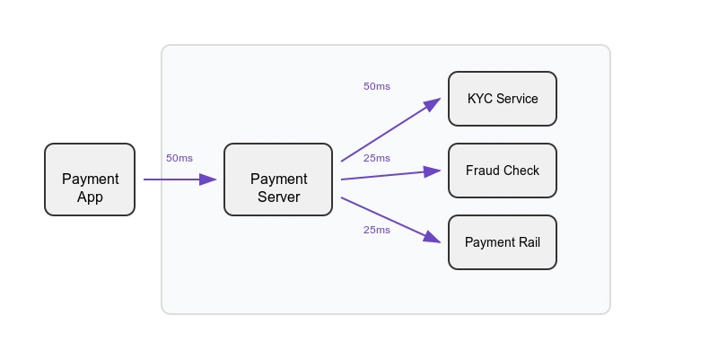

Financial fraud is a pervasive problem costing institutions and consumers billions annually.
Most known examples include credit card fraud, fraudulent online payments, and money laundering.
Banks worldwide faced an estimated **\$442** billion in fraud-related losses in 2023 alone.
In particular, credit card transactional fraud is projected to reach \$43 billion in annual losses by 2026.[^4]
Beyond direct losses, fraud undermines customer trust and can even lead to **false positives** where legitimate transactions are wrongly blocked.
These false alarms frustrate customers and damage reputation.
Consequently, fraud detection systems must not only **catch as much fraud as possible** but also **minimize false positives**.

Fraudsters' tactics evolve rapidly.
Traditional rule-based systems (or simple statistical methods) have proven inadequate against today’s adaptive fraud models.
On one hand, fraudsters form complex schemes and exploit networks of accounts.
On the other hand, legitimate transaction volumes continue to grow due to the rise of e-commerce and digital payments.
This has driven a shift toward **Machine Learning (ML) and AI-based approaches** that can learn subtle patterns and adapt over time.
Critically, detection must happen **in real-time** (or near-real time) to intervene before fraudsters can complete illicit transactions.
As an AWS engineering blog notes, catching fraud "closer to the time of fraud occurrence is key" so that suspicious transactions can be blocked or flagged immediately.[^2]

This article reviews the current state-of-the-art of **real-time transaction fraud detection**, spanning both academic research and industry practice.
It covers the major model families used today:

- **Classical ML models:** Logistic regression, decision trees, random forests, and SVMs.
- **Deep learning approaches:** Feed-forward neural networks, CNNs, RNNs/LSTMs, and autoencoders.
- **Graph-based methods:** Graph Neural Networks leveraging transaction networks.
- **Transformer-based models and foundation models:** Including large pre-trained models like Stripe’s payments foundation model.

For each category, we discuss representative use cases or studies, highlight strengths and weaknesses, and comment on their suitability for real-time fraud detection.
Beside these, we cover **cloud-native and streaming architectures** for real-time deployment (e.g. AWS SageMaker, Azure ML, Kafka streaming).
We also summarize **common datasets** and benchmarks used in fraud research, key **evaluation metrics** (precision, recall, F1, AUC-ROC, detection latency), and important **deployment considerations** such as latency requirements, scalability, explainability, and model retraining frequency.

# Classical ML Models

Classical ML algorithms have long been used in fraud detection and remain strong baselines in both research and production.
These include linear models like **logistic regression**, distance-based classifiers like **k-Nearest Neighbors**, and tree-based models such as **decision trees**, **random forests**, and **gradient boosted trees** (e.g. [XGBoost](https://xgboost.readthedocs.io/)).
Support Vector Machines ([SVMs](https://en.wikipedia.org/wiki/Support_vector_machine)) have also been explored in academic studies.
These approaches operate on hand-crafted features derived from transaction data (e.g. `transaction amount`, `location`, `device ID`, `time-of-day`, etc.), often requiring substantial feature engineering by domain experts.

Banks and financial institutions historically relied on **logistic regression** due to its simplicity and interpretability (its coefficients directly indicate risk factors). 
Even today, logistic models serve as **interpretable baseline** detectors and are sometimes combined with business rules.
However, linear models struggle to capture complex non-linear patterns in large transaction datasets. 
**Decision trees** and **ensemble forests**, such as [Random Forests](https://en.wikipedia.org/wiki/Random_forest) and XGBoost, address this by automatically learning non-linear splits and interactions.
In fact, boosted decision tree ensembles (like XGBoost) became popular in fraud detection competitions and industry solutions due to their high accuracy on tabular data.
These models can capture anomalous combinations of features in individual transactions effectively.
For example, [the winning solutions](https://github.com/VedangW/ieee-cis-fraud-detection) of the [IEEE-CIS fraud detection Kaggle challenge](https://www.kaggle.com/c/ieee-fraud-detection/overview) (2019) heavily used engineered features fed into gradient boosting models, achieving strong performance (AUC ≈ 0.91).
**SVMs** have seen limited practical use, while they can model non-linear boundaries (with kernels), they tend to be computationally heavy for large datasets and offer no interpretable output, so the industry has gravitated more to tree ensembles for complex models.

## Strengths

Classical ML models are typically **fast to train and infer**, and many (especially logistic regression and decision trees) are relatively **easy to interpret**. 
For instance, a logistic regression might directly quantify how much a mismatched billing address raises fraud probability, and a decision tree might provide a rule-like structure (e.g., "if IP country ≠ card country and amount > $1000 ⇒ flag fraud").
These models can be **deployed in real-time** with minimal latency.
A logistic regression is essentially a dot-product of features, and even a large XGBoost ensemble can score a transaction in tens of milliseconds or less on modern hardware. 
They also perform well with limited data: with careful feature engineering, a simple model can already catch a large fraction of fraud patterns.
**Industry adoption** is widespread: many banks initially deploy logistic or tree-based models in production, and even today **XGBoost is a common choice** in fraud ML pipelines.

## Weaknesses

A key limitation is the **reliance on manual features**. 
Classical models cannot automatically invent new abstractions beyond the input features given.
Thus, they may miss complex patterns (e.g., sequential spending behavior, or ring collusion between groups of accounts) unless analysts explicitly code such features (e.g., number of purchases in the last hour, or count of accounts sharing an email domain).
They may also struggle` with **high-dimensional data** like raw event logs or image data (where deep learning excels), though this is less an issue for structured transaction records. 
Another challenge is **class imbalance**.
The occurrence of fraud is rare (often <1% of transactions), which can bias models to predict the majority "non-fraud" class.
Techniques like [balanced class weighting](https://medium.com/@ravi.abhinav4/improving-class-imbalance-with-class-weights-in-machine-learning-af072fdd4aa4), [undersampling](https://www.kaggle.com/code/residentmario/undersampling-and-oversampling-imbalanced-data), or [SMOTE](https://machinelearningmastery.com/smote-oversampling-for-imbalanced-classification/) are often needed to train classical models effectively on imbalanced fraud data.[^16]
Finally, while faster than deep networks, complex ensembles (hundreds of trees) can become **memory-intensive** and may require optimization (quantized models, code generation, etc.) for ultra-low latency at high transaction volumes.

## Real-Time Suitability

Classical models are generally well-suited to real-time fraud scoring. 
They have **low latency inference** and modest resource requirements.
For example, a bank's fraud engine might run a logistic regression and a few decision tree rules in under 10ms per transaction on a CPU.
Even a sophisticated random forest or gradient boosting model can be served via highly optimized C++ libraries or cloud ML endpoints to meet sub-hundred-millisecond SLAs.
The straightforward nature of these models also simplifies **monitoring and updating** them.
New data can be used to frequently retrain or update coefficients (even via [online learning](https://en.wikipedia.org/wiki/Online_machine_learning) for logistic regression).
The main caution is that if fraud patterns shift significantly ([concept drift](https://en.wikipedia.org/wiki/Concept_drift)), purely static classical models will need frequent retraining to keep up.
In practice, many organizations retrain or fine-tune their fraud models on recent data **weekly or even daily** to adapt to new fraud tactics.

## Examples

Representative research and use-cases for classical methods include:

- **Logistic regression and decision trees as baseline models:** E.g., Banks deploying logistic regression for real-time credit card fraud scoring due to its interpretability.
- **Ensemble methods in academic studies:** E.g., evaluating logistic vs. decision tree vs. random forest on a credit card dataset (often finding tree ensembles outperform linear models in recall).[^17]
- **Kaggle competitions:** Use of XGBoost in the IEEE-CIS 2019 competition and by fintech companies, leveraging its accuracy on tabular features.
- **Hybrid systems:** Many production systems combine manual **business rules** (for known high-risk patterns) with an ML model (for subtler patterns), using the rules for immediate high-precision flags and the ML model for broad coverage.

# Deep Learning Models

In recent years, deep learning (DL) techniques have been [applied to transaction fraud detection](https://opencv.org/blog/online-transaction-fraud-detection-using-deep-learning) with promising results.
Deep neural networks can automatically learn complex feature representations from raw data, potentially capturing patterns that are hard to manually engineer. 

## Deep Learning Architectures

Several deep architectures have been explored for fraud detection.

### Feed-Forward Neural Networks (ANNs)

Multi-layer perceptrons treating each transaction’s features as input neurons. 
These can model non-linear combinations of features beyond what logistic regression can capture.
In practice, simple feed-forward networks have been used as a baseline deep model for fraud (e.g., a 3-layer network on credit card data)
They often perform similarly to tree ensembles if ample data is available but are harder to interpret.
They also don’t inherently handle sequence/time information beyond what features provide.

### Convolutional Neural Networks (CNNs)

While CNNs are famous for image tasks, they have been applied to fraud by treating transaction data as temporal or spatial sequences.
For example, a CNN can slide over a sequence of past transactions for a user to detect local patterns or use 1D convolution on time-series of transaction amounts. 
CNNs excel at automatic feature extraction of localized patterns. 
Some research reformats transaction histories into a 2D “image” (e.g., time vs. feature dimension) so that CNNs can detect anomalous shapes. 
CNNs for detecting fraud have seen limited but growing use; one study reported ~99% detection accuracy with a CNN on a credit card dataset[^19] (though such high accuracy is likely due to the highly imbalanced nature of the dataset and using AUC or F1 is more meaningful).

### Recurrent Neural Networks (RNNs)

RNNs, including LSTM and GRU networks, are well-suited for sequential transactional data.
They maintain a memory of past events, making them ideal for modeling an account’s behavior over time. 
For example, an LSTM can consume a customer’s sequence of transactions (with timestamps) and detect if the latest transaction is anomalous given the recent pattern. 
This temporal modeling is very powerful for fraud because many fraud patterns only make sense in context (e.g., a sudden spending spike, or a purchase in a new country right after another far-away purchase). 
Research has shown LSTM-based models can effectively distinguish fraudulent vs. legitimate sequences.
In one case, an LSTM achieved significantly higher recall than static models by catching subtle temporal shifts in user behavior.[^13]
RNNs do require sequential data, so for one-off transactions without history they are less applicable (unless modeling at the merchant or account aggregate level).

### Autoencoders

Autoencoders are unsupervised anomaly detection models that learn to compress and reconstruct data.
Training on predominantly legitimate transactions, an autoencoder will reconstruct normal transactions with low error, but fraudulent transactions (which differ from the learned “normal” manifold) will yield higher reconstruction error.
In fraud settings, we can flag transactions with reconstruction error above a threshold as potential fraud.
Autoencoders have emerged as valuable tools for fraud detection, especially when labeled fraud examples are scarce.[^20]
They learn to reconstruct typical transaction patterns and flag anomalies via high reconstruction error.
For instance, an autoencoder might be trained on millions of legitimate transactions and then, when presented with a new transaction, if it cannot well reconstruct it (high error), this indicates the transaction is unlike the normal patterns. 
Studies have found autoencoder-based detection can achieve good precision in identifying novel frauds without any fraud labels in training. 
Variational Autoencoders (VAEs) have also been tried for this purpose.[^21]

### Generative Adversarial Networks (GANs)

GANs consist of a generator and discriminator. They have two main uses in fraud detection: 

1. **Generate realistic synthetic fraud examples:** GANs can augment training data to address class imbalance. The generator is trained to produce fake transactions that the discriminator (trained to distinguish real vs. fake) finds plausible. By adding these synthetic frauds to the training set, models (including non-deep models) can learn a broader decision boundary. 

2. **Serve as anomaly detectors:** The generator tries to model the distribution of legitimate transactions, and the discriminator’s output can highlight outliers. 
 
Some financial institutions have experimented with GANs.
For example, [Swedbank reportedly used GANs](https://developer.nvidia.com/blog/detecting-financial-fraud-using-gans-at-swedbank-with-hopsworks-and-gpus/) to generate additional fraudulent examples for training their models.
However, GAN training can be complex and less common in production.
Still, in research, GAN-based methods have shown improved recall by expanding the fraud training sample space.[^22]

### Hybrid Deep Models

There are also custom architectures combining elements of the above, or combining deep models with classical ones. 
For example, a "wide and deep model" might have a linear (wide) component for memorizing known risk patterns and a neural network (deep) component for generalization. 
Another example is combining an LSTM for sequence modeling with a feed-forward network for static features (“dual-stream” models). 
Ensembles of deep and non-deep models have also been used (e.g., using an autoencoder’s anomaly score as an input feature to a random forest). 
Recent research explores stacking deep models with tree models to improve robustness and interpretability.

## Strengths

Deep learning’s biggest advantage is **automated feature learning**.
Deep models can uncover intricate, non-linear relationships and subtle correlations within massive datasets that older methods miss.
They can digest raw inputs (even unstructured data) and find patterns without explicit human-designed features.
For instance, an RNN can learn the notion of “rapid spending spree” or “geographical inconsistency” from raw sequences, which would be hard to capture with handcrafted features. 

Deep nets also tend to **improve with more data**, whereas classical models may saturate in performance.
In fraud detection, large payment companies have millions of transactions which deep models can leverage to potentially exceed the accuracy of simpler models.

Another strength is handling **complex data types**: If one incorporates additional signals like device fingerprints, text (e.g., product names), or network information, deep networks can combine these modalities more seamlessly (e.g., an embedding layer for device ID, an LSTM for text description, etc.).

In practice, deep models have shown **higher recall** (catching more fraud) at a given false-positive rate compared to classical models, in several cases.[^13]
They are also adaptive architectures like RNNs or online learning frameworks can update as new data comes in, enabling continuous learning (important as fraud evolves).

## Weaknesses 

The primary downsides are **complexity and interpretability**. 
Deep networks are often “black boxes”, meaning that it’s non-trivial to explain why a certain transaction was flagged.
This is problematic for financial institutions that need to justify decisions to customers or regulators.
Techniques like [SHapley Additive exPlanations](https://shap.readthedocs.io/) (SHAP) or [Local Interpretable Model-Agnostic Explanations](https://github.com/marcotcr/lime) (LIME) can help interpret feature importance for deep models, [but it’s still harder](https://www.milliman.com/en/insight/Explainable-AI-in-fraud-detection) compared to a linear model or decision tree. 

Another issue is the **data and compute requirement**.
Training large neural networks may require GPUs and extensive hyperparameter tuning, which can be overkill for some fraud datasets (especially if data is limited or highly imbalanced).
In fact, many academic studies on the popular Kaggle credit card dataset (284,807 transactions) found that simpler models can match deep model performance, likely because the dataset is small and mostly numeric PCA features. 
Deep models really shine when there are huge datasets or additional unlabeled data to pre-train on.

**Overfitting** is a risk too, fraud datasets are skewed and sometimes static snapshots in time.
A deep network might memorize past fraud patterns that fraudsters no longer use, if not carefully regularized.

Finally, **latency can be a concern**.
A large CNN or LSTM might take longer to evaluate than a logistic regression.
However, many deep models used for fraud are not excessively large (e.g. an LSTM with a few hundred units), and with optimized inference (batching, quantization, etc.) they can often still meet real-time requirements.
We discuss latency more later, but suffice it to say that deploying deep models at scale might necessitate **GPU acceleration** or model optimizations in high-throughput environments.

## Real-Time Suitability

Many deep learning models can be deployed for real-time fraud scoring, but it requires more care than classical models. 
Simpler networks (small MLPs) are no issue for real-time.
RNNs or CNNs might introduce slight latency (tens of milliseconds), but modern inference servers and even FPGAs/TPUs can handle thousands of inferences per second.
For instance, Visa reportedly targets fraud model evaluations in under \~25ms as part of their payment authorization pipeline.
It’s feasible to achieve this with a moderately sized neural network and good infrastructure.

Scaling to high transaction volumes is another aspect.
Deep models may consume more CPU/GPU resources, so a cloud deployment might need to autoscale instances or use GPU inference for peak loads.

A potential strategy for real-time use is a **two-stage system**: a fast classical model first filters obvious cases (either definitely legitimate or obviously fraudulent), and a slower deep model only analyzes the ambiguous middle chunk of transactions.
This way, the heavy model is used on a fraction of traffic to keep overall throughput high. 

Additionally, organizations often maintain a **feedback loop**: flag predictions are reviewed (by analysts or via outcomes like chargebacks), and the deep model is retrained frequently to incorporate the latest data. 

Some deep models can be updated via **online learning**.
For example, an RNN that continuously updates its hidden state or a streaming NN that periodically retrains on a rolling window of data, which helps keep them current with 
concept drift.

## Examples

Notable examples of deep learning in fraud detection:

- *Feedforward DNNs:* PayPal in the mid-2010s applied neural networks to fraud, and more recent fintech startups leverage DNNs on features (Feedzai, etc., often combining with tree models).
- *RNN/LSTM for sequences:* Multiple studies (Jha et al. 2019, Bahnsen et al. 2016, etc.) showed LSTM networks can detect sequential fraud behavior that static models miss, improving recall by capturing temporal patterns. Some large merchants use LSTMs on user event streams to catch account takeovers and fraud in session.
- *Autoencoder anomaly detection:* unsupervised autoencoders have been used by banks to flag new types of fraud. For instance, an autoencoder trained on normal mobile transactions flagged anomalies that turned out to be new fraud rings exploiting a loophole (detected via high reconstruction error).
- *Hybrid Deep + GBDT:* Recent trends include using neural networks to generate features for a gradient boosted tree. One approach trained a deep autoencoder or embedding model on transactions, then fed the learned embeddings into XGBoost, yielding improved accuracy while retaining the tree model’s explainability. This hints at a theme: combining deep learning’s representation power with the structured modeling and interpretability of classical methods.

# Graph-Based Models

A powerful class of methods treats the financial system as a graph, linking entities like users, accounts, devices, IP addresses, merchants, etc.
Fraudulent activity often involves networks: groups of fraudsters might share information (e.g. using the same stolen cards or devices), or a single fraudster might operate many accounts that transact with each other. 
Graph-based models aim to exploit these relational structures to detect fraud patterns that single-transaction models might miss. 
The rise of [Graph Neural Networks](https://en.wikipedia.org/wiki/Graph_neural_network) (GNNs) in recent years has led to many applications in fraud detection.[^23]

<figure class="jb_picture">
  {% responsive_image width: "100%" border: "1px solid #808080" path: img/posts/2025/2025-04-03/suspicious-subgraphs.png alt: "Illustration of entity linkages in transaction fraud" %}
  <figcaption class="stroke"> 
    Illustration of entity linkages in transaction fraud: Shared devices, phone numbers, and locations connect different users. Fraudsters (devil icons) may create many accounts that all link through common data points (phone, IP, geo), forming <b>suspicious</b> subgraphs that graph-based methods can detect.
  </figcaption>
</figure>

In a graph representation, we can model, for example, a bipartite graph of *credit card transactions*: one set of nodes are **cardholders**, another set are **merchants**, and an edge connects a cardholder to a merchant for each transaction.
Fraudulent cards might cluster via merchant edges (e.g. a fraud ring testing many stolen cards at one merchant), or vice versa. 
Similarly, for online payments we can create nodes for user accounts, email addresses, IP addresses, device IDs, etc., and connect nodes that are observed together in a transaction or account registration. 
This yields a rich heterogeneous graph of entities.
**Graph algorithms** can then be applied: community detection, link analysis (e.g. PageRank on the fraud graph), or, most effectively in recent literature, Graph Neural Networks (GNNs) that learn embeddings for nodes or edges to classify them as fraudulent or not.

GNNs are deep learning models designed for graph-structured data. 
They propagate information along edges, allowing each node to aggregate features from its neighbors. 
In fraud terms, a GNN can learn to identify suspicious nodes (e.g. users or transactions) by looking at their connected partners.
For instance, if a particular device ID node connects to many user accounts that were later flagged as fraud, a GNN can learn to embed that device node as high-risk, which in turn raises the risk of any new account connected to it.

<aside class="quote">
    <em>“Fraud is rarely a problem of isolated events… fraudsters operate within complex networks.”</em> 
</aside>

GNNs consider connections between accounts and transactions to reveal patterns of suspicious activity across the network.
By incorporating relational context, GNNs have demonstrated **higher fraud detection accuracy and fewer false positives** than models that ignore graph structure.
For example, combining GNNs features with an XGBoost classifier led to catching fraud that would otherwise go undetected and reducing false alarms due to the added network context. 
A GNN approach might catch a seemingly normal transaction if the card, device, or IP involved has connections to known frauds that a non-graph model wouldn’t see.

Several types of GNNs architectures have been used: **Graph Convolutional Networks (GCN)**, **GraphSAGE**, **heterogeneous GNNs** (for multi-type node graphs), and even **Graph Transformers**. 
A notable benchmark is the [Elliptic dataset](https://pytorch-geometric.readthedocs.io/en/latest/generated/torch_geometric.datasets.EllipticBitcoinDataset.html) (a Bitcoin transaction graph) where GNNs have been applied to identify illicit transactions by classifying nodes in a large transaction graph. 
In one study, a GCN on the Elliptic bitcoin graph outperformed random forest by a significant margin in identifying illicit nodes, especially when only a small fraction of nodes have labels.
GNNs have also been applied to credit card networks: e.g., researchers have built graphs linking credit card numbers, merchants, and phone numbers, and used a heterogeneous GNN to detect fraud cases involving synthetic identities and collusive merchants.[^3]

## Strengths

Graph-based methods can detect **patterns of collusion and linkage** that purely feature-based models miss. 
They effectively **augment each transaction with context**.
Rather than evaluating an event in isolation, the model considers the broader network (device usage graph, money flow graph, etc.). 
This is crucial for catching fraud rings.
For example, multiple accounts controlled by one entity or chains of transactions moving funds, which might appear normal individually but are anomalous in aggregate.
GNNs in particular combine the best of both worlds: they leverage **graph structure + attribute features** together, learning meaningful representations of nodes/edges.[^3]
This is important when fraudsters deliberately make individual transactions look innocuous but cannot hide the **relationships** (e.g., reusing the same phone or IP address across many accounts).

Another advantage is in reducing false positives by providing context.
For example, a transaction with a new device might normally seem risky, but if that device has a long history with the same user and no links to bad accounts, a 
graph model can recognize it as low risk, avoiding a false alarm. 
Industry reports indicate that adding graph features or GNNs outputs has improved precision of fraud systems by filtering out cases that looked suspicious in isolation but were safe in context.[^4]

##  Weaknesses

<aside class="quote">
    <em>“Current GNNs solutions mainly rely on offline batch training and inference, predicting fraudsters in real-time is crucial but challenging.”</em> 
</aside>

The biggest challenge is **complexity** in implementation and deployment. 
Building and maintaining the graph data (a.k.a. the “graph pipeline”) is non-trivial. 
Transactions arrive in a stream and must update the graph in real-time (e.g. adding new nodes, new edges). 
Querying the graph for each new transaction’s neighborhood can be slow if not engineered well.
The inference itself can be heavy.
Running a GNNs means loading a subgraph and doing matrix operations that are costlier than a simple ML model.
Many current GNNs solutions operate in batch (offline).
There are limited reference architectures for real-time GNNs serving, though this is an active development area. 

Another issue is **scalability**. 
Graphs of financial transactions or users can be enormous (millions of nodes, tens of millions of edges).
Training a full GNNs on such a graph might not fit in memory or might be extremely slow without sampling techniques.
Some approaches use graph sampling or partitioning to handle this, or only use GNNs to generate features offline.
Additionally, GNNs can be hard to interpret (even more so than regular deep nets) since the features are aggregate of neighbors. 
It can be challenging to explain to an analyst why a certain account was flagged: the reason might be “it’s connected to three other accounts that had chargebacks,” which is somewhat understandable, but the GNN’s learned weights on those connections are not human-interpretable beyond that concept.

## Real-Time Suitability

Real-time deployment of graph-based models is at the cutting edge. 
It is being done in industry but often with approximations.
One pragmatic solution is to use graph analytics to create additional features for a traditional model.
For example, compute features like “number of accounts sharing this card’s IP address that were fraud” or “average fraud score of neighbors” and update these in real-time, then let a gradient boosting model or neural network consume them. 
This doesn’t require full GNNs online inference, but captures some graph insights. 
However, truly deploying a GNNs in production for each event requires a fast graph database or in-memory graph store.

AWS demonstrated a prototype using Amazon Neptune (graph DB) + DGL (Deep Graph Library) to serve GNNs predictions in real-time by querying a subgraph around the target node for each inference.[^3]
This kind of pipeline can score within a second or two, which may be acceptable for certain use cases (e.g. online account opening fraud). 
For high-frequency card transactions (which need sub-second decisions), a full GNNs might still be too slow today unless heavily optimized.

An alternative is what Nvidia suggests: use GNNs offline to produce node embeddings or risk scores, then feed those into a super-fast inference system (like an XGBoost model or a rules engine) for the real-time decision.[^4]
This hybrid approach was shown to work at large scale, where GNN-based features improved detection by even a small percent (say 1% AUC gain), which for big banks translates to millions saved. 

Lastly, maintaining graph models demands continuous updates as the graph evolves.
This is stil manageable, as new data can be incrementally added, but one must watch for concept drift in graph structure (fraud rings forming new connectivity patterns).

## Examples

Representative examples of graph-based fraud detection:

- *Bitcoin fraud detection:* The [Elliptic Bitcoin Dataset](https://pytorch-geometric.readthedocs.io/en/latest/generated/torch_geometric.datasets.EllipticBitcoinDataset.html) is a graph of 203,769 transactions (nodes) with known illicit vs licit labels. GNNs models (GCN, GraphSAGE) on this dataset achieved strong results, showing that analyzing the transaction network is effective for detecting illicit cryptocurrency flows.
- *Credit card network:* Researchers built a **graph of credit card transactions** (cards, merchants, etc.) and applied a GNNs which outperformed a baseline MLP by leveraging connections (e.g. card linked to a fraudulent merchant gives card a higher fraud probability).
- *E-commerce account fraud:* Companies like Alibaba and PayPal have internal systems modeling user networks. For example, accounts connected via shared device or IP can indicate **sybil attacks** or mule accounts. Graph algorithms identified clusters of accounts that share many attributes (forming fraud communities) which were then taken down as a whole.
- *Telecom fraud (subscription/call fraud):* Graphs connecting phone numbers, IDs, and addresses have been used to catch identity fraud rings. A famous case is detecting **“bust-out fraud”** in which a group of credit card accounts all max out and default – the accounts often share phone or address; linking them in a graph helps catch the ring before the bust-out completes.
- *Social network fraud:* In social finance platforms or peer-to-peer payments, graph methods are used to detect **money laundering** or collusion by analyzing the network of transactions among users (e.g. unusually interconnected payment groups).

Overall, graph-based methods, especially GNNs, represent a cutting-edge approach that can significantly enhance fraud detection by considering **relational data**. As tooling and infrastructure improve (graph databases, streaming graph processing), we expect to see more real-time GNNs deployments for fraud in the coming years.

# Transformer-Based and Foundation Models

Transformers (originally developed for language processing) have revolutionized many domains, and they are now making inroads in fraud detection.
The key innovation of transformers is the **self-attention mechanism**, which allows modeling long-range dependencies in sequences.
In the context of transaction data, transformers can analyze **transaction sequences or sets of features** in flexible ways.
Moreover, large pre-trained **foundation models** (akin to GPT or BERT, but for payments) are emerging, where a model is pre-trained on massive amounts of transaction data to learn general patterns, then fine-tuned for specific fraud tasks.

One of the most notable recent developments comes from **Stripe**, the online payments company, which announced a transformer-based *“Payments Foundation Model.”* This is a large-scale self-supervised model trained on **tens of billions of transactions** to create rich numeric representations (embeddings) of each transaction. The idea is analogous to how language models embed words: Stripe’s model learns a high-dimensional embedding for a transaction that captures its essential characteristics and context. Transactions with similar patterns end up with similar embeddings (for example, transactions from the same bank or same email domain cluster together in embedding space). These embeddings serve as a universal representation that can be used for various tasks – fraud detection, risk scoring, identifying businesses in trouble, etc. For the fraud use-case, Stripe reports a dramatic improvement: by feeding sequences of these transaction embeddings into a downstream classifier, they achieved an **increase in detection rate for certain fraud attacks from 59% to 97% overnight**. In particular, they targeted *“card testing”* fraud (fraudsters testing stolen card credentials with small purchases) – something that often hides in high-volume data. The transformer foundation model was able to spot subtle sequential patterns of card testing that previous feature-engineered models missed, **blocking attacks in real-time** before they could do damage. This showcases the potential of transformer models: *“Turns out attention was all payments needed!”*, as the Stripe engineers quip.

<iframe src="https://www.linkedin.com/embed/feed/update/urn:li:share:7325973743875346433?collapsed=1" height="258" width="504" frameborder="0" allowfullscreen="" title="Embedded post" style="display: block; margin: 0 auto;"></iframe>

Beyond Stripe, we see academic interest in transformers for fraud. Some researchers have applied **Transformer encoders to tabular data** (there are models like TabTransformer or integration of transformers with structured data) and reported improved accuracy over MLPs and even over tree models in some cases. The ability of transformers to focus attention on important features or interactions could be beneficial for high-dimensional transaction data. For example, a transformer might learn to put high attention on the *DeviceID* feature when the *IP address country* is different from the *billing country*, effectively learning a rule-like interaction that would be hard for a linear model. Transformers can also model **cross-item sequences**: one can feed a sequence of past transactions as a “sentence” into a transformer, where each transaction is like a token embedding (comprised of attributes like amount, merchant category, etc.). The transformer can then output a representation of the sequence or of the next transaction’s risk. This is similar to an RNN’s use but with the advantage of attention capturing long-range dependencies (e.g. a pattern that repeats after 20 transactions). There have been experiments where a transformer outperformed LSTM on fraud sequence classification, due to its parallel processing and ability to consider all transactions’ relations at once.

Another angle is using transformer models for **entity resolution and representation** in fraud. For instance, a transformer can be trained on the corpus of all descriptions or merchant names that a user has transacted with, thereby learning a “profile” of the user’s spending habits and detecting an out-of-profile transaction (similar to how language models detect an odd word in a sentence). Additionally, **BERT-like models** can be used on event logs or customer support chats to detect social engineering fraud attempts, though that’s adjacent to transaction fraud.

**Foundation models** in fraud refer to large models trained on broad data that can then be adapted. Besides Stripe’s payments model, other financial institutions are likely developing similar *pre-trained embeddings*. For example, a consortium of banks could train a model on pooled transaction data (in a privacy-preserving way, or via federated learning) to get universal fraud features. These large models may use transformers or other architectures but the common theme is self-supervised learning: e.g. predicting a masked field of a transaction (merchant category, or amount) from other fields, or predicting the next transaction given past ones. Through such tasks, the model gains a deep understanding of normal transactional patterns. When fine-tuned on a specific fraud dataset, it starts with a rich feature space and thus performs better with less training data than a model from scratch. This is analogous to how image models pre-trained on ImageNet are fine-tuned for medical images with small datasets.

**Strengths:** Transformers and foundation models bring **state-of-the-art pattern recognition** to fraud. They particularly shine in capturing **complex interactions** and **sequential/temporal patterns**. The attention mechanism allows the model to focus on the most relevant parts of the input for each decision – for fraud, this could mean focusing on certain past transactions or specific features that are indicative of risk in context. This yields high detection performance, especially for *“hard fraud”* that evades simpler models. The Stripe foundation model’s success (boosting detection from 59% to 97% for a tricky fraud type) exemplifies how a richer model can dramatically improve outcomes. Another strength is **multitask capability**: a large foundation model can be trained once and then used for various related tasks (fraud, credit risk, marketing predictions) simply by fine-tuning or prompting, rather than maintaining separate models for each. This “one model, many tasks” approach can simplify the system and leverage cross-task learning (e.g. learning what a risky transaction looks like might also help predict chargebacks or customer churn). Moreover, transformers can handle **heterogeneous data** relatively easily – one can concatenate different feature types and the self-attention will figure out which parts to emphasize. For example, Stripe’s model encodes each transaction as a dense vector capturing numeric fields, categorical fields, etc., all in one embedding. Finally, foundation models can enable **few-shot or zero-shot fraud detection**: imagine detecting a new fraud pattern that wasn’t in the training data. A pre-trained model that has generally learned “how transactions usually look” might pick up the anomaly better than a model trained only on past known frauds.

## Weaknesses

The obvious downsides are **resource intensity and complexity**. Training a transformer on billions of transactions is a monumental effort – requiring distributed training, specialized hardware (TPUs/GPUs), and careful tuning. This is typically only within reach of large organizations or collaborations. In production, serving a large transformer in real-time can be challenging due to model size and latency. Transformers can have millions of parameters; even if each inference is 50-100ms on a GPU, at very high transaction volumes (thousands per second) this could be costly or slow without scaling out. Techniques like model quantization, knowledge distillation, or efficient transformer variants (Transformer Lite, etc.) might be needed. Another concern is **explainability** – even more so than a standard deep network, a giant foundation model is a black box. Explaining its decisions requires advanced XAI methods, like interpreting attention weights or using SHAP on the embedding features, which is an active research area. For regulated industries, one might still use a simpler surrogate model to justify decisions externally, while the transformer works under the hood. **Overfitting and concept drift** are also concerns: a foundation model might capture a lot of patterns, including some that are spurious or not causally related to fraud. If fraudsters adapt, the model might need periodic re-training or fine-tuning with fresh data to unlearn outdated correlations. The Stripe model is self-supervised (no fraud labels in pre-training) which helps it generalize, but any discriminative fine-tuning on fraud labels will still need updating as fraud evolves.

## Real-Time Suitability

Surprisingly, with the right engineering, even large transformers can be used in or near real-time. In Stripe’s case, they emphasize the solution runs *“all in real-time”* – meaning the foundation model embeddings are generated and used to score incoming traffic on the fly. This suggests they have optimized the embedding generation (possibly via GPU inference or caching mechanisms). One strategy is to pre-compute embeddings for entities (like a card or user) so that only incremental computation is needed per new transaction. Another strategy is **two-stage scoring**: use a smaller model to thin out events, then apply the heavy model to the most suspicious subset. If real-time means sub-second (say <500ms), a moderately sized transformer model on modern inference servers can fit that window, especially if batch processing a few transactions together to amortize overhead. Cloud providers also offer **accelerated inference endpoints** (like AWS Inferentia chips or Azure’s ONNX runtime with GPU) to deploy large models with low latency. That said, not every company will want to deploy a 100M+ parameter model for each transaction if a simpler model would do – there is a trade-off between maximum accuracy and infrastructure cost/complexity. In many cases, a foundation model could be used to **periodically score accounts offline** (to detect emerging fraud rings) and a simpler online model handle immediate decisions, combining their outputs.

Use cases and research for transformers in fraud:

* *Stripe’s Payments Foundation Model:* A transformer-based model trained on **billions of transactions**, now used to embed transactions and feed into Stripe’s real-time fraud systems. It improved certain fraud detection rates from 59% to 97% and enabled detection of subtle sequential fraud patterns that were previously missed.
* *Academic research – Tabular transformers:* Studies like Chang et al. (2023) applied a transformer to the **Kaggle credit card dataset** and compared it to SVM, Random Forest, XGBoost, etc. The transformer achieved comparable or superior Precision/Recall, demonstrating that even on tabular data a transformer can learn effectively.
* *Sequence anomaly detection:* Some works use transformers to model **time series of transactions per account**. A transformer may be trained to predict the next transaction features; if the actual next transaction diverges significantly, it could flag an anomaly. This is analogous to language model use (predict next word).
* *Cross-entity sequence modeling:* Transformers can also encode sequences of transactions across entities, e.g., tracing a **chain of transactions through intermediary accounts** (useful in money laundering detection). A graph transformer (like the recent *FraudGT* model) combines ideas of GNNs and transformer to handle transaction graphs with sequential relations.
* *Foundation models for documents and text in fraud:* While not the focus here, note that transformers (BERT, GPT) are heavily used to detect fraud in textual data – e.g., scam emails, fraudulent insurance claims text, etc. In a holistic fraud system, a foundation model might take into account not just the structured transaction info but also any unstructured data (like customer input or messages) to make a decision.

In summary, **transformer-based models and foundation models** represent the frontier of fraud detection modeling. They offer unparalleled modeling capacity and flexibility, at the cost of high complexity. Early results, especially from industry leaders, indicate they can substantially raise the bar on fraud detection performance when deployed thoughtfully. As these models become more accessible (with open-source frameworks and possibly smaller specialized versions), more fraud teams will likely adopt them, particularly for **large-scale, multi-faceted fraud problems** where simpler models hit a ceiling.

# Deployment Strategies

Developing a high-accuracy fraud model is only half the battle – it must be deployed in an architecture that can handle **real-time data streams, low latency decisions, and high throughput**. Modern fraud detection systems often leverage cloud-native components and streaming frameworks to achieve these goals. Here we outline typical deployment patterns and tools (with examples from AWS and Azure) for real-time fraud detection:

## Event Streaming and Ingestion

Transactions are often ingested as a continuous stream (from payment processors, banking systems, etc.). Cloud services like **Amazon Kinesis Data Streams** or **Apache Kafka** (Amazon MSK, Azure Event Hubs) are commonly used to capture and buffer these events in real-time. Streaming ingestion ensures that as soon as a transaction occurs, it’s funneled into the detection pipeline within milliseconds. Some systems also use message queues or HTTP APIs for ingestion, but streams provide better scalability for high volumes.

## Real-Time Feature Computation

Before the model can score a transaction, relevant features need to be assembled. This may involve **enriching the event with historical data** (e.g. how many transactions has this user made in the past 24 hours? What is the average amount?). In a cloud-native setup, a **feature store** or fast database is used. For example, **Amazon DynamoDB** or **Redis** can store running aggregates or recent activity for each account so that a Lambda function can quickly retrieve features for the incoming transaction. Some organizations use **in-memory feature caches** (like Redis, Hazelcast) to achieve sub-millisecond feature lookups. AWS offers a **Feature Store (SageMaker Feature Store)** that can ingest streaming updates and serve features with low latency. The goal is to avoid slow joins or searches in the transaction path – pre-compute whatever you can.

## Model Serving (Inference)

The core is a deployed ML model that given a transaction (with features) returns a fraud score or decision. Cloud providers have dedicated services for model hosting: **AWS SageMaker Endpoints**, **Google Vertex AI endpoints**, **Azure ML online endpoints**, etc. These can host a trained model behind a REST API, scaling it horizontally and often with GPU acceleration if needed. For extremely low latency, some opt for serverless functions (like AWS Lambda or Azure Functions) with embedded models for small lightweight models – but more commonly, persistent services handle the model. AWS in particular has a service called **Amazon Fraud Detector**, which is a managed service where you can train a fraud detection model (under the hood it uses algorithms like XGBoost or neural nets) and then do real-time predictions via an API without worrying about the infrastructure. Companies can also deploy their models in containers on Kubernetes or ECS, which many do for flexibility. Regardless of method, the inference service must be **highly scalable and responsive**. A typical target might be p95 latency under 50–100ms for the model API. Some use **multi-model endpoints** to host several models (for different segments or tasks) behind one service.

## Streaming Orchestration and Decision Logic

After getting a model score, the system needs to take action. Often a **stream processing framework** or workflow orchestrator handles this. For example, AWS proposes using **AWS Lambda + AWS Step Functions** to coordinate the steps in real-time. A Lambda function might receive a batch of transactions from Kinesis, call the Fraud Detector or SageMaker model endpoint for each, then the Step Functions workflow can route the result – if score > threshold, take one path (e.g. send alert or invoke a rule engine), else another path. Other setups use **Apache Flink or Spark Streaming** to embed the model scoring inside the stream processing code – each event flows through a function that scores it and then depending on the score, different streams (pass vs. review) are produced. These streaming frameworks allow for high-throughput, continuous processing with stateful operators (like keeping counters per user). **Complex Event Processing (CEP)** engines can also be used for certain rule-based detections (like “if 5 transactions from the same card in 1 minute, flag”) as part of the pipeline.

## Alerts, Notifications, and Downstream Actions

Once a transaction is scored as fraudulent or suspicious, the system typically triggers some action. In a cloud deployment, this could be an alert to a **queue or topic**. For instance, send a message to an **SNS topic or Azure Service Bus** that flags the transaction for manual review, or directly call an API to decline the transaction if integrated in an authorization system. Real-time dashboards may be updated, and cases created in case management systems. **Response time is crucial** – if the pipeline is integrated inline with transaction authorization, it might return a “reject” or “challenge (2FA)” decision immediately to the front-end (e.g. the e-commerce site or point-of-sale). More often, fraud detection runs in parallel with authorization and can post-authorize flag a transaction for follow-up (except for high-risk ones which might be blocked in real-time).

## Cloud Example – AWS

AWS provides a reference architecture for real-time fraud detection using all managed services. One pattern is: transactions flow into **Kinesis** → a **Lambda** processes each event (or micro-batches) → it calls **Amazon Fraud Detector** (which hosts the ML model) → the result is written to a DynamoDB and also triggers a Step Function workflow that has logic like “if fraud score above X, call SNS to alert or invoke a case creation”. This entire pipeline is serverless, meaning it can scale seamlessly and you pay per use. Latency can be low (tens of ms for model inference + some overhead). Another pattern uses **Kinesis Data Firehose** to batch events to S3 and simultaneously use a Lambda for real-time scoring (splitting into real-time vs. storage streams). AWS’s managed *Fraud Detector* service is noteworthy: it automates feature engineering (e.g. aggregates) and trains a model on provided data, then hosts an endpoint. This lowers the barrier for teams that don’t want to custom-build a model – though it may not be as flexible or cutting-edge as a custom model. For more advanced needs, AWS suggests using SageMaker to train custom models (possibly including GNNs as shown in an AWS blog using SageMaker + Neptune for real-time GNNs inference).

## Cloud Example – Azure

Azure’s approach would use similar components: **Azure Event Hubs** for ingestion, **Azure Stream Analytics or Azure Functions** for processing events, **Azure Machine Learning online endpoints** to serve the model, and maybe **Cosmos DB or Azure SQL** to store historical data. Microsoft published an architecture for *real-time mobile banking fraud detection* that uses **Azure Stream Analytics to process events and call an ML model**, achieving detection within \~2 seconds of the transaction. Azure also has an **Anomaly Detector** service (unsupervised) that could be leveraged for fraud, and a template for real-time fraud with Databricks or Synapse pipelines as well. GCP similarly would use **Pub/Sub, Dataflow (Apache Beam), Bigtable/Firestore for features, and Vertex AI for model deployment**, plus possibly **Cloud Functions** for lightweight handling.

## Microservices and APIs

Not all systems use streaming platforms – some bank architectures are microservice-based. For example, when a transaction request comes in, it hits a **Fraud Service** API (a dedicated microservice) which synchronously computes features (possibly via caching microservices), calls the ML model, applies some rules, and returns a decision to the transaction processor. This is a request/response approach rather than event-driven, but it can achieve real-time decisions inline. The microservice might be containerized and scaled on Kubernetes, with careful optimization for latency (e.g. written in a fast language like Go or C++ if needed). Many legacy bank systems still use this approach, sometimes even running models on mainframe or on-prem servers with custom code.

## Monitoring and Logging

A crucial part of deployment is monitoring model performance and system health. Cloud deployments will use tools like CloudWatch (AWS) or Application Insights (Azure) to track latency of model calls, throughput of the stream, error rates, etc. They will also log the model scores and decisions to data stores for offline analysis. In fraud, **drift monitoring** is very important – e.g., if the fraction of transactions flagged as fraud drops or spikes suddenly, that might indicate model drift or a new fraud attack getting past the model. So telemetry and alerting on model outputs are set up.

## Continuous Updates

Deployment strategies include mechanisms for **model retraining and redeployment**. In a cloud setup, one might schedule a SageMaker training job every day on the latest data, then deploy the new model to the endpoint if it passes evaluation. Blue/green deployment can be used to test new models on a shadow traffic before fully cutting over, to ensure they perform well. With infrastructure-as-code, all these steps (data extraction, training, evaluation, deployment) can be orchestrated in pipelines (e.g. using AWS Step Functions or Azure Pipelines). **Retraining frequency** depends on data drift – some retrain monthly, others daily. Real-time pipelines benefit from at least **weekly retraining** in high-fraud environments, as fraud rings can evolve quickly.

## Summary

In summary, **cloud-native architectures** provide the building blocks to operationalize fraud detection models at scale. Key characteristics of a robust deployment are: **low latency** data flow (streaming or fast APIs), **scalability** to handle spikes (serverless or auto-scaling services), **reliability** (redundant and monitored), and the ability to **quickly update models** and rules as fraud patterns change. By using managed services (streams, functions, hosted ML models), teams can focus on the fraud logic while the cloud handles the heavy lifting of scaling and throughput. Many modern fraud platforms (Feedzai, Featurespace, etc.) are built with these principles, often on top of the client’s cloud of choice.

# Public Datasets

Research in fraud detection often relies on a few key **public datasets** to evaluate models, given that real financial data is usually proprietary. Below we summarize some of the most commonly used datasets, along with their characteristics:

| **Dataset (Source)**                                            | **Description**                                                                                                                                                                                                                                                                                                                                          | **Size & Class Imbalance**                                                                                                                                                                                                            | **Notes**                                                                                                                                                                                                                                                                                                                                                                                                                |
|-----------------------------------------------------------------|----------------------------------------------------------------------------------------------------------------------------------------------------------------------------------------------------------------------------------------------------------------------------------------------------------------------------------------------------------|---------------------------------------------------------------------------------------------------------------------------------------------------------------------------------------------------------------------------------------|--------------------------------------------------------------------------------------------------------------------------------------------------------------------------------------------------------------------------------------------------------------------------------------------------------------------------------------------------------------------------------------------------------------------------|
| **Kaggle Credit Card (2013)**   *\[European Cardholders]*    | Real credit card transactions over 2 days in Sept. 2013, with features being 30 numerical values (most are PCA-transformed) plus time and amount. The data was made public by researchers from ULB (Belgium).                                                                                                                                            | **284,807 transactions**; **492 fraud** (0.172% fraud). Highly imbalanced.                                                                                                                                                            | The go-to dataset for many papers. All features are normalized PCA components (V1–V28) except Time and Amount, so it’s anonymized. Allows testing of algorithms on extreme imbalance. Many models achieve \~0.90+ AUC here, but need careful handling of class imbalance.                                                                                                                                                |
| **IEEE-CIS Fraud (Vesta 2019)**   *\[Kaggle Competition]*    | A large e-commerce transactions dataset with a wide range of features: device info, payment info (card type, etc.), email domain, address, etc. Split into transaction and identity tables. Released as part of a Kaggle competition by Vesta Corporation and IEEE-CIS.                                                                                  | **590,000 training transactions** (approx) with **3.5% fraud**; plus \~500,000 test transactions. Moderately imbalanced (about 1:28 fraud\:legit).                                                                                    | This dataset is much richer (about 300 features) including many categorical features and some missing data. It reflects online card-not-present fraud. Winning solutions used extensive feature engineering and ensemble models. Good testbed for entity-centric features and advanced models.                                                                                                                           |
| **PaySim (Mobile Money Sim)**   *\[Lopez-Rojas et al. 2016]* | A **synthetic** dataset generated by the PaySim simulator, which mimics mobile money transfer operations (in an African mobile money service). Includes different transaction types: CASH-IN, CASH-OUT, TRANSFER, etc., with fields for origin and destination balances. Fraudulent transactions are simulated as illegal transfers that get cashed out. | **6,362,620 transactions** in full dataset (as reported in the PaySim paper), of which a small fraction are fraud. A commonly used subset is \~2.77 million transactions with **8,213 fraud** (\~0.30%).                              | PaySim is not real data but derived from real patterns. It’s useful for evaluating models in a controlled scenario. It contains temporal information (step = hour of simulation). Most frauds in PaySim are in the TRANSFER and CASH-OUT type. Often used to evaluate how models handle larger-scale data. Note: because it’s synthetic, models might perform unrealistically well if they overfit simulation artifacts. |
| **Elliptic Bitcoin Dataset**   *\[Weber et al. 2019]*        | A graph of Bitcoin transactions with ground truth labels for illicit vs licit transactions. Each node is a transaction, edges are Bitcoin transfers, and node features include various blockchain features (e.g. times, amounts, participant info hashed). The task is typically to identify which transactions are illicit.                             | **203,769 transaction nodes** and **234,355 edges** (Bitcoin payment flows). Only **2% of transactions (4,545 nodes) are labeled illicit**; 21% labeled licit; the rest are unknown. Imbalance \~1:49 (illicit\:licit among labeled). | A benchmark for graph-based fraud methods. Allows testing of GNNs and graph features. It’s temporal (transactions over time). Performance is often measured with accuracy/AUC in classifying the illicit nodes. It’s a challenging dataset due to very few fraud examples and lots of unknown labels.                                                                                                                    |
| **UPFD & Others (Social/Insider Fraud)**                        | There are other niche datasets, e.g. **UBA for insider fraud** (synthetic user behavior audit logs), **social network fraud datasets** (Twitter bot detection, etc.), and **corporate fraud datasets** (Enron emails for detecting accounting fraud). These are less about transaction fraud but sometimes included in surveys.                          | Varies. (E.g., UBA has user activity logs with inserted malicious behaviors; social fraud datasets have posts/users labeled as fraudsters, etc.)                                                                                      | These are beyond transaction fraud but relevant for broader fraud and anomaly detection contexts. Researchers sometimes test generic anomaly detectors on them.                                                                                                                                                                                                                                                          |

**Notes on Metrics in these datasets:** Due to imbalance, accuracy is not informative (e.g. the credit card dataset has 99.8% non-fraud, so a trivial model gets 99.8% accuracy by predicting all non-fraud!). Hence, papers report metrics like AUC-ROC, precision/recall, or F1-score. For instance, on the Kaggle credit card data, an AUC-ROC around 0.95+ is achievable by top models, and PR AUC is much lower (since base fraud rate is 0.172%). In IEEE-CIS data, top models achieved about 0.92–0.94 AUC-ROC in the competition. PaySim being synthetic often yields extremely high AUC (sometimes >0.99 for simple models) since patterns might be easier to learn. When evaluating on these sets, it’s crucial to use proper cross-validation or the given train/test splits to avoid overfitting (particularly an issue with the small Kaggle credit card data).

Overall, these datasets have driven a lot of research. However, one should be cautious when extrapolating results from them to real-world performance. Real production data can be more complex (concept drift, additional features, feedback loops). Nonetheless, the above datasets provide valuable benchmarks to compare algorithms under controlled conditions.

# Evaluation Metrics

Evaluating fraud detection models requires metrics that account for particular challenges such as:

- **Class imbalance:** Transactions labeled as suspicious may be significantly lower of total historical transactions.
- **Relative costs of false positives vs. false negatives:** False positives (legitimate transactions flagged as fraud) can lead to customer dissatisfaction, while false negatives (fraudulent transactions not detected) can result in financial losses.

<figure class="jb_picture">
  {% responsive_image width: "100%" border: "0px solid #808080" path: img/posts/2025/2025-04-03/confusion-matrix-fp.png alt: "Confusion matrix of a financial fraud binary classifier." %}
  <figcaption class="stroke"> 
     Confusion matrix of a financial fraud binary classifier.
  </figcaption>
</figure>

Below are the most common metrics and considerations.

## Precision (Positive Predictive Value)

Among all transactions the model flagged as “fraud” (predicted positive), precision is the fraction that were actually fraud. High precision means **few false positives** – the model doesn’t cry wolf often. Precision is crucial for operational efficiency: low precision means investigators waste time on many false alarms, and customers suffer unnecessary declines. In formulas, Precision = TP / (TP + FP). For fraud, a precision of 0.50 would mean half of the alerts are real fraud. Many top systems aim for very high precision (e.g. 0.9+) at low fraud rates, but there’s a trade-off with recall. Precision is often reported at a certain operating point or as an average if multiple thresholds are considered. An example interpretation: *“Of transactions our system blocked, 95% were indeed fraudulent”* – that’s a precision of 95%.* 

## Recall (True Positive Rate or Sensitivity)

Recall is the fraction of actual fraud cases that the model correctly caught. High recall means **few false negatives** – the model is catching most fraudsters. In formula, Recall = TP / (TP + FN). This is critical for security: low recall means many frauds slip through and cause losses. However, one can usually increase recall by lowering the detection threshold at the cost of precision. So there’s a balance. A recall of 0.80 means 80% of fraud instances were detected (20% missed). In practice, businesses may set a recall target like “catch at least 70% of fraud” and then maximize precision under that constraint.* 

## F1-Score

The harmonic mean of precision and recall, F1 = 2 \* (Precision \* Recall) / (Precision + Recall). It gives a single-figure balance of precision and recall. F1 is useful when we want a combined score (for model selection, for example) and when class distribution is skewed. A high F1 requires both precision and recall to be reasonably high – if one is low, F1 suffers. In extremely imbalanced data, even F1 can be dominated by one side if not careful. But it’s much better than accuracy for fraud. For instance, if a model has precision 0.6 and recall 0.6, F1 = 0.60. If another has 0.7 precision but 0.4 recall, F1 \~0.50, telling us the first model is overall better balanced. F1 is a popular metric in Kaggle competitions and papers to compare models, ensuring they are not just optimizing one at the expense of the other.

## AUC-ROC (Area Under the ROC Curve)

This measures the model’s ability to discriminate between classes across all thresholds. ROC (Receiver Operating Characteristic) curve plots True Positive Rate (Recall) vs False Positive Rate. AUC is the area under this curve; an AUC of 0.5 is random, 1.0 is perfect. AUC has the advantage of being threshold-independent – it summarizes the model’s performance at all operating points. It’s very common in fraud research because it doesn’t require picking a threshold and is not affected by the overall class imbalance as much as accuracy. An intuitive interpretation of AUC-ROC: it’s the probability that a randomly chosen fraudulent transaction will receive a higher risk score than a randomly chosen legitimate transaction. So, if we randomly pair a fraud and a non-fraud, AUC is the chance the model ranks the fraud higher. AUC considers both recall and specificity (specificity = TN / (TN+FP)) over all thresholds. One caution: when the positive class is extremely rare, AUC can be less informative; AUC might be very high even if model struggles on the minority class, because FPR might be tiny for all models. In such cases, **Precision-Recall AUC** is often more informative. Many fraud competitions used AUC as the evaluation metric (e.g. IEEE-CIS used AUC).

## AUC-PR (Area Under Precision-Recall Curve)

Not explicitly asked in the question, but worth noting: PR AUC focuses on precision vs recall trade-off and is more sensitive to improvements on the minority class. In very imbalanced scenarios, PR AUC is a better indicator of performance improvements than ROC AUC. For example, a model might have a high ROC AUC of 0.98 but a PR AUC of only 0.10 if precision is low at high recalls. Researchers sometimes report this to show how well the model does in terms of actual precision/recall trade-off.

## Specificity (True Negative Rate)

In fraud, specificity = TN / (TN + FP) is usually very high by default because TN is huge. It’s rarely a focus, since not catching non-fraud (false positive) is already covered by precision, and we assume we want to allow legitimate transactions. But in some contexts, specificity is considered to make sure the false positive rate is controlled (e.g. “FPR should be below 0.1%”).

## False Positive Rate (FPR) and False Negative Rate (FNR)

Sometimes business sets these as requirements. For instance, *“We can only review 0.5% of transactions, so FPR must be <=0.5%.”* This is essentially controlling false positives. Or *“We cannot tolerate missing more than 10% of fraud – FNR <=10%,”* which is recall >=90%. These can be more actionable in setting thresholds than precision/recall alone.

## Matthews Correlation Coefficient (MCC) & others

Occasionally used in research for imbalanced classification, MCC is a single score from -1 to 1 that considers TP, TN, FP, FN, and is robust to imbalance. But it’s not as interpretable for business. It’s rarely reported outside academia.

## Detection Latency

Apart from classification metrics, **timeliness** is crucial. Detection latency can mean two things: (1) **online decision latency** – how long it takes to score a single transaction and respond (which affects user experience and fraud blocking effectiveness), and (2) **time-to-detection for fraud patterns** – if an attack starts at time T, how long before the system detects and flags it. The first is usually measured in milliseconds. For example, a payment system might have an end-to-end latency budget of 200ms for authorization, out of which fraud check gets 20–30ms. Modern systems often aim for **fraud model inference under \~50ms** or faster. Feedzai (a vendor) suggests looking at 99th percentile latency (e.g., 99% of transactions scored in <500ms), to ensure worst-case delays are bounded. The second definition (time to detect an emerging fraud modus operandi) is more about monitoring – e.g., *“did we catch the new fraud ring the first day it appeared, or did it go undetected for weeks?”*. This is harder to quantify, but important in evaluating adaptive systems. Real-time systems strive for **instant detection**, meaning as soon as the first few events of a fraud pattern occur, the system raises an alert. Metrics like **EEDD (Estimated Early Detection Delay)** are used in some research to measure this on sequence data, but not standard in industry. In summary, latency metrics ensure the model not only has good statistical performance but also operates quickly enough to be actionable.

## Summary

In practice, evaluation of a fraud model during development will involve: looking at the **ROC curve and PR curve**, reporting AUC, and then choosing one or two operating points to report precision/recall/F1. Often a **confusion matrix** at a chosen threshold is given to show how many alerts per day that yields (false positives) vs how many frauds caught. The threshold might be chosen to meet a business constraint (like a fixed review capacity or a false positive rate limit). Additionally, **business metrics** may be used: e.g., dollars of fraud caught (and dollars of false positive customer sales lost), which is essentially weighing each transaction by its amount. If a model catches more high-value fraud, that’s more impactful than catching many low-value frauds.

Finally, beyond metrics on historical data, it’s important to do **backtesting or sandbox testing**: run the model on a period of historical transactions day by day, and simulate the decisions, to see how it would have performed (how quickly fraud would be stopped, how many genuine transactions would be falsely declined, etc.). This can reveal things like adaptation of fraudsters (did fraud drop after some were caught? Did they try a different strategy?). In an online evaluation, one might do an **A/B test** with a new model vs old model to directly measure improvement in fraud dollars prevented and false positive rate in real operations. But offline metrics like precision/recall and AUC are the starting point to qualify a model for deployment.

# Deployment Considerations

When deploying fraud detection in real-time, there are several cross-cutting concerns beyond raw model accuracy. We highlight four key considerations: latency, scalability, explainability, and maintenance.

## Latency

At it's core, latency is the time delay between starting an action and completing it. 
In payment systems, this refers to the time between when a user initiates a transaction and when they receive a confirmation.
The processing latency is the "hidden" work that happens during transaction processing. 

It includes:

- KYC/AML verification checks (Know Your Customer/Anti-Money Laundering)
- **Fraud detection systems**
- Balance checks and holds, Currency conversion calculations
- Regulatory compliance checks
- Settlement processing (finalizing the transaction)
- Payment rail routing decisions (deciding which payment provider to use)

Fraud decisions often need to be made in **tens of milliseconds**, especially for card transactions at a point-of-sale or online checkout. Any significant delay could either inconvenience the customer or allow fraudulent transactions to go through unchallenged. For example, in a cross-border payment scenario, the fraud check might have a budget of \~25 ms out of a \~180 ms total processing time. Low latency is achieved by using in-memory data stores for features, efficient code (e.g., C++ or optimized libraries for model scoring), and parallelizing where possible. It’s crucial to monitor not just average latency but **tail latency** (99th percentile) – even a small fraction of slow requests can correspond to many transactions in absolute terms, given large volumes. Techniques like asynchronous processing or quickly approving low-risk transactions and separately processing suspicious ones can help. Also, model complexity impacts latency – large ensembles or deep models might need optimization or more compute. Engineers often make trade-offs, e.g. compressing a model slightly if it cuts latency in half. Meeting strict SLAs (say 95% in <50ms) might rule out extremely heavy models or require special hardware. The bottom line: **every millisecond counts** in real-time fraud detection, so the infrastructure must be tuned for speed.

## Scalability

Fraud systems for large institutions have to handle **huge throughput** – possibly thousands of transactions per second (TPS) at peak (e.g., holiday shopping season). The system should scale horizontally (add more nodes) without degradation in performance. Cloud auto-scaling helps here, as does partitioning workload (sharding by customer region, etc.). Back-end data stores (for features, logs) must handle concurrent reads/writes at scale; that’s why high-performance NoSQL databases or distributed caches are used. For instance, **Redis** can handle millions of operations per second with a cluster, suitable for feature lookups. Another aspect is **scaling with complexity of data**: as more data sources (device, network, etc.) are integrated, the system must manage more data joins or lookups. Designing stateless, modular components (so they can be scaled independently) is a good practice – e.g., a feature computation service that can scale separately from the model inference service. Cloud-native setups shine here, since managed services can scale under the hood (Lambda scales up concurrency, SageMaker endpoints scale instances on demand, etc.). Batch processing capabilities should complement real-time: for example, it may be inefficient to calculate certain heavy features on the fly, so a daily batch pre-calculation is done and results stored for quick access. Ensuring scalability often requires load testing. It’s also important to think about **failover and redundancy**: if one region’s service fails, a backup should take over to not miss fraud checks. Finally, **cost scalability**: doing real-time fraud detection on every transaction can be expensive (compute-wise). The design should optimize cost – e.g., simpler rules first (cheap) and only call the heavy model for borderline cases, or using spot instances/offloading non-critical analysis to batch processes.

## Explainability

As mentioned earlier, being able to **explain fraud decisions** is crucial for several reasons: customer communication (telling a declined customer why their transaction was flagged), regulatory compliance (laws like GDPR’s “right to explanation”), and internal model governance. Models like logistic regression or decision trees are inherently interpretable – one can list the top factors (e.g. “different country IP contributed +8 to score”). For complex models (ensembles, neural nets), often a **post-hoc explanation tool** is used. **SHAP (SHapley Additive exPlanations)** is popular in fraud detection – it assigns each feature a contribution value for a specific prediction. For example, a SHAP summary might say: *“Transaction was flagged mainly due to high-risk device and unusual amount (device\_id and amount contributed most to the fraud score)”*. Many banks deploy SHAP or LIME to produce reason codes that can be fed into case management systems. Some create surrogate decision trees to approximate the model for explanation. There’s also the strategy of combining interpretable and complex models: e.g., use a transparent model for borderline cases or to double-check the black-box. Explainability isn’t just to satisfy outsiders; it also helps fraud analysts trust the model and glean insights (like discovering a new fraud pattern because certain features consistently have high SHAP values for positives). So, any deployment should incorporate an **explanation pipeline** alongside predictions. This adds a bit of latency/compute overhead but is often worth it. Model documentation and behavior under various scenarios are reviewed thoroughly before deployment in industries like finance – often a requirement by model risk management teams. The need for explainability may sometimes influence model choice: a slightly less accurate but more interpretable model might be chosen over an opaque one, depending on the use case.

## Maintenance

Fraud patterns change over time – **concept drift** is a constant challenge. A model that was highly effective last year might start missing new fraud tactics this year unless updated. Deployment planning must include a **retraining schedule** and mechanism. Many organizations retrain models on fresh data **very frequently (e.g., daily or weekly)**, especially for online fraud, to capture newly emerging trends. Automation helps: using pipelines to fetch recent data (last N days), label it (which transactions were chargebacks or confirmed frauds), retrain the model, run evaluation (making sure it’s not worse than current model), and then deploy. If manual review labels come in with some delay, one might retrain on a moving window with a lag (e.g., train on data up to last week, deploy, then next week update). In addition, **incremental learning** approaches can update the model in near-real-time. For instance, online gradient descent can tweak a model with each new labeled instance. However, for stability, many prefer periodic full retrains. It’s also key to monitor **data drift** and **performance drift**: using statistical tests or monitoring distributions of inputs can alert if data characteristics shift (for example, a new type of transaction or a big change in customer behavior pattern). If drift is detected, one might trigger an earlier retrain or at least investigate. One should also guard against **model deterioration** due to adversaries. Fraudsters might probe the model (through repeated transactions) and find weaknesses. This is an area of adversarial ML – but practically, having an ensemble of models or periodically changing the model can make it harder for fraudsters to reverse-engineer detection logic. Lastly, maintenance includes **updating rules or thresholds** as fraud modus operandi evolves. A model might remain the same but you adjust the threshold for what score triggers a block vs review. This can be informed by recent fraud rates – e.g., if there’s a fraud spike, you might temporarily lower the threshold to be more aggressive.

## Summary

In summary, deploying a fraud detection solution is an ongoing effort. **Speed, scale, clarity, and agility** are the pillars: Speed (low latency), Scale (handle volume growth), Clarity (explain decisions), and Agility (update quickly as fraud evolves). Balancing these is non-trivial – e.g., increasing model complexity might hurt latency or explainability – so architects must choose appropriate technologies and model types for their specific context. Fortunately, modern cloud tools and a growing body of best practices (from large payment companies and banks) are making it easier to achieve a robust real-time fraud detection system that is both effective and maintainable.

# Conclusion

Real-time transaction fraud detection sits at the intersection of advanced analytics and mission-critical engineering. The state-of-the-art encompasses a spectrum from straightforward models (logistic regression, decision trees) to cutting-edge deep networks and transformers, each with a role to play. **Classical ML models** offer simplicity, speed, and transparency – they remain strong baseline solutions and are often production workhorses. **Deep learning approaches** bring higher predictive power, capturing sequential and non-linear patterns, which is increasingly important as fraudsters get sophisticated. **Graph-based methods** add a new dimension by leveraging relationships and networks, unmasking collusion and complex fraud rings that single-transaction models might overlook. **Transformer and foundation models** are pushing the frontier, hinting at a future where a single pre-trained model could underlie an entire fraud detection ecosystem, spotting nuances across billions of data points in a semantic way.

Equally important are the **operational considerations**: achieving low-latency, high-throughput scoring, scaling to big data and traffic spikes, and making sure that model outputs are explainable and regularly updated. The advent of cloud-native architectures, streaming analytics, and ML Ops automation has greatly enhanced our ability to deploy sophisticated models in real-time environments. A modern fraud platform might ingest events via Kafka, enrich with context from a feature store, score using an ensemble of a GNN-powered model and a transformer model, and respond within a few hundred milliseconds – something that would have seemed aspirational a decade ago.

No single model or technique is a silver bullet. In practice, **hybrid systems** often yield the best results: combining business rules for known patterns, tree models for interpretable risk scoring, deep models for complex pattern recognition, and graph analyses for relational insights. The survey of current methods shows that each has strengths that can complement the others. For example, a pipeline might first use a neural network to get a risk score, then a graph-based module to adjust the score if the entity is connected to others with fraud history, and finally a simple rule to enforce a business constraint (e.g., block if risk is high and amount > X).

Evaluation on public datasets and benchmarks provides a baseline, but ultimately **real-world performance** is what matters – metrics like dollars prevented, fraud rings dismantled, false alerts avoided, and customer friction minimized. Achieving high recall without swamping operations with false positives remains the core challenge. Metrics like precision, recall, F1, and AUC guide model development, while detection latency and system uptime are critical for deployment.

Looking forward, we see trends like **federated learning** (collaborative fraud models across institutions without sharing raw data), **online learning** (models that adapt in near real-time), and further integration of **unstructured data** (like behavioral biometrics or call center recordings analyzed by AI) into fraud detection. **Explainable AI** will also continue to grow, perhaps with inherently interpretable deep models or better tools, given regulatory pressure.

In conclusion, the state-of-the-art in real-time fraud detection is a multi-faceted landscape. By combining advances in machine learning – from the “classic” algorithms to graphs and transformers – with robust cloud-based deployment and monitoring, organizations can build fraud defenses that are both highly effective and responsive to new threats. As fraudsters evolve, so too will the models; staying at the state of the art is an ongoing race, but one where these tools and strategies give defenders a fighting chance to stay ahead of the adversaries.

# References

[^1]: Gautam Kedia (2024). *Stripe’s payments foundation model improves fraud detection.* LinkedIn post – describing Stripe’s transformer-based foundation model for payments, which embeds transactions into a high-dimensional vector space and significantly improved fraud detection rates. https://www.linkedin.com/posts/gautam-kedia-8a275730_tldr-we-built-a-transformer-based-payments-activity-7325973745292980224-vCPR

[^2]: G. Praspaliauskas, V. Raman (2023). *[Real-time fraud detection using AWS serverless and machine learning services](https://aws.amazon.com/blogs/machine-learning/real-time-fraud-detection-using-aws-serverless-and-machine-learning-services/).* AWS Machine Learning Blog – outlines a serverless architecture using Amazon Kinesis, Lambda, and Amazon Fraud Detector for near-real-time fraud prevention.

[^3]: Jian Zhang et al. (2022). *Build a GNN-based real-time fraud detection solution using Amazon SageMaker, Amazon Neptune, and DGL.* AWS ML Blog – explains how graph neural networks can be served in real-time for fraud detection, noting challenges in moving from batch to real-time GNN inference. https://aws.amazon.com/blogs/machine-learning/build-a-gnn-based-real-time-fraud-detection-solution-using-amazon-sagemaker-amazon-neptune-and-the-deep-graph-library/

[^4]: Summer Liu et al. (2024). *[Supercharging Fraud Detection in Financial Services with GNNs](https://developer.nvidia.com/blog/supercharging-fraud-detection-in-financial-services-with-graph-neural-networks/).* NVIDIA Technical Blog – highlights the scale of fraud losses (e.g. \$442B in 2023) and introduces graph neural networks as a solution, noting traditional methods aren’t keeping up with sophisticated fraud. 

[^5]: NVIDIA Blog (2024) – further details from the above, describing how combining GNNs with XGBoost yields higher accuracy, fewer false positives, and scalable real-time inference, plus the explainability benefit of using tree models with deep learning embeddings. https://developer.nvidia.com/blog/supercharging-fraud-detection-in-financial-services-with-graph-neural-networks/

[^6]: AWS Blog (2022) – diagram image showing relationships (phone, Wi-Fi, location) connecting users, illustrating how fraudsters (devil icons) share entities with victims. Emphasizes the value of graph relationships in fraud detection.

[^7]: Ogundile et al. (2024). *Credit Card Fraud: Analysis of Feature Extraction Techniques...* (MDPI) – provides details on the popular Kaggle credit card fraud dataset: 284,807 transactions with 492 fraud (0.172% fraud rate), and 30 features (28 PCA components + Time/Amount). https://www.mdpi.com/2076-3417/14/16/7389

[^8]: GitHub (shejz/IEEE-CIS-Fraud-Detection) – states that the IEEE-CIS dataset’s training set has \~590k transactions with 3.5% fraud, and a test set \~500k. Confirms the scale and imbalance of this 2019 competition dataset. https://github.com/shejz/IEEE-CIS-Fraud-Detection

[^9]: Talat Tariq (Kaggle kernel, via Thai thesis) – indicates that after filtering for relevant transaction types, PaySim dataset has 2,770,409 transactions with 8,213 fraud (\~0.3%). This gives a sense of PaySim’s fraud rate and scale (the full dataset is \~4x bigger as it’s a 1/4 sample of original logs). https://libdoc.dpu.ac.th/thesis/Suchet.Reab.pdf

[^10]: PyG Documentation – describes the Elliptic Bitcoin Dataset: 203,769 node transactions with 4,545 illicit (2%), and 234,355 edges. Useful for graph-based fraud detection experiments; highlights class imbalance (2% illicit labeled). https://pytorch-geometric.readthedocs.io/en/latest/generated/torch_geometric.datasets.EllipticBitcoinDataset.html

[^11]: Stripe Engineering (2024) – from LinkedIn Stripe post: notes that traditional approaches (feature engineering, labeling new patterns, **rapidly retraining models**) have reduced one type of fraud by 80%, implying that Stripe retrains models frequently as new attack patterns emerge. https://www.linkedin.com/posts/gautam-kedia-8a275730_tldr-we-built-a-transformer-based-payments-activity-7325973745292980224-vCPR

[^12]: Stripe (2024) – LinkedIn post excerpt: reports that using sequences of embeddings from the foundation model improved Stripe’s detection rate for card-testing attacks from 59% to 97% overnight, a dramatic increase attributed to the transformer-based model’s capabilities. https://www.linkedin.com/posts/gautam-kedia-8a275730_tldr-we-built-a-transformer-based-payments-activity-7325973745292980224-vCPR

[^13]: Kandi, Kianeh, and Antonio García-Dopico. "[Enhancing Performance of Credit Card Model by Utilizing LSTM Networks and XGBoost Algorithms.](https://www.mdpi.com/2504-4990/7/1/20)" Machine Learning and Knowledge Extraction 7.1 (2025): 20.

[^14]: OpenCV (2023). *Online transaction fraud detection using Deep Learning* (blog) – explains that autoencoders, trained on normal data, flag anomalies via high reconstruction error, which is useful when fraud examples are limited. This supports the use of autoencoders for unsupervised fraud detection. https://opencv.org/blog/online-transaction-fraud-detection-using-deep-learning/

[^15]: NVIDIA Blog (2024) – states that traditional fraud detection methods (rules-based or statistical) are reactive and increasingly ineffective as fraud tactics evolve, highlighting the need for more intelligent approaches (like ML/GNNs). This sets context for adopting advanced models. https://developer.nvidia.com/blog/supercharging-fraud-detection-in-financial-services-with-graph-neural-networks/

[^16]: For a Python library dedicated to handling imbalanced datasets and techniques, see [imbalanced-learn](https://imbalanced-learn.org/stable/), which provides tools for oversampling, undersampling, and more.

[^17]: Afriyie, Jonathan Kwaku, et al. *[A supervised machine learning algorithm for detecting and predicting fraud in credit card transactions.](https://doi.org/10.1016/j.dajour.2023.100163)* Decision Analytics Journal 6 (2023): 100163.

[^18]: Yu, Chang, et al. "[Credit Card Fraud Detection Using Advanced Transformer Model](https://arxiv.org/pdf/2406.03733v2)." 2024 IEEE International Conference on Metaverse Computing, Networking, and Applications (MetaCom). IEEE, 2024.

[^19]: Onyeoma, Chidinma Faith, et al. "[Credit Card Fraud Detection Using Deep Neural Network with Shapley Additive Explanations](https://ieeexplore.ieee.org/abstract/document/10838456)." 2024 International Conference on Frontiers of Information Technology (FIT). IEEE, 2024.

[^20]: Guven, Ela. [A Comparative Analysis of Autoencoders for Credit Card Fraud Detection](https://arno.uvt.nl/show.cgi?fid=180649). Master Thesis at Tilburg University, 2024.

[^21]: Alshameri, Faleh, and Ran Xia. "[An Evaluation of Variational Autoencoder in Credit Card Anomaly Detection](https://www.sciopen.com/article/10.26599/BDMA.2023.9020035)." Big Data Mining and Analytics (2024).

[^22]: Charitou, Charitos, Artur d’Avila Garcez, and Simo Dragicevic. "[Semi-supervised GANs for fraud detection](https://ieeexplore.ieee.org/document/9206844)." 2020 International Joint Conference on Neural Networks (IJCNN). IEEE, 2020.

[^23]: Motie, Soroor, and Bijan Raahemi. "[Financial fraud detection using graph neural networks: A systematic review](https://doi.org/10.1016/j.eswa.2023.122156)." Expert Systems with Applications (2024)

