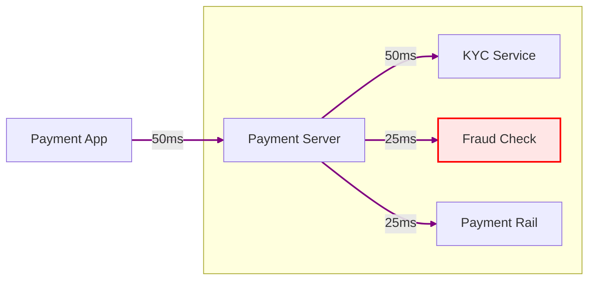

After training a machine learning model for [real-time financial fraud detection](../blog/real-time-financial-fraud-detection.html), the next step is to evaluate its performance.
Fraud detection models face unique challenges during evaluation.
Two examples are (1) class imbalance and (2) the different costs of false positives vs. false negatives.
Class imbalance means that the model doesn't have enough fraudulent transactions to learn from, as they are rare compared to legitimate ones.
False positives, which flag legitimate transactions as fraudulent, can lead to customer dissatisfaction, while false negatives, where fraudulent transactions go undetected, can result in significant financial losses.
In this post, I cover the most common metrics and considerations for evaluating fraud detection models while keeping these unique challenges in mind.

# Confusion Matrix

Most financial fraud detection systems generate a binary output: a prediction indicating whether a transaction (txt) is fraudulent (1) or genuine (0).

By leveraging this universal approach to binary classification, we can establish standard evaluation methodologies to assess the performance of this type of models.

The confusion matrix is a widely used tool for summarizing and visualizing the performance of a classification model in a tabular format.
It provides a clear breakdown of predictions vs. actual outcomes.

In a confusion matrix:

- The *x*-axis represents the ground-truth labels (actual outcomes).
- The *y*-axis represents the predictions made by the classification model.

Both axes are divided into two categories: positive (fraudulent txt) and negative (genuine txt).
The positive class corresponds to the minority class (fraud), while the negative class corresponds to the majority class (genuine).

This representation allows us to visualize the model's performance in terms of true positives, true negatives, false positives, and false negatives.

- **True Positives (TP):** The number of fraudulent transactions correctly identified as fraud.
- **True Negatives (TN):** The number of genuine transactions correctly identified as genuine.
- **False Positives (FP):** The number of genuine transactions incorrectly flagged as fraudulent.
- **False Negatives (FN):** The number of fraudulent transactions missed by the system.

By analyzing these metrics, we gain a comprehensive view of the model's strengths and weaknesses, enabling informed decisions for further optimization.

# Precision

[Precision](https://en.wikipedia.org/wiki/Precision_and_recall) is the fraction of transactions that were actually fraud among all transactions the model flagged as fraud (predicted positive).

For example, if a model flagged 100 transactions as fraud, and 80 of those were indeed fraudulent, then:

$$
\text{Precision} = \frac{TP}{TP + FP} = \frac{80}{80 + 20} = 0.8
$$

High Precision means few false positives, so it is crucial for operational efficiency.

Low Precision means investigators waste time on many false alarms, and customers suffer unnecessary transaction declines.

Many top systems aim for very high Precision (e.g., 0.9+) at low fraud rates, but there’s a trade-off with Recall.
For example, if we lower the threshold to catch more fraud, Precision may drop.
Therefore, Precision is often reported at a certain operating point or as an average if multiple thresholds are considered.

An example interpretation: “Of the transactions our system blocked, 95% were indeed fraudulent”, that’s a Precision of 95%.

# Recall

[Recall](https://en.wikipedia.org/wiki/Precision_and_recall) is the fraction of actual fraud cases that the model correctly predicts as fraud (true positives) out of all actual fraud cases.

For example, if there were 100 actual fraud cases and the model caught 80 of them, then:

$$
\text{Recall} = \frac{TP}{TP + FN} = \frac{80}{80 + 20} = 0.8
$$

A Recall of 0.80 means 80% of fraud instances were detected (20% missed).

High Recall means few false negatives, which is critical in fraud detection because missing a fraudulent transaction can lead to financial losses.

Low Recall means many frauds slip through and cause losses.

We can usually increase Recall by lowering the detection threshold at the cost of Precision.
In practice, businesses may set a Recall target like “catch at least 70% of fraud” and then maximize Precision under that constraint.

# F1-Score

[F1-Score](https://en.wikipedia.org/wiki/F-score), or F1 for short, is the harmonic mean of Precision and Recall.
It gives a single-figure balance of both metrics, which is useful when we want a combined score for model selection or when class distribution is skewed.

For example, if Precision is 0.8 and Recall is 0.6, then:

$$
F1 = \frac{2 \times Precision \times Recall}{Precision + Recall} \approx 0.686
$$

High F1 means both Precision and Recall are reasonably high.
Low F1 means either Precision or Recall is low, which is undesirable in fraud detection.

Overall, F1 is a good metric to assess a fraud detection model.
It is also a popular metric in Kaggle competitions and papers to compare models, ensuring they are not just optimizing one at the expense of the other.

# FPR

False Positive Rate (FPR) is is the share of legitimate transactions that get incorrectly flagged as fraud.

For example, if there were 100 legitimate transactions and the model flagged 5 of them as fraud, then:

$$
\text{FPR} = \frac{FP}{TN + FP} = \frac{5}{95 + 5} = 0.05
$$

FPR is important because it directly impacts customer experience.
High FPR means many legitimate transactions are blocked, leading to customer dissatisfaction and potential loss of business trust.

Sometimes businesses set FPR requirements to control false alarms.
For example: “We can only tolerate reviewing 0.5% of transactions, so FPR must be ≤ 0.005.”

# FNR

False Negative Rate (FNR) is the share of fraudulent transactions the model misses.

For example, if there were 100 actual fraud cases and the model missed 2 of them, then:

$$
\text{FNR} = \frac{FN}{TP + FN} = \frac{2}{98 + 2} = 0.025
$$

Some businesses set FNR requirements to control missed fraud.
For example: “We cannot tolerate missing more than 10% of fraud, so FNR ≤ 0.1” which implies Recall ≥ 0.9.

# TNR

True Negative Rate (TNR) or Specificity measures how well the system correctly identifies legitimate transactions as non-fraud.

For example, if there were 1000 legitimate transactions and the model flagged 50 of them incorrectly as fraud (FP), the calculation would be:

$$
\text{TNR} = \frac{TN}{TN + FP} = \frac{950}{950 + 50} = 0.95
$$

TNR is often overlooked in fraud detection because it’s essentially the complement of the False Positive Rate (FPR):

$$
\text{TNR} = 1 - \text{FPR}
$$

TNR is typically very high in fraud detection systems because the number of legitimate transactions (TN) is much larger than the number of frauds or false positives.

Since Precision already focuses on avoiding false positives, and we typically assume we want to approve as many legitimate transactions as possible, TNR doesn’t usually take center stage.

However, in some contexts, like regulatory requirements or customer experience, it’s important to keep FPR below a certain threshold, such as “FPR ≤ 0.1%,” which directly relates to maintaining high TNR.

# AUC-ROC

The Area Under the ROC Curve[^1] (AUC-ROC) measures a model’s ability to distinguish fraud from non-fraud across all possible thresholds.
In essence, it plots Recall against FPR.

The AUC is the area under this curve:

- AUC = 0.5 means random guessing.
- AUC = 1.0 means perfect discrimination.

This area is computed as follows:

$$
\text{AUC} = \int_0^1 \text{Recall}(FPR) \, dFPR
$$

AUC is threshold-independent: it summarizes performance across all thresholds, and it’s less sensitive to class imbalance than accuracy.

An intuitive interpretation: “If I randomly pick a fraud and a legitimate transaction, AUC is the chance the fraud gets a higher risk score.”

# AUC-PR

The Area Under Precision-Recall Curve (AUC-PR) plots Precision vs. Recall and focuses squarely on the minority class (fraud), so it tells us how well the model catches fraud while keeping false positives low.

In highly imbalanced data such as fraud detection, AUC-PR is more informative than AUC-ROC because it answers how well the model balances Precision and Recall where it matters.

For instance, a model could have AUC-ROC = 0.98 and still have AUC-PR = 0.10, which means that the model detects fraud more often than non-fraud, but when it comes to real-world detection, Precision at high Recall isn’t stellar.

AUC-PR is the go-to metric when fraud cases are rare, and we care about catching as many as possible without overwhelming the system with false alarms.

## Threshold for AUC-PR

Once we have chosen the best model as per AUC-PR, we need to decide a threshold, denoted as $$ \tau $$, to convert this model’s fraud probability output into a concrete binary decision (fraud or not fraud).

If we look at the Precision-Recall (PR) curve in the figure below, different values of $$ \tau $$ correspond to different trade-offs between Precision and Recall.

<figure class="jb_picture">
  {% responsive_image width: "100%" border: "1px solid #808080" path: img/posts/2025/2025-05-08/AUPRC.png alt: "Sample Precision-Recall curves for two models A and B." %}
  <figcaption class="stroke">
    Sample Precision-Recall curves for two models A and B. Model B is superior to model A as is reflected in the AUC-PR values of the two models. Different points on the PR curve represent different threshold values and different trade-offs between Precision and Recall metrics.
  </figcaption>
</figure>

We ultimately need to choose the right trade-off that suits our use case.
The threshold $$ \tau $$ determines the decision boundary for classifying transactions as fraudulent or genuine. Mathematically, this can be expressed as:

$$ \text{Decision: Fraud if } P(x) > \tau $$

Where:

- $$ P(x) $$ is the predicted probability of fraud for transaction $$ x $$.
- $$ \tau $$ is the threshold value.

With the above framework in mind, we can decide the threshold value $$ \tau $$ based on the value of $$ k $$, where $$ k $$ represents the minimum Precision we want to maintain.

For example, if we want to maintain a minimum Precision of 90%, then $$ k = 90 $$. Using the Precision-Recall curve, we can derive the threshold value $$ \tau $$ as well as the equivalent Recall value at 90% Precision.

This strategy allows us to calculate the optimal threshold $$ \tau $$ while evaluating our trained model on the test set. Once the threshold is determined, it can be used to classify transactions during deployment:

$$
\text{Fraud if } P(x) > \tau, \text{ otherwise Genuine.}
$$

By adjusting $$ \tau $$, we can balance Precision and Recall to meet specific business objectives and constraints.

# Latency

Latency is the time it takes for the system to process a transaction and make an inference.
Keeping latency low is crucial for real-time systems.
Fraud models not only need to have good statistical performance but also operate quickly enough to be used in practice.

Latency and complexity matter in payment systems.
In the example below, the `Payment Server` dispatches parallel calls to `KYC Service`, `Fraud Check`, and `Payment Rail`, but the transaction can only complete once the slowest of these services responds (the `KYC Service` in this example).
Even though `Fraud Check` takes just 25 ms, any fluctuation (like a network hiccup or a slow third-party response) can bottleneck the entire flow.
That’s why latency is a system-wide risk amplifier.

Real-time fraud detection latency is commonly measured in two ways:

1. **Online decision latency (ODL):** How long it takes to score a single transaction and respond (which affects user experience and fraud blocking effectiveness).
2. **Time-to-detection for fraud patterns (TTD):** If an attack starts at a certain time, how long before the system detects and flags it.

ODL is usually measured in milliseconds.
For example, a payment system might have an end-to-end latency budget of 200ms for authorization, out of which fraud checks get 20–30ms.
Modern systems often aim for fraud model inference under ~50ms.
In practice, we can look at 99th percentile latency (e.g., 99% of transactions scored in <500ms), to ensure worst-case delays are bounded.

TTD is more about monitoring and measuring the resilience of the system to detect an emerging fraud *modus operandi*.
For example: “Did we catch the new fraud ring the first day it appeared, or did it go undetected for weeks?”
This is harder to quantify but important in evaluating adaptive systems.

# Summary

In practice, evaluating a fraud detection model involves:

1. Analyzing the confusion matrix at the operating point.
2. Reviewing Recall, F1, and AUC-PR.
3. Choosing a threshold that satisfies business constraints (e.g., maximum number of tolerable false positives).

But evaluation doesn’t stop at metrics.
Weighting fraud by transaction amount matters: catching a 10,000 USD fraud is more impactful than catching five 1,000 USD cases.
Moreover, metrics on static test sets aren't enough.
We also need to perform [backtesting](https://en.wikipedia.org/wiki/Backtesting) (simulate past performance) and [sandbox testing](https://en.wikipedia.org/wiki/Sandbox_(computer_security)) (simulate deployment), and monitor the model in production.

Observe how fraud patterns change: Do attackers evolve? Do false positives creep up?

Or even better: run [A/B tests](https://en.wikipedia.org/wiki/A/B_testing).

Put the new model in production in [shadow mode](https://en.wikipedia.org/wiki/Shadowing_(computing)) and compare it to the previous version.

But that's content for another post.

# Footnotes

[^1]: [ROC Curve](https://en.wikipedia.org/wiki/Receiver_operating_characteristic) stands for "Receiver Operating Characteristic", a very weird name, indeed.
