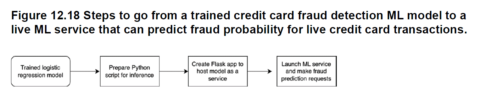

In this article, we turn this trained model into an ML
service that can be hosted as a web app on a remote server to receive
incoming credit card fraud transactions and return their fraud probabilities, as
shown in figure 12.18.

1. We first save the trained model as a file and write the necessary Python
script to load the saved model and use the model to run inference on
new credit card transactions.
2. We then convert this Python script into an ML service using Flask.
3. Finally, we create another Python program to send requests to our Flask
web app to receive fraud decisions in response

# Deployment Patterns

Developing a high-accuracy fraud model is only half the story.
The rest of the challenge is deploying it in an architecture that can handle real-time data streams, sub-second decisions, and surging throughput.
Modern fraud detection systems increasingly lean on cloud-native components and streaming frameworks to make this happen.

This section presents an overview of common deployment patterns using Google Cloud Platform (GCP) as an example, but the principles apply across cloud providers like AWS and Azure.

## Event Streaming and Ingestion

Fraud detection starts with ingesting a continuous stream of transactions from payment processors, banking systems, or point-of-sale devices.

In GCP, Pub/Sub acts as the primary streaming backbone, capturing and buffering transaction events in real-time.
This works much like AWS Kinesis or Azure Event Hubs, but with Google’s global network and seamless scaling.
Pub/Sub guarantees message durability, ordering (with ordering keys), and scales automatically to handle spikes.

Some systems also use HTTP APIs or queues for ingestion.
However, Pub/Sub’s scalability and integration with Dataflow (Apache Beam) make it ideal for high-volume, low-latency scenarios.

## Real-Time Feature Computation

Before scoring, each transaction needs feature enrichment like user history, transaction frequency, or average transaction amounts.

GCP’s Bigtable or Firestore (for document-style lookups) provide ultra-fast, horizontally-scalable NoSQL storage for such features.

Imagine a fraud detection system where a Cloud Function or Dataflow pipeline enriches each transaction event by querying Bigtable for recent account activity, reducing latency to milliseconds.

Memorystore (Redis) can be used for caching and in-memory lookup, providing [sub-millisecond access for high-throughput enrichment](https://redis.io/solutions/fraud-detection/).

Advanced GCP users might implement a custom feature store using Bigtable, Dataflow, and Pub/Sub to precompute and update rolling aggregates.

## Model Serving (Inference)

GCP’s Vertex AI Prediction service offers online endpoints with autoscaling, low-latency serving, and even GPU acceleration.

* Model is trained using XGBoost or TensorFlow and deployed as a Vertex AI model endpoint.
* It exposes a REST API (or gRPC) to score transactions in real time.
* For ultra-low-latency needs, Cloud Functions can serve embedded lightweight models (although this works best for small models like decision trees or logistic regression).

[GCP’s Fraud Detection Blueprint](https://cloud.google.com/blog/products/databases/fraud-detection-with-cloud-bigtable/) combines Vertex AI with Dataflow and Bigtable to create a reference architecture that can process fraud decisions at scale and with sub-second response times.

## Streaming Orchestration and Decision Logic

After scoring, the fraud detection system needs orchestration to determine actions.

GCP offers Dataflow (Apache Beam) for stream processing, perfect for scoring events inline and routing them based on the model’s output.

* Pub/Sub streams transaction events.
* Dataflow reads the stream, enriches each event with features, scores it using Vertex AI endpoint, and applies business logic (e.g., if fraud score > threshold, flag for review).

Alternatively, Workflows and Cloud Functions can orchestrate more complex, conditional logic, much like AWS Step Functions or Azure Durable Functions.

## Alerts, Notifications, and Downstream Actions

When fraud is detected, immediate action is needed:

* Send alerts via Pub/Sub topics to downstream systems.
* Trigger Cloud Functions to initiate case creation, notify analysts, or invoke an authorization block.
* Update real-time dashboards in BigQuery or Looker.

Moreover, Pub/Sub’s dead-letter topics and retry mechanisms ensure reliability even in edge cases.

In high-risk scenarios, decisions can integrate directly with the payment gateway to decline or challenge transactions within milliseconds.

## Example

Here’s a GCP-native fraud detection pipeline:

1. Transactions stream into Pub/Sub.
2. A Dataflow job processes each event:

* Enriches with features from Bigtable or Firestore.
* Calls the Vertex AI endpoint for scoring.
* Routes events based on the fraud score (e.g., sends high-risk ones to a Pub/Sub alert topic).

3. Alerts are consumed by downstream systems or Cloud Functions for further actions (blocking, notification, manual review).
4. BigQuery stores logs for monitoring, drift detection, and analytics.
5. Cloud Monitoring and Error Reporting track system health and model performance, alerting teams to anomalies in real time.

## Microservices and APIs

Some systems favor microservices over streaming.

Here, a dedicated Fraud Detection Service running on GKE (Kubernetes) handles synchronous feature computation (with Bigtable or Memorystore), invokes the Vertex AI model, applies rules, and returns a decision—all within the transaction’s authorization flow.

This design aligns with traditional banking architectures where fraud decisions happen inline.

## Monitoring and Logging

GCP’s Cloud Monitoring and Cloud Logging track:

* Latency and throughput of ingestion and inference.
* Error rates and system health.
* Model score distributions (for detecting drift or attacks).

In fraud detection, monitoring model drift is non-negotiable.
If fraud rates drop or spike unexpectedly, the system might be under attack or outdated.

## Continuous Updates

Fraudsters evolve, so models must adapt to new patterns rapidly.
To keep up, the system needs a robust retraining/retuning and redeployment pipeline with an automatic feedback loop (i.e. adaptive).

* Vertex AI Pipelines orchestrate training on fresh data (e.g., daily or weekly) and deploy updated models if performance checks out.
* Blue/green deployment or A/B testing ensures safe rollouts.
* Infrastructure-as-code (with Terraform or Deployment Manager) automates the pipeline, minimizing manual error.

Retraining frequency depends on fraud velocity.
Fast-evolving threats may require weekly or even daily retraining.

## Summary

Cloud-native architectures provide the building blocks to operationalize fraud detection models at scale.

Key characteristics of a robust deployment are:

* Low latency data flow (streaming or fast APIs).
* Scalability to handle spikes (serverless or auto-scaling services).
* Reliability (continuous monitoring).
* The ability to quickly update models and rules as fraud patterns change.

By using managed services (streams, functions, hosted ML models), teams can focus on the fraud logic while the cloud handles the heavy lifting of scaling and throughput.

Many modern fraud platforms ([Feedzai](https://www.feedzai.com/), [Featurespace](https://www.featurespace.com/), etc.) are built with these principles, often on top of the client’s cloud of choice.

# Deployment Considerations

When deploying fraud detection in real-time, there are several cross-cutting concerns beyond raw model accuracy. We highlight four key considerations: latency, scalability, explainability, and maintenance.

## Latency

At it's core, latency is the time delay between starting an action and completing it.
In payment systems, this refers to the time between when a user initiates a transaction and when they receive a confirmation.
The processing latency is the "hidden" work that happens during transaction processing.

It includes:

* KYC/AML verification checks (Know Your Customer/Anti-Money Laundering)
* **Fraud detection systems**
* Balance checks and holds, Currency conversion calculations
* Regulatory compliance checks
* Settlement processing (finalizing the transaction)
* Payment rail routing decisions (deciding which payment provider to use)

<figure class="jb_picture">
  {% responsive_image width: "100%" border: "0px solid #808080" path: img/posts/2025/2025-04-03/latency.png alt: "Confusion matrix of a financial fraud binary classifier." %}
  <figcaption class="stroke">
     TODO
  </figcaption>
</figure>

Fraud decisions often need to be made in **tens of milliseconds**, especially for card transactions at a point-of-sale or online checkout. Any significant delay could either inconvenience the customer or allow fraudulent transactions to go through unchallenged. For example, in a cross-border payment scenario, the fraud check might have a budget of \~25 ms out of a \~180 ms total processing time. Low latency is achieved by using in-memory data stores for features, efficient code (e.g., C++ or optimized libraries for model scoring), and parallelizing where possible. It’s crucial to monitor not just average latency but **tail latency** (99th percentile) – even a small fraction of slow requests can correspond to many transactions in absolute terms, given large volumes. Techniques like asynchronous processing or quickly approving low-risk transactions and separately processing suspicious ones can help. Also, model complexity impacts latency – large ensembles or deep models might need optimization or more compute. Engineers often make trade-offs, e.g., compressing a model slightly if it cuts latency in half. Meeting strict SLAs (say 95% in <50ms) might rule out extremely heavy models or require special hardware. The bottom line: **every millisecond counts** in real-time fraud detection, so the infrastructure must be tuned for speed.

## Scalability

Fraud systems for large institutions have to handle **huge throughput** – possibly thousands of transactions per second (TPS) at peak (e.g., holiday shopping season). The system should scale horizontally (add more nodes) without degradation in performance. Cloud auto-scaling helps here, as does partitioning workload (sharding by customer region, etc.). Back-end data stores (for features, logs) must handle concurrent reads/writes at scale; that’s why high-performance NoSQL databases or distributed caches are used. For instance, **Redis** can handle millions of operations per second with a cluster, suitable for feature lookups. Another aspect is **scaling with complexity of data**: as more data sources (device, network, etc.) are integrated, the system must manage more data joins or lookups. Designing stateless, modular components (so they can be scaled independently) is a good practice – e.g., a feature computation service that can scale separately from the model inference service. Cloud-native setups shine here, since managed services can scale under the hood (Lambda scales up concurrency, SageMaker endpoints scale instances on demand, etc.). Batch processing capabilities should complement real-time: for example, it may be inefficient to calculate certain heavy features on the fly, so a daily batch pre-calculation is done and results stored for quick access. Ensuring scalability often requires load testing. It’s also important to think about **failover and redundancy**: if one region’s service fails, a backup should take over to not miss fraud checks. Finally, **cost scalability**: doing real-time fraud detection on every transaction can be expensive (compute-wise). The design should optimize cost – e.g., simpler rules first (cheap) and only call the heavy model for borderline cases, or using spot instances/offloading non-critical analysis to batch processes.

## Explainability

As mentioned earlier, being able to **explain fraud decisions** is crucial for several reasons: customer communication (telling a declined customer why their transaction was flagged), regulatory compliance (laws like GDPR’s “right to explanation”), and internal model governance. Models like logistic regression or decision trees are inherently interpretable – one can list the top factors (e.g., “different country IP contributed +8 to score”). For complex models (ensembles, neural nets), often a **post-hoc explanation tool** is used. **SHAP (SHapley Additive exPlanations)** is popular in fraud detection – it assigns each feature a contribution value for a specific prediction. For example, a SHAP summary might say: *“Transaction was flagged mainly due to high-risk device and unusual amount (device\_id and amount contributed most to the fraud score)”*. Many banks deploy SHAP or LIME to produce reason codes that can be fed into case management systems. Some create surrogate decision trees to approximate the model for explanation. There’s also the strategy of combining interpretable and complex models: e.g., use a transparent model for borderline cases or to double-check the black-box. Explainability isn’t just to satisfy outsiders; it also helps fraud analysts trust the model and glean insights (like discovering a new fraud pattern because certain features consistently have high SHAP values for positives). So, any deployment should incorporate an **explanation pipeline** alongside predictions. This adds a bit of latency/compute overhead but is often worth it. Model documentation and behavior under various scenarios are reviewed thoroughly before deployment in industries like finance – often a requirement by model risk management teams. The need for explainability may sometimes influence model choice: a slightly less accurate but more interpretable model might be chosen over an opaque one, depending on the use case.

## Maintenance

Fraud patterns change over time – **concept drift** is a constant challenge. A model that was highly effective last year might start missing new fraud tactics this year unless updated. Deployment planning must include a **retraining schedule** and mechanism. Many organizations retrain models on fresh data **very frequently (e.g., daily or weekly)**, especially for online fraud, to capture newly emerging trends. Automation helps: using pipelines to fetch recent data (last N days), label it (which transactions were chargebacks or confirmed frauds), retrain the model, run evaluation (making sure it’s not worse than current model), and then deploy. If manual review labels come in with some delay, one might retrain on a moving window with a lag (e.g., train on data up to last week, deploy, then next week update). In addition, **incremental learning** approaches can update the model in near-real-time. For instance, online gradient descent can tweak a model with each new labeled instance. However, for stability, many prefer periodic full retrains. It’s also key to monitor **data drift** and **performance drift**: using statistical tests or monitoring distributions of inputs can alert if data characteristics shift (for example, a new type of transaction or a big change in customer behavior pattern). If drift is detected, one might trigger an earlier retrain or at least investigate. One should also guard against **model deterioration** due to adversaries. Fraudsters might probe the model (through repeated transactions) and find weaknesses. This is an area of adversarial ML – but practically, having an ensemble of models or periodically changing the model can make it harder for fraudsters to reverse-engineer detection logic. Lastly, maintenance includes **updating rules or thresholds** as fraud modus operandi evolves. A model might remain the same but you adjust the threshold for what score triggers a block vs review. This can be informed by recent fraud rates – e.g., if there’s a fraud spike, you might temporarily lower the threshold to be more aggressive.

## Summary

In summary, deploying a fraud detection solution is an ongoing effort. **Speed, scale, clarity, and agility** are the pillars: Speed (low latency), Scale (handle volume growth), Clarity (explain decisions), and Agility (update quickly as fraud evolves). Balancing these is non-trivial – e.g., increasing model complexity might hurt latency or explainability – so architects must choose appropriate technologies and model types for their specific context. Fortunately, modern cloud tools and a growing body of best practices (from large payment companies and banks) are making it easier to achieve a robust real-time fraud detection system that is both effective and maintainable.

# Conclusion

Real-time transaction fraud detection sits at the intersection of advanced analytics and mission-critical engineering. The state-of-the-art encompasses a spectrum from straightforward models (logistic regression, decision trees) to cutting-edge deep networks and transformers, each with a role to play. **Classical ML models** offer simplicity, speed, and transparency – they remain strong baseline solutions and are often production workhorses. **Deep learning approaches** bring higher predictive power, capturing sequential and non-linear patterns, which is increasingly important as fraudsters get sophisticated. **Graph-based methods** add a new dimension by leveraging relationships and networks, unmasking collusion and complex fraud rings that single-transaction models might overlook. **Transformer and foundation models** are pushing the frontier, hinting at a future where a single pre-trained model could underlie an entire fraud detection ecosystem, spotting nuances across billions of data points in a semantic way.

Equally important are the **operational considerations**: achieving low-latency, high-throughput scoring, scaling to big data and traffic spikes, and making sure that model outputs are explainable and regularly updated. The advent of cloud-native architectures, streaming analytics, and ML Ops automation has greatly enhanced our ability to deploy sophisticated models in real-time environments. A modern fraud platform might ingest events via Kafka, enrich with context from a feature store, score using an ensemble of a GNN-powered model and a transformer model, and respond within a few hundred milliseconds – something that would have seemed aspirational a decade ago.

No single model or technique is a silver bullet. In practice, **hybrid systems** often yield the best results: combining business rules for known patterns, tree models for interpretable risk scoring, deep models for complex pattern recognition, and graph analyses for relational insights. The survey of current methods shows that each has strengths that can complement the others. For example, a pipeline might first use a neural network to get a risk score, then a graph-based module to adjust the score if the entity is connected to others with fraud history, and finally a simple rule to enforce a business constraint (e.g., block if risk is high and amount > X).

Evaluation on public datasets and benchmarks provides a baseline, but ultimately **real-world performance** is what matters – metrics like dollars prevented, fraud rings dismantled, false alerts avoided, and customer friction minimized. Achieving high Recall without swamping operations with false positives remains the core challenge. Metrics like Precision, Recall, F1, and AUC guide model development, while detection latency and system uptime are critical for deployment.

Looking forward, we see trends like **federated learning** (collaborative fraud models across institutions without sharing raw data), **online learning** (models that adapt in near real-time), and further integration of **unstructured data** (like behavioral biometrics or call center recordings analyzed by AI) into fraud detection. **Explainable AI** will also continue to grow, perhaps with inherently interpretable deep models or better tools, given regulatory pressure.

In conclusion, the state-of-the-art in real-time fraud detection is a multi-faceted landscape. By combining advances in machine learning – from the “classic” algorithms to graphs and transformers – with robust cloud-based deployment and monitoring, organizations can build fraud defenses that are both highly effective and responsive to new threats. As fraudsters evolve, so too will the models; staying at the state of the art is an ongoing race, but one where these tools and strategies give defenders a fighting chance to stay ahead of the adversaries.

# References
