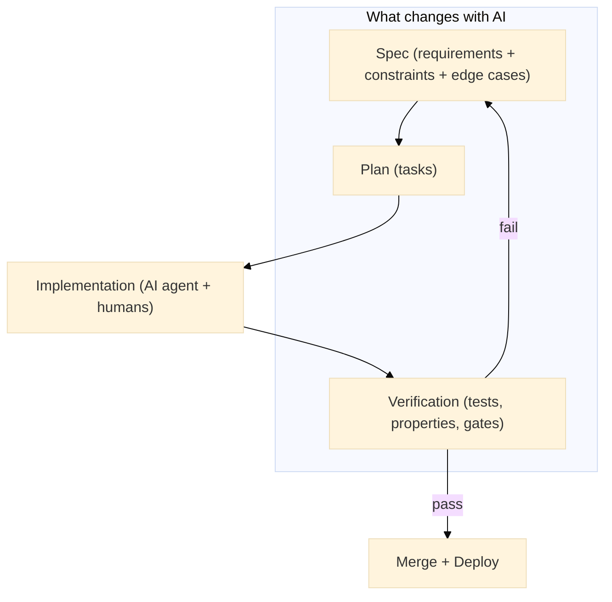



The next massive software failure will probably not come from a missing line of code.
It will come from a missing sentence.

Right now, developers are using AI agents to write code faster than they can actually read it.
I’m doing it too!
The latest models can generate thousands of lines in seconds.
But that’s not the problem.
The problem is that speed removes friction.
And friction used to be where _thinking_ happened.

Recently, GitHub ran controlled experiments where developers using Copilot finished tasks faster (with numbers often quoted around “up to 55%”).[^1]
And that sounds like a dream. Until you realize that speed without direction is just a faster way to reach the wrong place.
In other studies, experienced developers got slower when AI increased review load, coordination cost, and rework.[^11]
So the real question is not “Can AI write code?”
It definitely can.

The question is:

> “Can we keep AI speed without turning our systems into a high-throughput confusion factory?”

That is where [Spec-Driven Development (SDD)](https://martinfowler.com/articles/exploring-gen-ai/sdd-3-tools.html) shows up.
The idea is simple: **write a clear, structured specification ("spec") before the code**, so that AI gets constraints instead of vibes.

But I keep wondering:

> Are we just reinventing [1990s Waterfall](https://en.wikipedia.org/wiki/Waterfall_model), but this time with an AI-powered engine on top?

In this post, I’ll cover three things:

1. What SDD actually is (and why vague thinking is now your biggest technical liability).
2. The three levels of SDD (and the specific one that quietly traps most teams).
3. A practical checklist to decide which features deserve a real spec and which ones you should just build fast and move on.

By the end, you’ll know whether SDD is a real shift in how software gets built, or just another heavyweight idea that sounds smart and wastes everyone’s time.

# What is SDD?

In SDD, the _specification is the primary artifact_.

Not the code. Not the framework. Not the Jira tickets.
The spec is the source of truth and everything else is downstream.[^3]

And no, the spec is not a vague paragraph or a wish list.
A real SDD spec is a structured, testable description of behavior.

The spec defines:

- What the system must do (and what it must not do)
- Edge cases
- Business rules
- Failure modes
- An explicit [definition of done (DoD)](<https://en.wikipedia.org/wiki/Scrum_(project_management)#Definition_of_Done_(DoD)>)

The goal is to guarantee unambiguous behavior from the AI coding agent.

# Why is SDD Relevant Now?

SDD is not new.
What’s new is the environment it now lives in.

In the past, we used to say “code is the bottleneck.”
Research in requirements engineering has been blunt for years: a big chunk of effort ends up as rework, and unclear or shifting requirements are a major driver.[^2]

<aside class="quote">
    <em>“In a world of infinite code, clarity is the scarce resource.”</em>
</aside>

But now code is cheap, and ambiguity is expensive.
AI raises the stakes because it will happily translate fuzzy intent into crisp code without asking clarifying questions.
Think of an [AI agent](https://en.wikipedia.org/wiki/AI_agent) like a brilliant intern who never says “I don’t understand.”
If your requirements are fuzzy, it won’t stop.
It will confidently generate a clean, professional-looking solution that could be catastrophically wrong.

And there’s a second issue that feels almost philosophical: Humans transmit information slowly.
We type maybe 40 words per minute on a good day.
That speed forces reflection.
But AI can generate 2,000 lines in minutes.
It removes the pause where thinking used to happen.

When thinking disappears, ambiguity leaks straight into production.
This is why some researchers now treat prompts as a form of requirements, and argue that classic requirements methods will become even more valuable in the generative era.[^4]

Same problem.

Higher speed.

Bigger blast radius.

# SDD vs Waterfall (the real difference)

Yes, SDD feels like Waterfall, you are not crazy.
They both say _“think before you build.”_
But they diverge on the most important thing:
Waterfall assumes you can predict the future.
SDD assumes you cannot, so it builds a fast loop where the spec, tests, and code evolve together.
Modern SDD discussions emphasize tight iteration and executable checks, not month-long requirements phases.[^9]
So yes, it looks like Waterfall if you only look at the order of steps.
It behaves like something else if you look at the feedback loop.

# A Matter of Intent

Let's be honest: most bugs are not code bugs.
They are argument bugs.

You did not write incorrect logic.
You postponed a decision until it exploded in production.

Example: a payment gateway requirement says:

> “The system must block _risky_ transactions.”

One person interprets “risky” as “high-risk country.”
Another interprets it as “amount above $1,000.”
Both are reasonable.
But both can be wrong in different ways.

Research shows this is not just anecdotal.
Practitioners interpret conditionals in requirements inconsistently, even when they believe they are being precise.[^10]

SDD forces that decision to happen early.
When stakeholders are calm, when assumptions are visible, and when the codebase still has exactly zero lines of code.

# SDD as a Pipeline

Spec-Driven Development is not about writing more documentation.

It’s about removing ambiguity before the agent starts making decisions for you.

A practical workflow looks like this:

## 1) Requirements (the what)

Describe what the user experiences from the outside (not how the system works).

Example:

> “When a user submits a support ticket, they receive a clear and empathetic response within five seconds. The response must reference their issue and suggest a concrete next step.”

## 2) Design (the how, at a high level)

Define structure and boundaries.

What information can the agent see?

What tools can it use?

What is it not allowed to do?

Example:

> “The agent can read the ticket text and query the internal FAQ. It cannot invent policies, promise refunds, or escalate issues on its own.”

## 3) Tasks (the work)

Tasks must be explicit, sequential, and boring.

Example:

```markdown
1. Extract the user’s core problem in one sentence.
2. Match it against FAQ categories.
3. Select the most relevant solution.
4. Generate a response using approved tone guidelines.
```

No “think carefully.”
No “use best judgment.”
Agents do exactly what you specify.
Nothing more.

## 4) Build (implementation plus automated verification)

Now you turn the spec into checks.
Does the response reference the user’s issue?
Is the response under 120 words?
If it fails, the build fails.
That’s the whole loop.
It is intentionally simple.
Because when working with non-deterministic tools, simplicity is not a style choice.
It’s a reliability strategy.



# The Three Levels of SDD

Not all SDD looks the same.

In practice, there are three levels:

## Level 1: Spec-First (spec as a thinking tool)

You write a spec to clarify your own thinking, use it to guide the agent, then move on.
Perfect for MVPs and experiments.
The spec is useful even if it dies tomorrow.

## Level 2: Spec-Anchored (spec as a living contract)

The spec is a living artifact.
If the code changes, the spec must change.
This is where high-performing teams tend to land because it balances flexibility with discipline.
GitHub’s Spec Kit explicitly pushes the idea of specs that can drive implementation and verification, not just explanation.[^7]
This is also where most teams quietly fail.
Not because they cannot write specs.
Because they cannot keep them alive.

## Level 3: Spec-as-Source (spec as the codebase)

You edit the spec, and tooling regenerates the implementation.
This is the low-code dream.
Some newer tools and platforms point in this direction by making the spec the center of gravity.[^8]

### My take (warning label)

Level 3 is dangerous right now for complex systems.
When the spec becomes the source of truth, the spec becomes the codebase.
Meaning if you cannot express intent precisely (and natural language is notoriously ambiguous), you are moving bugs upstream and making them look like prose.
At that point, you reinvented a programming language.
But fuzzier.
And some of the loudest skepticism you’ll hear about SDD is basically this argument, stated more rudely.[^12]

# The reality check (where SDD shines, where it bleeds)

## 🟢 Green light

SDD excels at:

- New features
- Greenfield systems
- Modernization efforts

When the slate is clean, a clear spec is a superpower.

## 🔴 Red light

SDD struggles with deeply entangled legacy systems.
If logic is spread across five services, three cron jobs, and one senior engineer’s memory, a “clean spec” is not a document problem.
It’s an archaeology problem.
AI agents will suggest elegant refactors that ignore the decade of hacks quietly keeping the business alive.

Also, a personal confession:

> Sometimes I can understand code faster than I can understand a folder full of Markdown.
> That might be because we have decades of tooling to navigate code, and far less mature tooling to navigate living specs.

So yes, SDD needs tooling support, not moral superiority.
And there’s another reason SDD is having a moment:
AI-assisted development can increase duplication, churn, and architectural drift when you do not constrain the agent with explicit rules and boundaries.[^5][^6]

Here is an example of a simple spec verification in Java:


public final class SupportReplySpec {

  // Spec constraint: keep responses short and reference the user's issue.
  // This is not "AI evaluation." This is build gating.
  public static void validate(String ticketText, String reply) {
    if (reply == null || reply.isBlank()) {
      throw new IllegalArgumentException("Reply must not be empty");
    }

    int wordCount = reply.trim().split("\\s+").length;
    if (wordCount > 120) {
      throw new IllegalArgumentException("Reply must be <= 120 words (was " + wordCount + ")");
    }

    // Naive overlap check (good enough to catch obvious failures).
    String[] ticketWords = ticketText.toLowerCase().split("\\W+");
    String replyLower = reply.toLowerCase();

    int overlaps = 0;
    for (String w : ticketWords) {
      if (w.length() >= 5 && replyLower.contains(w)) {
        overlaps++;
        if (overlaps >= 2) {
          break;
        }
      }
    }

    if (overlaps < 2) {
      throw new IllegalArgumentException("Reply does not reference the user's issue enough");
    }
  }
}


# When to Use SDD

Run this three-point check:

1. **Risk:** Does this touch money, security, or permissions? Use SDD.
2. **Longevity:** Will someone else maintain this in a year? Use SDD.
3. **Exploration:** Are you probing an API or testing an idea? Skip SDD. Just code.

In my opinion, the future isn’t “always spec-driven.”
The future is spec-driven when being wrong is expensive.

# External Resources

- Thoughtworks Technology Radar: Spec-driven development (technique entry).[^3]
- GitHub Spec Kit: spec-driven development toolkit.[^7]
- Requirements engineering perspective: prompts as requirements.[^4]
- Empirical signals on code quality drift and churn with AI assistance.[^5][^6]

# Footnotes

[^1]: GitHub, [_Research: quantifying GitHub Copilot’s impact on developer productivity and happiness_](https://github.blog/news-insights/research/research-quantifying-github-copilots-impact-on-developer-productivity-and-happiness/) (2022).

[^2]: Lars-Ola Damm, Lars Lundberg, and Claes Wohlin, [_A Model for Software Rework Reduction through Improved Requirements Engineering Practice_](https://fileadmin.cs.lth.se/cs/Personal/Lars_Ola_Damm/Lars-OlaDamm_JSS2008.pdf) (Journal of Systems and Software, 2008).

[^3]: Thoughtworks, [_Spec-driven development_](https://www.thoughtworks.com/radar/techniques/spec-driven-development) (Technology Radar technique entry, 5 Nov 2025).

[^4]: Andreas Vogelsang, [_From Specifications to Prompts: On the Future of Generative LLMs in Requirements Engineering_](https://arxiv.org/abs/2408.09127) (IEEE Software column preprint, 2024).

[^5]: GitClear, [_AI Copilot Code Quality: 2025 Look Back at 12 Months of Data_](https://gitclear-public.s3.us-west-2.amazonaws.com/GitClear-AI-Copilot-Code-Quality-2025.pdf) (report, 2025).

[^6]: Thoughtworks, [_Complacency with AI-generated code_](https://www.thoughtworks.com/en-gb/radar/techniques/complacency-with-ai-generated-code) (Technology Radar technique, 23 Oct 2024).

[^7]: GitHub, [_Spec-driven development with AI: Get started with a new open source toolkit_](https://github.blog/ai-and-ml/generative-ai/spec-driven-development-with-ai-get-started-with-a-new-open-source-toolkit/) (2 Sept 2025).

[^8]: Tessl, [_Tessl launches spec-driven framework and registry_](https://tessl.io/blog/tessl-launches-spec-driven-framework-and-registry/) (23 Sept 2025).

[^9]: Thoughtworks, [_Spec-driven development: Unpacking one of 2025’s key new AI-assisted engineering practices_](https://www.thoughtworks.com/insights/blog/agile-engineering-practices/spec-driven-development-unpacking-2025-new-engineering-practices) (4 Dec 2025).

[^10]: Jannik Fischbach et al., [_How Do Practitioners Interpret Conditionals in Requirements?_](https://arxiv.org/abs/2109.02063) (arXiv, 2021).

[^11]: METR, [_Measuring the impact of AI on experienced developers_](https://www.metr.org/blog/2025-02-27-measuring-the-impact-of-ai-on-experienced-developers/) (2025).

[^12]: Discussion thread capturing practitioner skepticism about SDD-as-source and ambiguity in natural language, [_Hacker News thread: “Spec-Driven Development (SDD)”_](https://news.ycombinator.com/item?id=45610996) (Sept 2025).
