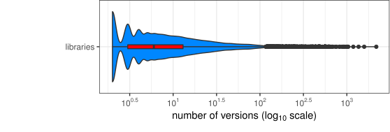

### Study Subjects

1. Libraries that have only one version: `$ {\sim}30\% $` 
2. Libraries with multiple versions all released on the same day: `$ {\sim}15\% $`
3. Libraries with multiple versions released within different time intervals:  <!-- .element: class="fragment grow" data-fragment-index="1"--> `$ {\sim}55\% $`

     

<!-- .element: class="fragment" data-fragment-index="2" -->

