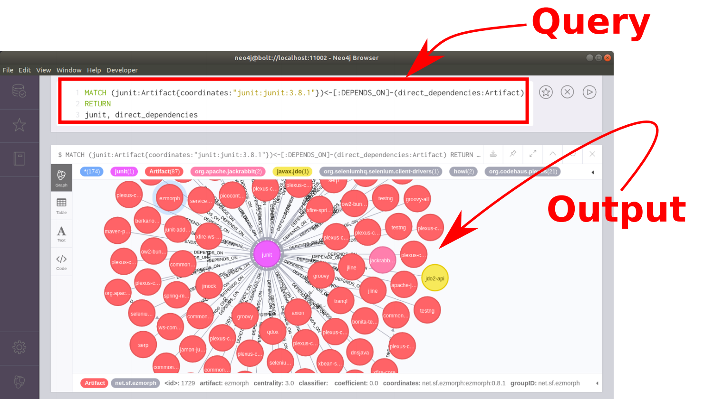
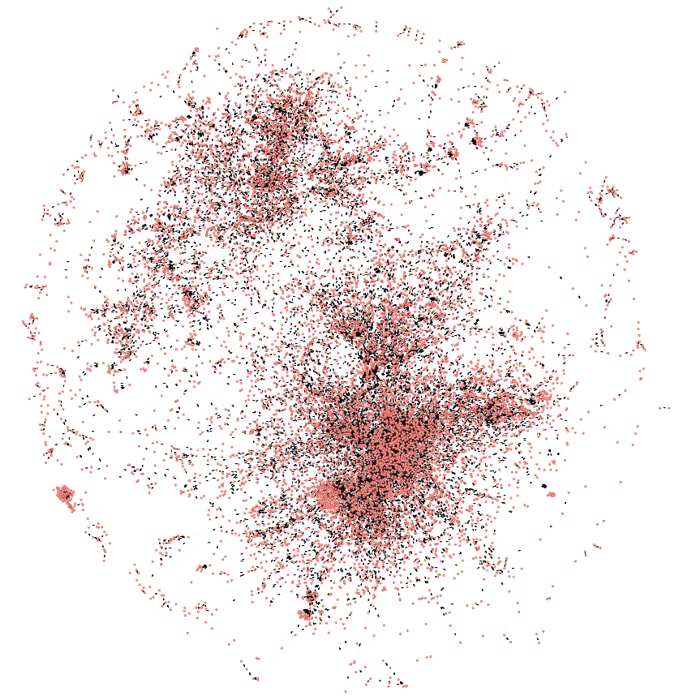

 ### The Maven Dependency Graph
- Captures a snapshot of Maven Central in the form of a temporal Neo4j graph database
    * `$2.4M$` artifacts
    * `$223K$` libraries
    * `$9M$` direct dependency relationships

    
    

https://zenodo.org/record/1489120